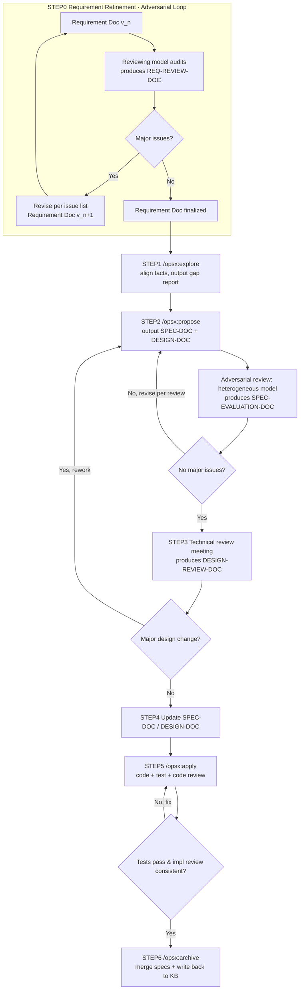
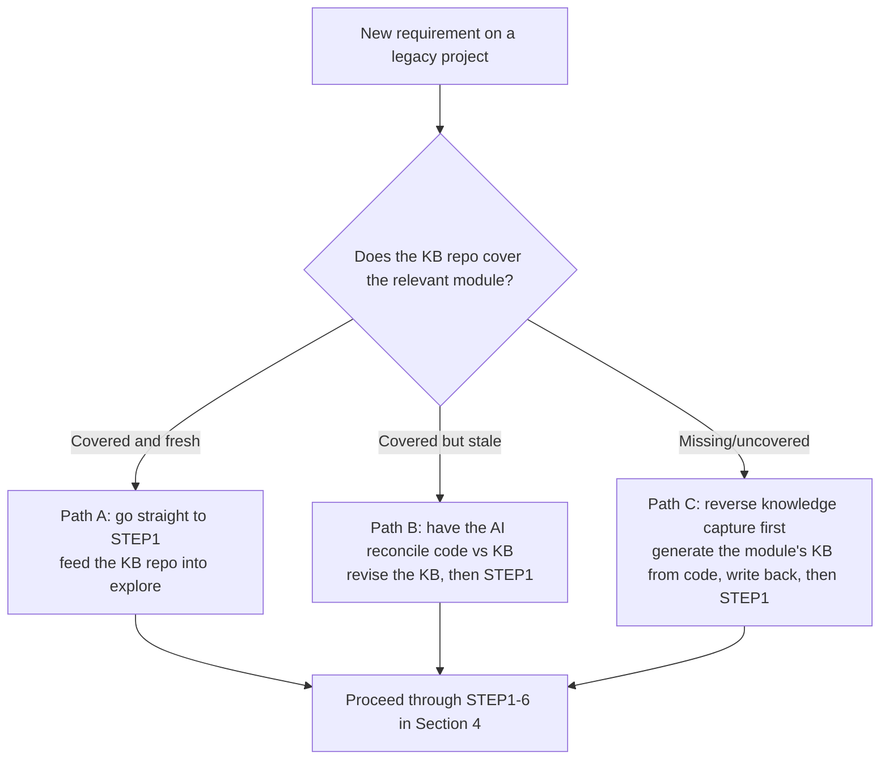

<p align="center">
  Languages:
  <a href="./README.md">English</a> ·
  <a href="./README_cn.md">中文</a>
</p>

# A Practical Handbook for Spec-Driven Development

> This handbook is written for developers with an **engineering background**, and is a complete, self-contained guide.
> It assumes you start from **a clean machine**, and covers: environment setup → tool selection → the full workflow → a worked example → legacy-project development → a prompt library → configuration reference.

---

## Table of Contents

1. [Core Concepts: Why Do It This Way](#1-core-concepts-why-do-it-this-way)
2. [Your AI Toolbox (CLI / Codex / Cursor / Windsurf / Copilot)](#2-your-ai-toolbox)
3. [Environment Setup: Starting From Scratch](#3-environment-setup-starting-from-scratch)
4. [The Complete Workflow](#4-the-complete-workflow)
5. [Example Project: mini-kv (In-Memory Cache with TTL)](#5-example-project-mini-kv-in-memory-cache-with-ttl)
6. [Legacy Project Development: The Knowledge-Base Loop](#6-legacy-project-development-the-knowledge-base-loop)
7. [Prompt Library](#7-prompt-library)
8. [Configuration Reference (config.yaml / CLAUDE.md / per-tool rules)](#8-configuration-reference)

---

## 1. Core Concepts: Why Do It This Way

### 1.1 Agent = LLM + Tool Use

AI coding tools (Claude Code, Codex, Cursor's Agent, Windsurf Cascade, Copilot Agent) are all, at their core, the same loop:
**the LLM calls tools (read files, grep, run commands) → it steadily accumulates "known facts" in its context → once the set of known facts stabilizes, it infers from those facts how to write the code.**

> Corollary: **the more accurate and complete the facts you feed it, the more reliable its inferences.** The entire methodology is built around one thing — how to supply facts with high quality.

### 1.2 Document-Driven Development: Three Documents

The problem with vibe coding is that the prompt is too vague and the requirements too loose, so the AI "creatively" writes code within a huge space of freedom. The fix is to use documents to collapse that freedom onto the correct track. Three documents map to three kinds of facts:

| Document | Role | The question it answers |
|---|---|---|
| **Requirement Doc** (top-level prompt) | Describes the abstract intent `system state A → new state B` | "What should it become?" |
| **System Knowledge Base / TRUTH-DOC** (source of all facts) | An abstracted summary of all existing code; the set of black-box intents; maintained long-term | "What is it now (state A)?" |
| **Code** (real data flow) | The concrete landing of the knowledge base; how data actually flows internally | "How does it actually run, in detail?" |

> Once the Agent reads the **Requirement Doc** it knows the target state B; the **System Knowledge Base** lets it reconstruct most of the current state A; **Code** fills in the rest of the detail, and it now grasps most of the system's truth.
> **Without the system knowledge base, the Agent can only reverse-engineer abstract intent from the code — slow, and easy to guess wrong.** This is exactly the core tension Section 6 ("Legacy Project Development") is meant to resolve.

### 1.3 Test-Driven Development

Early in development, from the requirement doc plus existing facts, first produce test cases (scenario-style `if … then …`):

```
If the user is not logged in and visits the /profile page
Then redirect to /login, carrying a redirect parameter
```

After the AI writes the code and the tests, it **runs the tests itself**, keeping the code self-consistent and eliminating low-level mistakes (compile errors, missing fields, malformed data).

### 1.4 Adversarial Review

> **Adversarial review = use a model *different* from the "producer" to audit the output.** A single model acting as both athlete and referee will systematically overlook its own blind spots.

Developers hold several AI tools at once, which makes them naturally suited to adversarial review — **produce with tool/model A, poke holes with tool/model B**:

```
Claude Code (Opus/Claude)  ──produces──►  SPEC-DOC + DESIGN-DOC
        ▲                                       │
        │                                       ▼
   revise per review  ◄──SPEC-EVALUATION-DOC──  Codex / Cursor switched to GPT, reviews
```

Adversarial review runs through three points: **① requirement-doc review (STEP0) ② spec + design review (STEP2) ③ code implementation review (STEP5)**.

---

## 2. Your AI Toolbox

This methodology is **decoupled from any specific tool** — any "LLM + Tool use" Agent can run it. Below are common tools, their roles, and how they pair up.

### 2.1 Tool Overview

| Tool | Form | Default model ecosystem | OpenSpec integration | Role in this workflow |
|---|---|---|---|---|
| **Claude Code CLI** | Terminal | Claude (Opus/Sonnet/Haiku) | Generates slash commands `/opsx:*` | Primary producer + complex logic |
| **Codex** | CLI / IDE | GPT family | Generates instruction files like `AGENTS.md` | Adversarial review (a GPT perspective) |
| **Cursor** | IDE (VSCode-derived) | Multiple models | Generates `.cursor/rules` | Produce or review, depending on the chosen model |
| **Windsurf** | IDE | Multiple models (Cascade) | Generates rules / workflow files | Produce or review |
| **Copilot** | IDE plugin | Multiple models | Generates `.github` instructions | Produce or review, inline completion |

> ⚠️ Tools invoke OpenSpec slightly differently: those that support custom slash commands (e.g. Claude Code) call `/opsx:explore` directly; for the others, OpenSpec generates **equivalent prompt/rule files** that you reference in chat. **The four phases (explore/propose/apply/archive) are universal; only the invocation differs per tool.**

### 2.2 Switching Models / Tools

**Adversarial review requires the ability to switch models.** Common approaches:

- **Claude Code CLI** (switch **between Anthropic models** via an environment variable):
  ```shell
  # PowerShell
  $env:ANTHROPIC_MODEL="claude-opus-4-7"; claude
  $env:ANTHROPIC_MODEL="claude-sonnet-4-6"; claude

  # Linux / macOS / WSL
  ANTHROPIC_MODEL="claude-opus-4-7" claude
  ANTHROPIC_MODEL="claude-sonnet-4-6" claude
  ```
  > ⚠️ `ANTHROPIC_MODEL` **only works among Anthropic's own models**. To make Claude Code use a non-Anthropic model (e.g. GPT), you **cannot** just set it to `gpt-5.5` — the default endpoint does not serve that model and the call will error out. You must route through a gateway/proxy that speaks the Anthropic protocol:
  > ```shell
  > # e.g. a gateway like LiteLLM / claude-code-router forwarding the request to GPT
  > ANTHROPIC_BASE_URL="https://your-gateway.example.com" ANTHROPIC_MODEL="gpt-5.5" claude
  > ```
  > If you just want a GPT review perspective, **the simpler path is to use Codex / Cursor directly** (below) — no gateway needed.
- **Cursor / Windsurf / Copilot**: switch directly via the model dropdown in the chat box.
- **Codex**: specify the model via its config or launch flags.

> 💡 Recommended combo: **Claude Code (Opus) for production + Codex/Cursor on GPT for review**. The two model families have non-overlapping blind spots, which makes the adversarial pass most effective.
> 🐧 Linux / macOS / WSL is the best environment for CLI-type tools — rich command tooling and the most training examples in LLM corpora, so behavior is most stable.

---

## 3. Environment Setup: Starting From Scratch

Assume a clean machine. Every step below gives **a command you can run directly** plus **a verification command** — no steps skipped.

### 3.1 Install Node.js (The Runtime for Everything)

OpenSpec is an npm package, so you need Node.js first. **Use a version manager** so you can switch versions later.

**macOS / Linux / WSL (nvm recommended):**
```shell
# 1. Install nvm (the v0.40.1 in the script is an example version — use the latest release from the nvm repo)
curl -o- https://raw.githubusercontent.com/nvm-sh/nvm/v0.40.1/install.sh | bash
# 2. Reload your shell config (or reopen the terminal)
source ~/.bashrc   # zsh users: source ~/.zshrc
# 3. Install and activate the latest LTS Node
nvm install --lts
nvm use --lts
```

**macOS (Homebrew also works):**
```shell
brew install node
```

**Windows (pick one):**
```powershell
# Option A: winget (built into Win10+)
winget install OpenJS.NodeJS.LTS

# Option B: nvm-windows — download the installer from https://github.com/coreybutler/nvm-windows/releases, then:
nvm install lts
nvm use lts
```

**Verify (a version number means success):**
```shell
node -v   # e.g. v22.x.x
npm -v    # e.g. 10.x.x
```

> You can also let the AI do it: in your AI tool, send "Check whether this machine has Node.js LTS installed; if not, install it the appropriate way for this OS and print the version." But it's worth **doing it manually at least once** so you understand what's being installed.

### 3.2 Install AI Coding Tools (Pick 1–2 as Needed)

- **Claude Code CLI**: `npm install -g @anthropic-ai/claude-code`, then `claude` to launch and log in.
- **Cursor / Windsurf**: download the installer from the official site and log in.
- **Copilot**: install the plugin in VSCode / JetBrains and log in to GitHub.
- **Codex**: install the CLI / plugin per its official docs and log in.

> For adversarial review, **install at least two tools from different model ecosystems** (e.g. Claude Code + Cursor, or Claude Code + Codex).

### 3.3 Install and Initialize OpenSpec

```shell
# Install globally
npm install -g @fission-ai/openspec@latest
# Verify
openspec --version
```

From your project root, initialize:
```shell
cd /path/to/your-project
openspec init
```

`openspec init` lets you **check the AI tools you use** (multiple allowed) and generates the matching integration files for each (Claude Code → slash commands; Cursor → `.cursor/rules`; Copilot → `.github` instructions; etc.). The generated `openspec/` directory is the "manual" for the process — **commit it to version control, don't casually delete it.**

> Official repo (with the latest per-tool integration docs): https://github.com/Fission-AI/OpenSpec

### 3.4 Command Cheat Sheet

| Command | Purpose |
|---|---|
| `/opsx:explore` | Early-stage exploration; align known facts and the design |
| `/opsx:propose` | Output the implementation docs (SPEC-DOC, DESIGN-DOC, etc.) |
| `/opsx:apply` | Implement code and tests per the SPEC-DOC |
| `/opsx:archive` | Archive the change; merge delta specs into the OpenSpec spec store |

---

## 4. The Complete Workflow

### 4.1 Glossary

| Abbreviation | Full name | Description |
|---|---|---|
| TRUTH-DOC | System knowledge-base doc | The abstracted set of all known facts about the current system, maintained long-term (your team's long-lived knowledge-base repo) |
| SPEC-DOC | Spec doc | The requirement spec generated by OpenSpec, describing every scenario of this change |
| DESIGN-DOC | Design doc | The technical approach for this change, output by `/opsx:propose` |
| REQ-REVIEW-DOC | Requirement review doc | The issue list the reviewing model produces on the requirement doc in **STEP0** |
| SPEC-EVALUATION-DOC | Spec review doc | In **STEP2** adversarial review, another model's audit of SPEC-DOC + DESIGN-DOC |
| DESIGN-REVIEW-DOC | Technical review record | The conclusions and revisions from the human **STEP3** technical review meeting |

### 4.2 Overview Flowchart

> The flowchart explicitly draws the **STEP0 requirement-doc adversarial review loop**, as well as the **loop-backs** between phases.



### 4.3 STEP0: Requirement Refinement (Adversarial Review, Up to 5 Rounds)

> The requirement doc is the **top-level prompt** for AI development — make it precise. Ideally, product runs an AI self-check on it first.

This step is itself an adversarial loop:

```
Requirement Doc v1.0 ──► reviewing model audits ──► REQ-REVIEW-DOC (issue list)
        ▲                                                  │
        └────────── revise to v2.0 ◄───────────────────────┘   … (up to 5 rounds)
                                          │
                          until "no major issues" ──► finalized
```

- **The reviewing model should differ from the one that drafted the requirement** (e.g. draft with Claude, review with GPT).
- Fix the review dimensions as a checklist: **is target state B clear / any ambiguity / are edge cases and exceptions covered / any implied-but-undeclared state changes / are acceptance criteria testable**.
- **Exit condition**: the reviewing model explicitly outputs "no major issues," or a human decides after hitting the 5-round cap.

For the prompt, see [§7.1](#71-step0-requirement-doc-adversarial-review).

### 4.4 STEP1: `/opsx:explore` (Explore & Align)

Explore based on all known facts, and align the design.

- **Inputs**: TRUTH-DOC (the knowledge-base repo), any leftover SPEC-DOC from the previous round, the code, the finalized requirement doc.
- **Output**: an alignment report listing the **gap between current state A and target state B**.

> Legacy projects depend on this step especially: see Section 6 — make sure the knowledge-base repo covers the relevant modules first, or `explore` will surface facts with holes in them.

### 4.5 STEP2: `/opsx:propose` (Produce Spec & Design + Adversarial Review)

Produce the proposal, all spec docs (SPEC-DOC), and the design doc (DESIGN-DOC), then enter adversarial review:

```
SPEC-DOC + DESIGN-DOC_V1  ──reviewing model──►  SPEC-EVALUATION-DOC_V1
SPEC-EVALUATION-DOC_V1    ──producer revises──►  SPEC-DOC + DESIGN-DOC_V2
SPEC-DOC + DESIGN-DOC_V2  ──reviewing model──►  SPEC-EVALUATION-DOC_V2
… (up to N rounds)
```

**Exit condition**: the reviewing model explicitly outputs "no major issues, ready to proceed to execution," or a human decides after the cap. Prompt: see [§7.3](#73-step2-adversarial-review-and-revision).

### 4.6 STEP3: Technical Review

Hold a technical review meeting on the `DESIGN-DOC`; in parallel, hand the `spec.md` inside the `SPEC-DOC` (which holds all the scenarios) to QA. Record the conclusions as the DESIGN-REVIEW-DOC.

> If the review produces a **major design change**, return to STEP2 and re-run `/opsx:propose`.

### 4.7 STEP4: Update Related Documents

Update SPEC-DOC and DESIGN-DOC per the DESIGN-REVIEW-DOC; you can layer on another round of adversarial review.

### 4.8 STEP5: `/opsx:apply` (Code + Test + Implementation Review)

Write code per the SPEC-DOC, produce test code in lockstep, and treat **all tests passing** as the bar.

- **Prefer a stronger model (Opus) for complex logic, and a faster/cheaper model (Sonnet) for routine coding.**
- Add adversarial review: use **another model** (e.g. Sonnet 4.6 / GPT) to review the **consistency** between spec and implementation — focus on "written in the spec but missing in the code," and "the code has a `continue`/silent-skip/skip branch that the spec never declared as user-visible."

### 4.9 STEP6: `/opsx:archive` (Archive and Capture Facts)

What `/opsx:archive` actually does: it **merges this change's delta specs into OpenSpec's own spec store (`openspec/specs/`)** and archives the change, keeping OpenSpec's specs consistent with the final implementation.

> ⚠️ Note the distinction: `/opsx:archive` **does NOT automatically update your separately-maintained knowledge-base repo (TRUTH-DOC)**. Writing this change's new/changed facts **back into the knowledge-base repo is a separate step** (use the prompt in [§7.5](#75-step6-archive) to have the AI do it explicitly, or write it manually).

**This step is the lifeline of long-term maintainability for legacy projects** — every change deposits new facts back into the knowledge-base repo, so the next `explore` has no holes.

---

## 5. Example Project: mini-kv (In-Memory Cache with TTL)

We'll run the whole workflow end-to-end on a small library with **real state and easy tests**. It's chosen because it lands squarely on a key rule in the OpenSpec config — **"external shared state MUST describe the three moments: init / update / cleanup"** (see §8.1) — making it a good way to feel out the right spec granularity.

> Goal: a Node.js library `mini-kv` providing in-memory key-value storage with time-to-live (TTL); plus a small CLI demo.

### 5.0 Scaffold the Project

```shell
mkdir mini-kv && cd mini-kv
npm init -y
openspec init        # check the AI tools you use
git init             # version control recommended, so you can diff each step
```

### 5.1 STEP0 · Write and Review Requirements

First write a plain-language requirement in `requirement/req-v1.md`:

```text
Build an in-memory key-value cache library, mini-kv:
1. set(key, value, ttlMs?): write a key-value; ttlMs is an optional expiry in ms, omitted means never expires;
2. get(key): return the value; if the key doesn't exist or has expired, return undefined;
3. del(key): delete the given key;
4. Expiry cleanup: expired keys must not be readable via get, and must not occupy memory long-term;
5. Overwrite: calling set again on an existing key overwrites both the old value and the old TTL.
```

Then have a **reviewing model** (a model/tool different from the one that drafted it) review it once per the prompt in [§7.1](#71-step0-requirement-doc-adversarial-review), filling in edge cases you missed (e.g. what `ttlMs<=0` does, whether `get` cleans up lazily or on a timer, concurrent-write semantics). Finalize as `requirement/req-final.md`.

### 5.2 STEP1 · explore

In your primary tool:
```text
/opsx:explore
* Requirement doc: requirement/req-final.md
* System knowledge base: (new project: none / legacy project: path to the knowledge-base repo)
* Code: this repo
Please align the facts and output a gap report between current state A and target B.
```

### 5.3 STEP2 · propose + Adversarial Review

```text
/opsx:propose
```
Pay attention to whether the resulting `spec.md` **gives each user-visible behavior its own scenario**, and whether the **external shared state (here, that in-memory map) describes the three moments: init / update-at-runtime / cleanup-and-invalidation**.
Then switch to your reviewing tool/model and review → revise per [§7.3](#73-step2-adversarial-review-and-revision), looping until "no major issues."

### 5.4 STEP5 · apply

```text
/opsx:apply
Begin implementation, run the tests yourself, and continue until tests pass, coverage is adequate, and the feature is complete.
```
Expect output along the lines of:
- `src/mini-kv.js`: the core implementation
- `test/mini-kv.test.js`: covers set/get/del, TTL expiry, overwrite, `ttlMs<=0`, etc.

Run it to confirm:
```shell
npm test
```

### 5.5 Acceptance & STEP6 · archive

Verify by hand (the snippet below assumes a class `KV` is exported — adjust to whatever export shape was actually generated):
```shell
node -e "const KV=require('./src/mini-kv'); const k=new KV(); k.set('a',1,50); console.log(k.get('a')); setTimeout(()=>console.log(k.get('a')), 80);"
# expected: prints 1 first, then undefined after expiry
```
Once satisfied, archive:
```text
/opsx:archive
```
A new project's first archive **produces the initial TRUTH-DOC** — congratulations, your mini-kv now has a system knowledge base, and the next feature can start from the "knowledge base exists" path in Section 6.

---

## 6. Legacy Project Development: The Knowledge-Base Loop

> Here, the **System Knowledge Base (TRUTH-DOC)** means a documentation repo that sits alongside the code repo and is maintained long-term — it captures each module's abstract intent, public interfaces, and data flow. Below it's called the "knowledge-base repo."

The biggest risk in legacy projects was flagged in [§1.2](#12-document-driven-development-three-documents): **without the system knowledge base, the Agent can only reverse-engineer intent from the code — slow, and easy to guess wrong.** So the first principle of legacy development is — **make sure the knowledge-base repo covers the module you're about to change, then develop.**

### 6.1 Three Starting Points, Three Paths



### 6.2 Path A: Knowledge Base Already Covers It (Ideal)

Go straight to STEP1, feeding the knowledge-base repo (cloned to a local directory) in as the source of facts:
```text
/opsx:explore
* Requirement doc: requirement/req-final.md
* System knowledge base: ../knowledge-base folder (module: <module-name>)
* Detailed technical design doc: design.md
Please align facts from the KB and the code, and output a gap report.
```

### 6.3 Path B: Knowledge Base Is Stale

First have the AI treat the **code as the source of truth** to reconcile and revise the knowledge base (prompt: [§7.6](#76-reverse-knowledge-capture-for-legacy-projects)), commit the revised knowledge-base repo, then follow Path A.

### 6.4 Path C: Knowledge Base Missing (Most Common)

**Reverse knowledge capture**: have the AI read the target module's code and produce that module's knowledge-base doc (abstract intent, public interfaces, data flow, dependencies, side effects); after review, **write it back to the knowledge-base repo**, then enter the normal workflow. Prompt: [§7.6](#76-reverse-knowledge-capture-for-legacy-projects).

> ⚠️ Reverse-captured knowledge **must be reviewed by a human or a heterogeneous model** — when an AI reverse-engineers intent from code, it fabricates "plausible-looking but actually wrong" abstractions. Don't let a poisoned knowledge base contaminate all downstream development.

### 6.5 Closing the Loop: Write Back After Every Change

Whether a legacy project gets easier to change over time depends on **whether STEP6 faithfully writes back to the knowledge-base repo**. Bake it into a team rule:
**one change = one code commit + one knowledge-base-repo update.** Sustained over time, the knowledge-base repo converges from "Path C" toward "Path A," and development efficiency keeps rising.

---

## 7. Prompt Library

> Every prompt shares one structure: explicit "Role / Input / Task / Output / Constraints," with version numbers, loops, and exit conditions made explicit. Paths are examples — replace with real ones.

### 7.1 STEP0: Requirement-Doc Adversarial Review

> Run with a **model/tool different from the one that drafted the requirement**.

```text
You are a senior requirements reviewer. Review the requirement doc below; the goal is to make it precise enough to hand straight to an AI for implementation.

[Input]
* Requirement doc: requirement/req-v{N}.md
* System knowledge base (if any): <KB repo path / module name>

[Review dimensions, give a verdict on each]
1. Is target state B clear and unambiguous
2. Are edge cases and exception paths covered (null, out-of-range, concurrency, timeout, failure rollback)
3. Are there "implied but undeclared" state changes or side effects
4. Is each acceptance criterion testable (expressible as "if … then …")
5. Does it conflict with the current state A (if a KB was provided)

[Output]
Produce a REQ-REVIEW-DOC: doc/review/req-review-v{N}.md
* List an "issue list" by dimension; each entry has: issue description / risk / suggested fix
* End with an overall verdict: whether it is "no major issues" and can be finalized

Do not modify the requirement doc itself; only produce the review.
```

Revise and loop:
```text
The review is at doc/review/req-review-v{N}.md. Revise the requirement doc accordingly and output requirement/req-v{N+1}.md.
For each issue, state how you handled it (accept/reject + reason).
```
Repeat until the review outputs "no major issues," finalizing as `requirement/req-final.md` (max 5 rounds).

### 7.2 STEP1: explore

```text
/opsx:explore
I want to implement a new requirement on an existing system. First align all known facts — do not write code.
[Input]
* Requirement doc: requirement/req-final.md
* System knowledge base: <KB repo path> (module: <module-name>; for a new project, note "none")
* Detailed technical design doc: design.md (if any)
* Code: this repo
[Output]
A gap report: list current state A, target state B, and the differences and risks to bridge between them.
```

### 7.3 STEP2: Adversarial Review and Revision

**Produce (primary tool/model):**
```text
/opsx:propose
Based on the aligned facts, write the proposal and all spec docs (SPEC-DOC), and output the design doc (DESIGN-DOC) in lockstep.
Requirements:
* Every "user-visible output" must be its own scenario; multiple visible side-effects must not be merged;
* For any external shared state (Redis/DB field/global singleton/in-memory cache), separately describe the three moments: init / update-at-runtime / cleanup-and-invalidation.
Stop when done and wait for review.
```

**Review (heterogeneous model/tool):**
```text
You are a technical reviewer. Review the spec and design of this change, focusing on issues that would "cause rework or a production incident."
[Input]
* SPEC-DOC: openspec/changes/<change-name>/specs/
* DESIGN-DOC: openspec/changes/<change-name>/design.md
* System knowledge base: <KB repo path>
* Requirement doc: requirement/req-final.md
[Checklist]
1. Do the scenarios cover every visible behavior of the requirement; any missing failure/edge scenarios
2. Are the three moments of external shared state (init/update/cleanup) complete
3. Does the design conflict with current state A or break existing conventions
4. Anything the spec requires but the design doesn't deliver, or behavior the design introduces that the spec never declared
[Output]
Produce a SPEC-EVALUATION-DOC: doc/design/<change-name>-review-v{N}.md
List issues one by one (description/risk/suggestion), ending with a verdict: whether it is "no major issues, ready to proceed to execution."
```

**Back to the producer to revise (note: revise the spec/design, not the source):**
```text
I had another model review your design and spec; the review is at doc/design/<change-name>-review-v{N}.md.
Handle each item (accept/reject + reason), modifying the spec and design files that need changes (not the source).
When done, go to review again, producing v{N+1}.
```
Loop until the review outputs "no major issues, ready to proceed to execution."

### 7.4 STEP5: apply (Code + Test)

```text
/opsx:apply
Implement strictly in tasks.md order; mark each task [x] immediately on completion.
Requirements:
* Write tests in lockstep, covering every scenario in the spec, aiming for 100% coverage;
* Use a stronger model for complex logic, a faster model for routine implementation;
* Log at key branches and function entries per the logging convention;
* When all done, run the tests until green; for any continue/skip/silently-ignored branch, re-check the spec to confirm whether it must be user-visible.
Stop when done and wait for archive.
```

**Implementation-consistency adversarial review (heterogeneous model):**
```text
Review the consistency of this implementation against the SPEC-DOC. Focus on:
1. Behavior the spec requires but the code doesn't implement;
2. continue/skip/silently-ignored branches in the code — does the spec require them to be user-visible;
3. Whether the tests truly cover each scenario (not just the happy path).
List each inconsistency and a suggested fix.
```

### 7.5 STEP6: archive

```text
/opsx:archive
Archive this change, and update the system knowledge base and specs in lockstep:
* Write this change's new/changed facts back to the corresponding module (<module-name>) in the knowledge-base repo;
* Ensure the TRUTH-DOC is consistent with the final implementation;
List which files and which sections of the knowledge-base repo you updated.
```

### 7.6 Reverse Knowledge Capture for Legacy Projects

```text
You are a system knowledge-base engineer. Read the following module's code and produce/reconcile that module's system knowledge-base doc.
[Input]
* Code scope: <directory or file list>
* Existing KB (if any): <path to this module's doc in the KB repo>
[Task]
* Treating the code as the sole source of truth, abstract the module's: public responsibilities/interfaces, core data flow, key state and side effects, dependencies on other modules, important conventions and pitfalls;
* If an existing KB is provided, flag each "mismatched with code / outdated / missing" point and revise.
[Output]
Following the existing doc style of the KB repo, output a draft module KB doc to doc/truth/<module-name>.md.
[Constraints]
* Describe only facts that actually exist in the code; do not speculate. Explicitly mark uncertainties as "needs human confirmation"; do not invent abstract intent.
```
> After producing it, **always have a human / heterogeneous model double-check** before writing it back to the knowledge-base repo (see [§6.4](#64-path-c-knowledge-base-missing-most-common)).

---

## 8. Configuration Reference

### 8.1 `openspec/config.yaml`

The OpenSpec config at the project root defines language, proposal rules, task granularity, and implementation constraints. Below is a general baseline — add or remove per project:

```yaml
schema: spec-driven

context: |
  Language: English
  All artifacts must be written in English.

rules:
  proposal:
    - Only create artifacts (proposal.md/design.md/specs/tasks.md); do not modify any source files
    - Stop when done and wait for the user to run /opsx:apply
    - Every "user-visible output" must have its own scenario; if one requirement has multiple visible side-effects (e.g. "filtering" and "showing the filtered-out results"), write them as two separate scenarios, never merged into one sentence
    - |
      For any spec involving "external shared state" (Redis, DB fields, global singletons, etc.),
      you MUST additionally describe behavior at these three moments:
      1. Initialization (how it's written at run/session/request start)
      2. Update at runtime
      3. Cleanup/invalidation (how it's handled on run end, timeout, reset)
      Missing any one of these moments means the spec is incomplete.
  tasks:
    - Each task's granularity is at most one file or one feature point
    - All tasks must be listed individually, never merged
  apply:
    - Execute strictly in the order of tasks.md
    - Mark each task [x] immediately on completion before continuing
    - Stop when all done and wait for the user to run /opsx:archive
    - For any continue / silent-ignore / skip branch in the code, re-check the spec to confirm whether that branch must be user-visible; if the spec requires it, produce the corresponding record — don't satisfy only the "exclude the main path" while dropping the "display side"
    - Every key branch or function entry in the code must log; the log format is `[UUID]-description,XXX:[{}],YYY:[{}]`
```

### 8.2 Project Rules File (CLAUDE.md and Per-Tool Equivalents)

The rules file is the Agent's "always-on global convention." Each tool puts it in a different place, but **the content is the same**:

| Tool | Rules file location |
|---|---|
| Claude Code | `CLAUDE.md` (project root) |
| Cursor | `.cursor/rules/*.mdc` |
| Windsurf | `.windsurf/rules` (or workflow files) |
| Copilot | `.github/copilot-instructions.md` |
| Codex | `AGENTS.md` |

> **Land the same convention in all the tools your team uses**, so behavior is consistent across tools. The content of the rules file is **highly stack-specific** and should be written by you for your own project. Below is a **language-agnostic skeleton template** — fill in your team's real conventions (the example entries are placeholders, please replace).

````markdown
# Basics

* Reply in English throughout, including your reasoning
* Ask first when unsure; don't guess

# Project Architecture

## Directory / Module Structure

* `<dir-A>`: <responsibility>
* `<dir-B>`: <responsibility>
* … (list the key directories and their responsibilities, so the Agent knows "where code goes")

## Module Dependencies and Conventions

* <how modules reference each other; build/publish caveats>
* <operations to do in lockstep when changing across modules>

# Coding Conventions

* Naming: <naming convention>
* Library choices: <preferred standard/util libraries and their common methods, e.g. emptiness checks, time handling, random numbers>
* Layering constraints: <e.g. DB access only in the data-access layer, not the business layer>
* Dependency injection / resource management: <team preference>
* Other team habits: <list, one by one, the conventions people keep having to remind each other of>

# Logging Convention

A unified format, for global search and pinpointing:

```text
[UUID]-description,XXX:[{}],YYY:[{}]
```

* `UUID` is a genuinely-generated unique string used as a code tag, guaranteeing global uniqueness in the code
* Wrap the UUID and the printed object in `[]` for easy copying
* Print objects via JSON serialization; print non-objects directly
* For large collections, extract the key IDs first to avoid log explosions
* Log at key branches and function entries; no method may be entirely without logs

# Testing Convention

* Test file location: <convention>
* Base class / framework: <convention>
* Mock strategy: <what to mock (e.g. external remote calls), what to avoid mocking (e.g. local data access — operate for real where possible)>
* Test numbering / naming: <convention, e.g. numbering ranges for success vs failure scenarios>
* Coverage requirement: <e.g. cover all branches where possible, target 100%>
* Test method-body template: <give an empty-shell example to unify the style>
````

> Tip: deposit, one by one, the conventions your team keeps having to remind each other of into the rules file; **the more specific and executable the rules, the more stable the Agent's output.**

---

> By now you've covered: setup from scratch → multi-tool selection and adversarial review → the full STEP0–STEP6 workflow → a worked example → the legacy-project knowledge-base loop → prompts and configuration.
