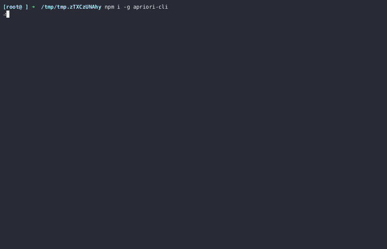

<p align="center">
  Languages:
  <a href="./README.md">English</a> ·
  <a href="./README_cn.md">中文</a>
</p>

# A Practical Handbook for Spec-Driven Development

## What is this & how to use it

**apriori** is a spec-driven workflow for AI coding, plus a zero-dependency CLI (`apriori-cli`) that makes your specs **executable**: every scenario is bound to a test, so "spec'd but never built" is caught by a command, not by eyeballing a diff. You drive an AI agent through a state machine — refine the spec, adversarial review by a *different* model, implement, archive — stopping at the human gates that matter.

Humans start with the Quickstart below; AI agents read the self-contained [RUNBOOK.md](./RUNBOOK.md) instead and never need this handbook. apriori answers in **whatever language you write in** (pin it with `apriori init --language 中文` if you prefer).

<p align="center">
  
  <br><sub><b>spec → red → green → gate → archive.</b> <code>verify</code> refuses to go green until there is real, passing test evidence for the change — a false &ldquo;done&rdquo; is caught by a command, not by eyeballing a diff.</sub>
</p>

## Quickstart

apriori is built to be **driven by an AI agent** — you talk, it runs the loop, you approve at the gates. **Route A** is how you'll actually use it; **Route B** runs the same loop by hand once, so you can see (and trust) every command the agent issues. Requires Node ≥ 22 and a POSIX shell.

### Route A — the way you'll actually use it (Claude Code)

<p align="center">
  
  <br><sub>Real, unedited run (waits cut): <code>npm i</code> → <code>apriori init</code> → <code>/apriori</code> a tiny change → <code>/goal</code> drives spec → review → implement → verify → gate → archive on its own, stops at the one human gate for your OK, then you run the tool it built. You say what you want and nod once.</sub>
</p>

Install once (`npm i -g apriori-cli`), then in your project name the AI tools to wire up:

```text
apriori init --tools claude
```

(The known tools are `claude, codex, cursor, copilot, opencode, windsurf` — run `apriori init` bare and the message lists them, plus any it detects in your project.)

It previews what it'll write, asks `Proceed? (Y/n)`, then scaffolds `apriori/` and gives Claude Code its two pointers: a `CLAUDE.md` rule and a `/apriori` slash command. Now launch Claude Code (`claude`) and drive it in plain language:

- **Idea still fuzzy** → type `/apriori` with no arguments. It brainstorms with you first — asking the edge questions you didn't think of — and **writes nothing durable until you approve**.
- **Change already clear** → type `/apriori add-reopen` (any change name). The agent reads the runbook, runs `apriori new` / `verify` / `gate` / `archive` in the background, pulls a *different* model for the adversarial review, and **stops at each human gate** to report and wait for your nod.

You do two things: **say what you want, and approve at the gates** — you never hand-write a spec or a state file. (The same protocol runs in Codex / Cursor / Windsurf / Copilot; `init --tools <tool>` just writes each one its own pointer.)

### Route B — see the engine (run the loop by hand once)

Route A's agent runs exactly the commands below. Doing them yourself once — ten minutes, empty directory to a spec-bound green — is the fastest way to trust what the agent does, and it's the deterministic path, so every output is checkable.

```shell
npm i -g apriori-cli
mkdir hello-apriori && cd hello-apriori
apriori init --tools claude --test-cmd "node --test --test-reporter=tap" --yes
apriori doctor --no-run
```

`init` here adds `--yes` to skip the confirmation prompt (handy for scripts and CI); `doctor` confirms the seam is healthy (expect `DOCTOR: HEALTHY`; exit 0).

```shell
apriori new hello
cat > apriori/changes/hello/flow-state.md <<'EOF'
change: hello
phase: review

## Open

gates:
  - 2026-01-01T00:00 note: quickstart demo
EOF
mkdir -p apriori/changes/hello/specs/hello
cat > apriori/changes/hello/specs/hello/spec.md <<'EOF'
## ADDED Requirements

### Requirement: greeting
The module SHALL greet by name.

#### Scenario: HL-01 greets by name
- WHEN greet('World') is called
- THEN it returns 'Hello, World'
EOF
apriori verify --change hello
```

Every change carries a tiny state file (`flow-state.md` — `mode` sizes the workflow; an agent normally maintains it for you) and its delta specs. `verify --change` binds scenarios against the **projected** store (the store as it will look after this change merges). One scenario, zero tests → `RESULT: GAPS`, exit 1. Fail-closed is the point. Now make it green:

```shell
mkdir -p test
cat > hello.js <<'EOF'
module.exports = { greet: (name) => `Hello, ${name}` };
EOF
cat > test/hello.test.js <<'EOF'
const { test } = require('node:test');
const assert = require('node:assert');
const { greet } = require('../hello');
test('HL-01 greets by name', () => assert.strictEqual(greet('World'), 'Hello, World'));
EOF
apriori verify --change hello
```

The test name carries the scenario ID, so `verify` can bind it — naming it this way is a convenience, never a requirement. Expect `RESULT: GREEN — spec is the test suite`, exit 0.

```shell
mkdir -p apriori/changes/hello/review
cat > apriori/changes/hello/review/step5-review-v1.md <<'EOF'
# step5 review, round 1

VERDICT: no major issues
EOF
cat > apriori/changes/hello/review/step5-review-v1-raw.txt <<'EOF'
<!-- provenance: provider=example model=example session=example date=2026-01-01 -->
the reviewer's own output, landed verbatim
EOF
apriori gate --change hello --json
apriori archive --change hello --write
apriori verify --specs apriori/specs
apriori check
```

The two review files are the one thing neither mode may drop: **the single independent review** — `gate` and `archive` refuse a change that has none, `fast` and `standard` alike. Here they are hand-written because this is a demo; in a real change the `.md` carries the reviewer's verdict and the `-raw.*` file its output verbatim, from a *different* model (runbook R2). Note what is NOT in this bundle: no requirement doc, no proposal, no design doc, no gap report, no task list — 6.0 asks for none of them, in either mode. `gate` aggregates the mechanical checks into one exit code (its PASS never replaces a human decision). `archive --change` merges the delta into the living store `apriori/specs/` and files the change away — it **refuses a change that is not finished**, which is why the flow-state above already says `phase: review` (the delivering phase); then it declares three states and freezes the bundle. Plain `verify` now proves the merged store, and `check` is your CI guard. That's the loop Route A automates for you: **ground → spec → red → green → review → gate → archive**.

## Where everything else lives

| doc | what's in it |
|---|---|
| [docs/concepts.md](./docs/concepts.md) | why it works this way: core concepts, the AI toolbox, the four-phase workflow, the mini-kv worked example, the prompt library |
| [docs/legacy.md](./docs/legacy.md) | existing codebases: the knowledge-base loop, doctor-first onboarding |
| [docs/ci.md](./docs/ci.md) | ready-to-paste CI snippets for `check` / `verify` / `gate`, exit-code table |
| [docs/cli.md](./docs/cli.md) | all ten subcommands: exact synopses, flags, exit codes, configuration reference |
| [docs/troubleshooting.md](./docs/troubleshooting.md) | every doctor finding and the classic traps, each with its fix |
| [RUNBOOK.md](./RUNBOOK.md) | the agent-facing executable protocol (canonical where they disagree) |

### Command Cheat Sheet

| `apriori` command | When | Purpose |
|---|---|---|
| `apriori init` | once per project | scaffold `apriori/` + per-tool pointers |
| `apriori doctor` | onboarding / anytime | diagnose the project↔apriori seam; findings name their fixer |
| `apriori new <name>` | change kickoff | scaffold `apriori/changes/<name>/` + a flow-state skeleton |
| `apriori status` | anytime | where each change is: phase, reality check, evidence, next actions (`--json`; `--escalation` exits 3) |
| `apriori verify` | Build & Test exit gate | confirms tests actually ran and nothing attributable is failing; scenario-ID binding gaps are reported as diagnostics, not gates; `--change <name>` = the projected, mid-change form |
| `apriori stamp <store-file>` | delta authoring | print the CAS base-stamp line — verify/archive refuse if the store diverged since |
| `apriori gate --change <name>` | Build & Test / Review, CI | one exit code over the mechanical checks (PASS ≠ a human decision); `--review-ready` is the transient admission view |
| `apriori archive` | Review & Deliver | merge delta specs into the living store; `--change <name>` = whole-change, failure-atomic (up to the commit point) |
| `apriori check` | CI / pre-commit | structural consistency (scenario IDs bindable) |
| `apriori update` | after a CLI upgrade | refresh the runbook copy + command pointers (never your files — one exception, stated: a pre-manifest `apriori/runbook.md`, written by a CLI older than `managed.json`, is adopted and overwritten once, then protected like any managed file; an old tool-written pointer paragraph in a rules file is upgraded in place, the rest of the file untouched) |

## Acknowledgments

The artifact interface this workflow is built on — delta specs (`ADDED` / `MODIFIED` / `REMOVED`), Requirement/Scenario blocks with stable IDs, the archive-merge semantics, and the multi-tool `init` scaffolding pattern — is directly inspired by **[OpenSpec](https://github.com/Fission-AI/OpenSpec/)**, which the V1 and V2 lines used directly. V3 reimplements that interface natively as the zero-dependency `apriori` CLI rather than depending on it — but the shape of the interface is OpenSpec's, and the debt is gladly acknowledged.
