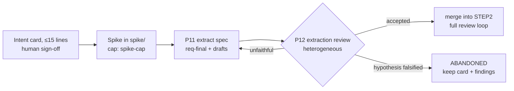
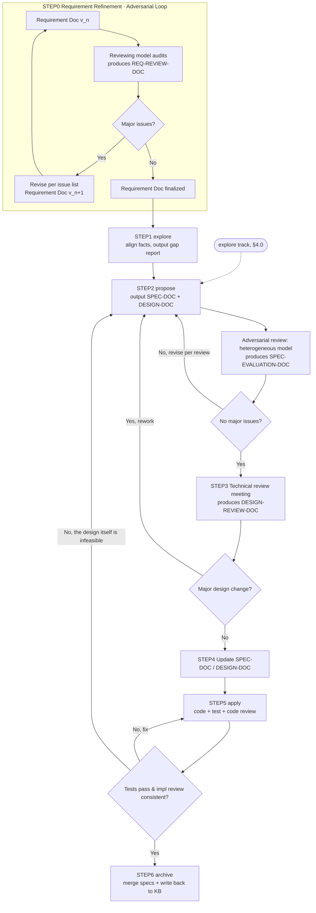
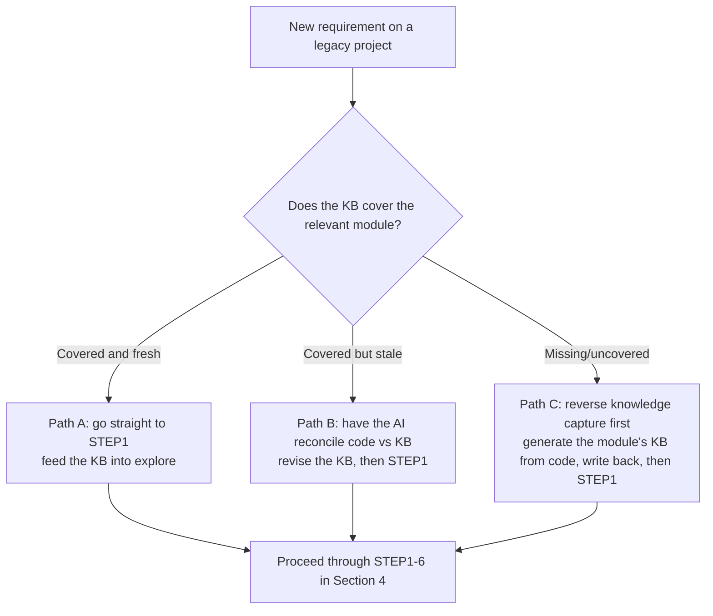

<p align="center">
  Languages:
  <a href="./README.md">English</a> ·
  <a href="./README_cn.md">中文</a>
</p>

# A Practical Handbook for Spec-Driven Development

## What is this & how to use it

**apriori** is a spec-driven workflow for AI coding, plus a zero-dependency CLI (`apriori-cli`) that makes your specs **executable**: every scenario is bound to a test, so "spec'd but never built" is caught by running a command — not by eyeballing a diff. You drive an AI agent through a state machine (refine the spec → adversarial review by a *different* model → implement → archive), stopping at the human gates that matter.

```shell
npm i -g apriori-cli              # zero dependencies; or install from GitHub (see §3.3)
cd your-project && apriori init   # scaffold the workflow, pick your AI tools
```

Then tell your agent: *"Follow the apriori runbook for change `<name>`."* It runs the workflow to the next human gate, then stops and reports. Three deterministic gates are CLI commands: **`apriori verify`** (every scenario has a passing test), **`apriori archive`** (merge the change's specs into the living store), **`apriori check`** (CI consistency). Everything below is the full walkthrough for humans — AI agents read the self-contained [RUNBOOK.md](./RUNBOOK.md) instead.

**Language.** By default apriori works in **whatever language you write in** — a Chinese kickoff produces Chinese requirement docs, specs and messages. (Scenario IDs like `CALC-01`, verdict lines and file paths always stay English, so `apriori verify`/`check` keep working.) To pin one language regardless of how you type, set the `language` field in `apriori/process-config.md` (e.g. `中文` or `English`; the default is `auto` = match you) — or scaffold it up front with `apriori init --language 中文`.

---

> This handbook is written for developers with an **engineering background**, and is a complete, self-contained guide.
> It assumes you start from **a clean machine**, and covers: environment setup → tool selection → the full workflow → a worked example → legacy-project development → a prompt library → configuration reference.

> 🤖 **AI agents have their own entry point: [RUNBOOK.md](./RUNBOOK.md)** — the self-contained executable protocol (hard rules, state machine, prompts). Agents don't need this handbook. To adopt the workflow in your own project: copy the runbook in and add one reference line to your project's rules file (RUNBOOK §0). Humans: keep reading.

---

## Table of Contents

1. [Core Concepts: Why Do It This Way](#1-core-concepts-why-do-it-this-way)
2. [Your AI Toolbox (CLI / Codex / Cursor / Windsurf / Copilot)](#2-your-ai-toolbox)
3. [Environment Setup: Starting From Scratch](#3-environment-setup-starting-from-scratch)
4. [The Complete Workflow](#4-the-complete-workflow)
5. [Example Project: mini-kv (In-Memory Cache with TTL)](#5-example-project-mini-kv-in-memory-cache-with-ttl)
6. [Legacy Project Development: The Knowledge-Base Loop](#6-legacy-project-development-the-knowledge-base-loop)
7. [Prompt Library](#7-prompt-library)
8. [Configuration Reference (config.yaml / CLAUDE.md / per-tool rules)](#8-configuration-reference)

---

## 1. Core Concepts: Why Do It This Way

### 1.1 Agent = LLM + Tool Use

AI coding tools (Claude Code, Codex, Cursor's Agent, Windsurf Cascade, Copilot Agent) are all, at their core, the same loop:
**the LLM calls tools (read files, grep, run commands) → it steadily accumulates "known facts" in its context → once the set of known facts stabilizes, it infers from those facts how to write the code.**

> Corollary: **the more accurate and complete the facts you feed it, the more reliable its inferences.** The entire methodology is built around one thing — how to supply facts with high quality.

### 1.2 Document-Driven Development: Three Documents

The problem with vibe coding is that the prompt is too vague and the requirements too loose, so the AI "creatively" writes code within a huge space of freedom. The fix is to use documents to collapse that freedom onto the correct track. Three documents map to three kinds of facts:

| Document | Role | The question it answers |
|---|---|---|
| **Requirement Doc** (top-level prompt) | Describes the abstract intent `system state A → new state B` | "What should it become?" |
| **System Knowledge Base / TRUTH-DOC** (source of all facts) | An abstracted summary of all existing code; the set of black-box intents; maintained long-term | "What is it now (state A)?" |
| **Code** (real data flow) | The concrete landing of the knowledge base; how data actually flows internally | "How does it actually run, in detail?" |

> Once the Agent reads the **Requirement Doc** it knows the target state B; the **System Knowledge Base** lets it reconstruct most of the current state A; **Code** fills in the rest of the detail, and it now grasps most of the system's truth.
> **Without the system knowledge base, the Agent can only reverse-engineer abstract intent from the code — slow, and easy to guess wrong.** This is exactly the core tension Section 6 ("Legacy Project Development") is meant to resolve.

**North star:** this workflow is **Spec-Anchored** (specs persist as living documents); the endgame it paves toward — executable scenarios, "the spec *is* the test suite", trending toward the Spec-as-Source tier — lives in [VISION.md](./VISION.md). It is non-blocking guidance: no gate reads it; a change that conflicts with it merely records why. The scenario-ID ↔ test-name mapping in §4.8 is the first paving stone.

### 1.3 Test-Driven Development

Early in development, from the requirement doc plus existing facts, first produce test cases (scenario-style `if … then …`):

```
If the user is not logged in and visits the /profile page
Then redirect to /login, carrying a redirect parameter
```

After the AI writes the code and the tests, it **runs the tests itself**, keeping the code self-consistent and eliminating low-level mistakes (compile errors, missing fields, malformed data).

> Each scenario in the SPEC-DOC ([§4.5](#45-step2-produce-spec--design--adversarial-review)) is one such `if … then …`, so **the spec's scenarios *are* the test cases** the implementation must satisfy in STEP5 — "test-driven" here means letting the spec's scenarios drive the tests.

### 1.4 Adversarial Review

> **Adversarial review = use a model *different* from the "producer" to audit the output.** A single model acting as both athlete and referee will systematically overlook its own blind spots.

Developers hold several AI tools at once, which makes them naturally suited to adversarial review — **produce with tool/model A, poke holes with tool/model B**:

```
Claude Code (Opus/Claude)  ──produces──►  SPEC-DOC + DESIGN-DOC
        ▲                                       │
        │                                       ▼
   revise per review  ◄──SPEC-EVALUATION-DOC──  Codex / Cursor switched to GPT, reviews
```

**What actually makes a review adversarial — three independent levers:**

| Lever | Why it helps | Needs a 2nd tool? |
|---|---|---|
| **Different model weights** | Partially non-overlapping blind spots (the most intuitive lever — see the caveat below) | Yes |
| **Fresh context** | The reviewer never sees the producer's reasoning, so it isn't anchored to its conclusions | No |
| **Adversarial role** | The producer optimizes for "make it work"; the reviewer optimizes for "find where it breaks" | No |

> The last two levers matter *more* than the first, and neither requires a second tool. A **freshly-started session explicitly told to refute** catches most issues even when it runs the same model as the producer — because it isn't bound to its own earlier reasoning. The worst anti-pattern is **asking the model to "review what you just wrote" in the same conversation**: its context is full of its own justifications, so it rubber-stamps. Switching models but staying in one session is *weaker* than the same model in a fresh one. If you only have Claude Code, see [§2.4](#24-adversarial-review-with-only-claude-code).

**Fresh context vs. cross-round memory — the issue ledger.** Multi-round review has a built-in tension: each round's reviewer should be *fresh* (the second lever), yet it must remember earlier rounds to verify "was issue #3 actually fixed?" Keeping one long-lived reviewer session buys memory at the cost of freshness — after round 1, the reviewer is anchored to *its own* past findings too. The fix is to move the memory out of the session and into a file: a cumulative **issue ledger** per change ([§7.0](#70-the-issue-ledger-shared-by-all-review-loops)), where every issue carries an ID and a status (`open / fixed / rejected + reason / verified`). Each round's reviewer can then be a brand-new session: it reads the ledger to verify fixes and appends new findings, staying unanchored. The ledger doubles as the audit trail for human gates — rejections stay visible with their reasons, and a resurfacing issue reopens its old ID instead of masquerading as a new finding.

Adversarial review runs through three points: **① requirement-doc review (STEP0) ② spec + design review (STEP2) ③ code implementation review (STEP5)** — and every round of each one logs to the same per-change issue ledger.

**An honest caveat on LLM judges.** Heterogeneity reduces bias but does not eliminate it: self-preference in LLM judges is driven by *familiarity* (perplexity), not authorship — a different model only partially escapes it; code defects are partly **shared, systemic weaknesses across models**, so a cross-model reviewer inherits some of the producer's blind spots; and in one four-tool review comparison, 93.4% of distinct findings were caught by exactly one tool — review coverage is inherently incomplete. The implication: deterministic verification stays the primary instrument, always.

LLM adversarial review is one instrument in a larger verification portfolio — where quality actually comes from, stage by stage, is stated once in [§1.5](#15-where-quality-comes-from).

### 1.5 Where Quality Comes From

Four principles every mechanism in this handbook (and the RUNBOOK) instantiates:

1. **Quality comes from different instruments at different stages.** In a change's requirement/spec **document stages** (STEP0/2), LLM review is the only instrument available — there it is the primary one, and it never drops below one round per stage per change. In the **implementation stage** (STEP5), executable verification is primary (v1.0 already worked this way); LLM review covers what execution can't judge.
2. **Intent comes first; the spec's form may come later.** On any track, a human-acknowledged statement of intent precedes code; the tracks (§4.0) differ only in when the full spec crystallizes — **the spec is a conserved quantity at merge time**.
3. **Supervision parameters are never written by the supervised.** Round caps and shrink decisions live in a human-held config and human gates; the agent reports data, never adjusts its own oversight.
4. **Extracted descriptions are drafts until reviewed.** Anything reverse-derived from code or a prototype (P10, P11) must pass review before anything downstream consumes it.

**Compatibility with the V1 baseline (v1.0), honestly stated:** the harden track's paths, gates, exit conditions and prompt numbering are unchanged (default config: zero path drift); exit conditions gained mapping variants only for project types v1.0 never defined (docs-only projects). The explore track is an **addition** whose named decision points — `intent-card sign-off`, `extraction review`, `STEP2 full review` — carry gate status. Gate consolidation (RUNBOOK §1) is an explicit, logged, revocable human authorization, never covering the shrink decision, the KB sign-off, or the intent-card sign-off — though each of those may still be decided by presented-first explicit proxy (RUNBOOK §1).

---

## 2. Your AI Toolbox

This methodology is **decoupled from any specific tool** — any "LLM + Tool use" Agent can run it. Below are common tools, their roles, and how they pair up.

### 2.1 Tool Overview

| Tool | Form | Default model ecosystem | `apriori init` entry | Role in this workflow |
|---|---|---|---|---|
| **Claude Code CLI** | Terminal | Claude (Opus/Sonnet/Haiku) | `CLAUDE.md` + `/apriori` command | Primary producer + complex logic |
| **Codex** | CLI / IDE | GPT family | `AGENTS.md` + `.codex/prompts` | Adversarial review (a GPT perspective) |
| **Cursor** | IDE (VSCode-derived) | Multiple models | `.cursor/rules/apriori.mdc` (rule-level) | Produce or review, depending on the chosen model |
| **Windsurf** | IDE | Multiple models (Cascade) | `.windsurf/rules` + workflow | Produce or review |
| **Copilot** | IDE plugin | Multiple models | `.github/copilot-instructions.md` | Produce or review, inline completion |

> ⚠️ `apriori init` writes each tool a thin **pointer** to the one self-contained `apriori/runbook.md` in that tool's native location — a slash command where the tool supports one (Claude Code, Codex, Windsurf), a rule-level entry otherwise (Cursor, Copilot). **The protocol lives once; only the entry point differs per tool.** The four step actions (explore/propose/apply/archive, RUNBOOK §4) are universal.

> **Process-skill layers are swappable — artifact machinery is not.** The RUNBOOK's P1–P12 prompts *are* this workflow's own SDD skill layer; skill systems such as Claude Code's superpowers (TDD, debugging, planning) sit below it at the implementation layer — compatible, but no replacement for the artifact machinery (spec store, ledger, gates). On any conflict of instructions, the RUNBOOK stays canonical.

### 2.2 Switching Models / Tools

**Adversarial review requires the ability to switch models.** Common approaches:

- **Claude Code CLI** (switch **between Anthropic models** via an environment variable):
  ```shell
  # PowerShell
  $env:ANTHROPIC_MODEL="claude-opus-4-8"; claude
  $env:ANTHROPIC_MODEL="claude-sonnet-4-6"; claude

  # Linux / macOS / WSL
  ANTHROPIC_MODEL="claude-opus-4-8" claude
  ANTHROPIC_MODEL="claude-sonnet-4-6" claude
  ```
  > ⚠️ `ANTHROPIC_MODEL` **only works among Anthropic's own models**. To make Claude Code use a non-Anthropic model (e.g. GPT), you **cannot** just set it to `gpt-5.5` — the default endpoint does not serve that model and the call will error out. You must route through a gateway/proxy that speaks the Anthropic protocol:
  > ```shell
  > # e.g. a gateway like LiteLLM / claude-code-router forwarding the request to GPT
  > ANTHROPIC_BASE_URL="https://your-gateway.example.com" ANTHROPIC_MODEL="gpt-5.5" claude
  > ```
  > If you just want a GPT review perspective, **the simpler path is to use Codex / Cursor directly** (below) — no gateway needed.
- **Cursor / Windsurf / Copilot**: switch directly via the model dropdown in the chat box.
- **Codex**: specify the model via its config or the `-m` launch flag; to actually drive it from the CLI for a multi-round review, see [§2.3](#23-driving-codex-non-interactively-multi-round-adversarial-review).

> 💡 Recommended combo: **Claude Code (Opus) for production + Codex/Cursor on GPT for review**. The two model families have non-overlapping blind spots, which makes the adversarial pass most effective.
> 🐧 Linux / macOS / WSL is the best environment for CLI-type tools — rich command tooling and the most training examples in LLM corpora, so behavior is most stable.

### 2.3 Driving Codex Non-Interactively (Multi-Round Adversarial Review)

The adversarial-review loop (review → revise → re-review) only works if the reviewing tool **remembers the previous round**. With Codex you run this straight from the command line — no IDE needed — using `codex exec` to open a review session and `codex exec resume` to keep every round in **one conversation context**.

**Round 1 — open a session:**
```shell
# -s read-only : the reviewer only audits; it must not modify your files
# --skip-git-repo-check : only needed when running outside a git repo
codex exec -s read-only "<your review prompt — e.g. the RUNBOOK P5 reviewer prompt>"
```
The output header prints a line like `session id: 019f....`. **Copy that id** — it's the handle for the next round. (Invoking codex from a script or background job? Close stdin — append `< /dev/null` — or it waits for input and hangs.)

**Round 2…N — resume the same context:**
```shell
# codex CLI ≥ 0.14x: `resume` rejects -s — pass the sandbox as a config override
codex exec resume -c sandbox_mode="read-only" <session-id> "I've revised per your last review; re-review and produce v{N+1}."
# older CLIs: -s works, but flags MUST come before the session id
codex exec resume -s read-only <session-id> "..."
```
Because the session is preserved, the reviewer still remembers its earlier findings — it can verify "was issue #3 actually fixed?" instead of starting over each round.

> Don't want to track the id? `codex exec resume --last "..."` continues the most recent session. But with several reviews in flight that's ambiguous, so prefer the explicit id for real review loops.

**Pick the reviewing model** (keep it a *different* family from the producer — that's the whole point): `codex exec -m <model> ...`, or set the default in Codex's config.

> ⚠️ **Transport warnings are gateway-specific, not failures.** If your Codex is pointed at a **custom / self-hosted gateway**, you may see `failed to connect to websocket: 404` followed by `Falling back ... to HTTPS`. That only means *that gateway* doesn't serve the WebSocket transport — the request still completes over HTTPS and the review is unaffected; on the official endpoint you won't see it at all. If the noise bothers you, filter it:
> ```shell
> codex exec ... 2>&1 | grep -v -E "websocket|Reconnecting|Falling back"
> ```

> 💡 Even with `resume`, keep the **issue ledger** ([§7.0](#70-the-issue-ledger-shared-by-all-review-loops)) updated every round — the session gives the *reviewer* memory, but the ledger gives *you* (and every human gate) the audit trail, and it lets you swap in a completely fresh reviewer at any round without losing state.

### 2.4 Adversarial Review With Only Claude Code

No Codex or second tool? You can still run a real adversarial loop — you just give up the "different model family" lever ([§1.4](#14-adversarial-review)) and lean on **fresh context + adversarial role**, which carry most of the weight anyway.

**The one rule: the reviewer must be a *separate session* — never a "now review your own work" turn inside the producer's conversation** (there its context is full of its own justifications, so it rubber-stamps). Open a second terminal, start a fresh `claude` on a different tier, and feed it only the artifacts (spec / design / code paths) plus the reviewer prompt from the RUNBOOK (§5):

```shell
# left terminal — producer
claude                                    # Opus by default; produces SPEC-DOC / code

# right terminal — reviewer: fresh context + a different tier
ANTHROPIC_MODEL="claude-sonnet-4-6" claude
# then paste the RUNBOOK P5 / P8 reviewer prompt, pointing at the artifact paths
```

This two-terminal setup is the Claude-only equivalent of §2.3's `codex exec` / `resume` loop: produce on the left, hand the artifacts to the right, paste findings back, repeat until "VERDICT: no major issues." One difference from `resume`: a fresh `claude` remembers nothing across rounds — so hand the reviewer the **issue ledger** ([§7.0](#70-the-issue-ledger-shared-by-all-review-loops)) along with the artifacts. It verifies earlier fixes from the ledger while keeping fresh eyes; per [§1.4](#14-adversarial-review), that combination is worth having even when `resume` is available.

**Match the model tier to the review point:**

| Review point | What it needs | Suggested reviewer |
|---|---|---|
| STEP0 / STEP2 (requirement / design) | Judgment & reasoning | the **strongest** model available (e.g. Opus), fresh session |
| STEP5 (impl vs spec consistency) | Semantic faithfulness (binding already done by `apriori verify`) | **Sonnet 4.6 / Haiku 4.5** — fast and cheap is enough |

> ⚠️ Don't point a weaker model at a stronger one's hard reasoning — auditing an Opus design with Haiku tends to miss exactly the subtle issues Haiku can't follow. Review *sideways or down* in capability, not steeply up. (`/model` switches the current session, but for review always **start a new session** so the reviewer keeps fresh eyes.)

---

## 3. Environment Setup: Starting From Scratch

Assume a clean machine. Every step below gives **a command you can run directly** plus **a verification command** — no steps skipped.

### 3.1 Install Node.js (The Runtime for Everything)

The `apriori` CLI runs on Node.js, so install that first. **Use a version manager** so you can switch versions later.

**macOS / Linux / WSL (nvm recommended):**
```shell
# 1. Install nvm (the v0.40.1 in the script is an example version — use the latest release from the nvm repo)
curl -o- https://raw.githubusercontent.com/nvm-sh/nvm/v0.40.1/install.sh | bash
# 2. Reload your shell config (or reopen the terminal)
source ~/.bashrc   # zsh users: source ~/.zshrc
# 3. Install and activate the latest LTS Node
nvm install --lts
nvm use --lts
```

**macOS (Homebrew also works):**
```shell
brew install node
```

**Windows (pick one):**
```powershell
# Option A: winget (built into Win10+)
winget install OpenJS.NodeJS.LTS

# Option B: nvm-windows — download the installer from https://github.com/coreybutler/nvm-windows/releases, then:
nvm install lts
nvm use lts
```

**Verify (a version number means success):**
```shell
node -v   # e.g. v22.x.x
npm -v    # e.g. 10.x.x
```

> You can also let the AI do it: in your AI tool, send "Check whether this machine has Node.js LTS installed; if not, install it the appropriate way for this OS and print the version." But it's worth **doing it manually at least once** so you understand what's being installed.

### 3.2 Install AI Coding Tools (Pick 1–2 as Needed)

- **Claude Code CLI**: `npm install -g @anthropic-ai/claude-code`, then `claude` to launch and log in.
- **Cursor / Windsurf**: download the installer from the official site and log in.
- **Copilot**: install the plugin in VSCode / JetBrains and log in to GitHub.
- **Codex**: install the CLI / plugin per its official docs and log in.

> For adversarial review, **install at least two tools from different model ecosystems** (e.g. Claude Code + Cursor, or Claude Code + Codex).

### 3.3 Install and Initialize apriori

Two ways to install — both give you the same `apriori` command. The CLI is self-contained (**zero runtime dependencies**, pure Node).

**A. From npm (recommended):**
```shell
npm install -g apriori-cli        # or run any command via `npx apriori-cli …`
apriori --help                    # verify
```

**B. From GitHub (no npm registry needed):**
```shell
npm install -g github:Apriorhythm/apriori-spec-development#v3
```
> If a GitHub install ever serves a stale version (npm caches git installs), clear the cache first: `npm cache clean --force`.

From your project root, scaffold the workflow:
```shell
cd /path/to/your-project
apriori init
```

`apriori init` lets you **check the AI tools you use** (multiple allowed) and writes each a thin pointer to the one `apriori/runbook.md` in that tool's native location (Claude Code → `CLAUDE.md` + slash command; Cursor → `.cursor/rules`; Copilot → `.github` instructions; etc.). It creates the single `apriori/` root (`runbook.md`, `process-config.md`, and the `specs/ changes/ review/ truth/` working dirs). It is additive and never overwrites — **commit `apriori/` to version control.**

> Upstream (with the latest per-tool integration docs): https://github.com/Apriorhythm/apriori-spec-development

### 3.4 Command Cheat Sheet

| `apriori` command | When | Purpose |
|---|---|---|
| `apriori init` | once per project | scaffold `apriori/` + per-tool pointers |
| `apriori verify` | STEP5 exit gate | bind every scenario ID to a passing test (GREEN or GAPS) |
| `apriori archive` | STEP6 | merge a change's delta specs into the living store |
| `apriori check` | CI / pre-commit | structural consistency (anchors, scenario IDs, drift) |

The four **step actions** the runbook refers to — explore (STEP1), propose (STEP2), apply (STEP5), archive (STEP6) — are prompts the agent runs (RUNBOOK §5); only `archive` also has a deterministic CLI (`apriori archive`).

---

## 4. The Complete Workflow

### 4.0 Size the Change First

STEP0–STEP6 below describe the **full** pipeline. Running all of it on a typo-level fix is how teams end up abandoning the process altogether — so before anything else, size the change and run only the steps that pay for themselves:

| Tier | Typical shape | Steps to run |
|---|---|---|
| **Trivial** | Bugfix / single file; no new user-visible behavior; no shared-state change | Light `explore` (facts only) → STEP5 `apply` with tests + one consistency-review pass → STEP6 writeback if any KB fact changed |
| **Medium** | One module; new user-visible behavior | STEP0 (1–2 rounds) → STEP1 → STEP2 (1–2 review rounds) → STEP5 → STEP6; STEP3 shrinks to an async design look-over |
| **Large** | Cross-module / touches external shared state / data migration / new subsystem | The full STEP0–STEP6, every gate included |

Two rules of thumb: **anything touching external shared state (§8.1's three-moments rule) or crossing module boundaries is Large, no matter how small the diff looks**; and when in doubt, start one tier lower and escalate the moment `explore` or a review surfaces a surprise — escalating early is cheap, discovering a missing spec in production is not.

**The second axis: goal certainty.** Sizing decides how much process; certainty decides *which track*. On both tracks intent comes first and **the spec is a conserved quantity at merge time** — the tracks differ only in when it crystallizes ([§1.5](#15-where-quality-comes-from)).

| Situation | Track |
|---|---|
| Goal and acceptance stateable, even roughly | **Harden** (default) — the STEP0 loop refines them |
| Goal clear, approach unknown | **Harden** — approach uncertainty is design work, not goal uncertainty |
| Neither goal nor acceptance stateable | **Explore** |
| Exploration reveals a clear goal | switch to Harden immediately |

**Tripwires outrank certainty**: shared-state / production-data / cross-module / migration changes never take the explore track, however vague — they go Harden, optionally with a research spike (RUNBOOK §4's STEP1 variant). When in doubt: **Harden** — the opposite default from the size axis, because the risks point the other way. The track and its rationale land in the state file and are reported at the next human gate.

The explore track in one picture — it merges into the main flow at STEP2 ([§4.2](#42-overview-flowchart)):


```mermaid
graph LR
    IC[Intent card, ≤15 lines<br/>human sign-off] --> SP[Spike in spike/<br/>cap: spike-cap]
    SP --> P11[P11 extract spec<br/>req-final + drafts]
    P11 --> P12{P12 extraction review<br/>heterogeneous}
    P12 -- accepted --> S2[merge into STEP2<br/>full review loop]
    P12 -- unfaithful --> P11
    P12 -- hypothesis falsified --> AB[ABANDONED<br/>keep card + findings]
```

### 4.1 Glossary

| Abbreviation | Full name | Description |
|---|---|---|
| TRUTH-DOC | System knowledge-base doc | The abstracted set of all known facts about the current system, maintained long-term (default: `apriori/truth/` inside the code repo — see §6) |
| SPEC-DOC | Spec doc | The requirement spec produced by the propose action, describing every scenario of this change |
| DESIGN-DOC | Design doc | The technical approach for this change, output by the propose action |
| REQ-REVIEW-DOC | Requirement review doc | The issue list the reviewing model produces on the requirement doc in **STEP0** |
| SPEC-EVALUATION-DOC | Spec review doc | In **STEP2** adversarial review, another model's audit of SPEC-DOC + DESIGN-DOC |
| DESIGN-REVIEW-DOC | Technical review record | The conclusions and revisions from the human **STEP3** technical review meeting |
| Issue ledger | Cumulative issue table | One per change, shared by every review loop; each issue carries an ID and a status — see [§7.0](#70-the-issue-ledger-shared-by-all-review-loops) |
| Intent card | Explore-track intent statement | ≤15 lines: goal hypothesis / success criteria / spike questions; human-signed **before** any spike (RUNBOOK §4) |
| P11 / P12 | Extraction & its review | P11 extracts the spec from a validated prototype; P12 (heterogeneous) reviews it against the intent card |
| track | Certainty-axis routing | `harden` or `explore`, with a rationale, in the state file ([§4.0](#40-size-the-change-first)) |

**Where each artifact lives** (these paths are the conventions used throughout the RUNBOOK's prompts — adjust to your repo; process artifacts can also be relocated wholesale via the state file's `artifact-root` field, whose semantics live in RUNBOOK §3):

| Artifact | Default location |
|---|---|
| Requirement doc | `requirement/req-v{N}.md`, finalized as `requirement/req-final.md` |
| REQ-REVIEW-DOC | `apriori/review/<change>-req-review-v{N}.md` (prefix with the change name — parallel changes must not overwrite each other) |
| Gap report (STEP1 output) | `apriori/explore/<change>-gap-report.md` |
| Issue ledger | `apriori/review/<change>-issues.md` |
| SPEC-DOC / DESIGN-DOC / tasks.md | `apriori/changes/<change>/specs/`, `…/design.md`, `…/tasks.md` |
| SPEC-EVALUATION-DOC | `apriori/design/<change>-review-v{N}.md` |
| Intent card (explore track) | `requirement/intent-card.md` |
| Extraction review (explore track) | `apriori/review/<change>-extraction-review-v{N}.md` |
| Prototype (explore track) | `spike/` — deleted or quarantined at archive; never referenced by tasks.md |
| TRUTH-DOC (knowledge base) | `apriori/truth/<module>.md`, **in the same repo as the code** (a separate KB repo also works if every doc carries a `source-commit` stamp — see §6) |

### 4.2 Overview Flowchart

> The flowchart explicitly draws the **STEP0 requirement-doc adversarial review loop**, as well as the **loop-backs** between phases.

> **This chart is the harden track — the default.** Vague-goal changes run the explore track ([§4.0](#40-size-the-change-first)'s small chart) and merge into this one at STEP2, drawn below as the dashed arrival.


```mermaid
graph TD
    X0([explore track, §4.0]) -.-> C
    subgraph S0[STEP0 Requirement Refinement · Adversarial Loop]
        A1[Requirement Doc v_n] --> A2[Reviewing model audits<br/>produces REQ-REVIEW-DOC]
        A2 --> A3{Major issues?}
        A3 -- Yes --> A4[Revise per issue list<br/>Requirement Doc v_n+1]
        A4 --> A1
        A3 -- No --> A5[Requirement Doc finalized]
    end

    A5 --> B[STEP1 explore<br/>align facts, output gap report]
    B --> C[STEP2 propose<br/>output SPEC-DOC + DESIGN-DOC]

    C --> D[Adversarial review: heterogeneous model<br/>produces SPEC-EVALUATION-DOC]
    D --> D2{No major issues?}
    D2 -- No, revise per review --> C

    D2 -- Yes --> E[STEP3 Technical review meeting<br/>produces DESIGN-REVIEW-DOC]
    E --> F{Major design change?}
    F -- Yes, rework --> C
    F -- No --> G[STEP4 Update SPEC-DOC / DESIGN-DOC]
    G --> H[STEP5 apply<br/>code + test + code review]
    H --> H2{Tests pass & impl review consistent?}
    H2 -- No, fix --> H
    H2 -- No, the design itself is infeasible --> C
    H2 -- Yes --> I[STEP6 archive<br/>merge specs + write back to KB]
```

> Every loop drawn here has a machine-checkable exit condition, so each can be **driven automatically by `/goal`** — see [§4.10](#410-automating-the-loop-with-goal-claude-code).

> One loop-back the chart doesn't draw: if implementation reveals the **requirement itself** was wrong, go all the way back to STEP0 — coding around a wrong goal is the most expensive loop in the diagram.

### 4.3 STEP0: Requirement Refinement (Adversarial Review, Up to 5 Rounds)

> The requirement doc is the **top-level prompt** for AI development — make it precise. Ideally, product runs an AI self-check on it first. If it lacks any of the three essentials — goal / out-of-scope / testable acceptance — have the AI interview you with structured questions before drafting. (Round numbers in this section's title and below are defaults — `process-config.md` is the source of truth.)

This step is itself an adversarial loop:

```
Requirement Doc v1.0 ──► reviewing model audits ──► REQ-REVIEW-DOC (issue list)
        ▲                                                  │
        └────────── revise to v2.0 ◄───────────────────────┘   … (up to 5 rounds)
                                          │
                          until "VERDICT: no major issues" ──► finalized
```

- **The reviewing model should differ from the one that drafted the requirement** (e.g. draft with Claude, review with GPT).
- Fix the review dimensions as a checklist: **is target state B clear / any ambiguity / are edge cases and exceptions covered / any implied-but-undeclared state changes / are acceptance criteria testable**.
- **Exit condition**: the reviewing model explicitly outputs "VERDICT: no major issues", or a human decides after hitting the 5-round cap.
- **Every round also logs to the issue ledger** (`apriori/review/<change>-issues.md`, [§7.0](#70-the-issue-ledger-shared-by-all-review-loops)): new findings get IDs, fixes flip statuses, and a reopened ID is your early warning that the loop isn't converging.

For the prompt, see [§7.1](#71-step0-requirement-doc-adversarial-review).

### 4.4 STEP1: Explore & Align

The **explore action**. Explore based on all known facts, and align the design.

- **Inputs**: TRUTH-DOC (the KB, `apriori/truth/`), any leftover SPEC-DOC from the previous round, the code, the finalized requirement doc.
- **Output**: an alignment report listing the **gap between current state A and target state B**, saved to `apriori/explore/<change>-gap-report.md`.

> **Skim the gap report before running propose** — it's the cheapest gate in the pipeline. A wrong or missing fact caught here costs a minute of reading; the same fact caught by the STEP2 reviewer costs a review round, and caught in STEP5 it costs a rework.

> Legacy projects depend on this step especially: see Section 6 — make sure the KB covers the relevant modules first, or `explore` will surface facts with holes in them.

### 4.5 STEP2: Produce Spec & Design + Adversarial Review

The **propose action**. Produce the proposal, all spec docs (SPEC-DOC), and the design doc (DESIGN-DOC), then enter adversarial review:

```
SPEC-DOC + DESIGN-DOC_V1  ──reviewing model──►  SPEC-EVALUATION-DOC_V1
SPEC-EVALUATION-DOC_V1    ──producer revises──►  SPEC-DOC + DESIGN-DOC_V2
SPEC-DOC + DESIGN-DOC_V2  ──reviewing model──►  SPEC-EVALUATION-DOC_V2
… (up to N rounds)
```

Each round mirrors its findings into the issue ledger ([§7.0](#70-the-issue-ledger-shared-by-all-review-loops)), so the producer's accept/reject calls stay visible to the STEP3 human gate.

**Exit condition**: the reviewing model explicitly outputs "VERDICT: no major issues, ready to proceed to execution", or a human decides after the cap. Prompt: see [§7.3](#73-step2-adversarial-review-and-revision).

### 4.6 STEP3: Technical Review

Hold a technical review meeting on the `DESIGN-DOC`; in parallel, hand the `spec.md` inside the `SPEC-DOC` (which holds all the scenarios) to QA. Record the conclusions as the DESIGN-REVIEW-DOC.

> If the review produces a **major design change**, return to STEP2 and re-run the propose action.

> **Solo developer?** There's no meeting to hold — substitute a self-review against a fixed checklist (the [§7.3](#73-step2-adversarial-review-and-revision) reviewer checklist works) plus one extra fresh-session heterogeneous review round, and still record the conclusions as DESIGN-REVIEW-DOC. The point of STEP3 is a decision record made *outside the producer's context*, not the meeting itself.

### 4.7 STEP4: Update Related Documents

Update SPEC-DOC and DESIGN-DOC per the DESIGN-REVIEW-DOC; you can layer on another round of adversarial review.

### 4.8 STEP5: Code + Test + Implementation Review

The **apply action**. Write code per the SPEC-DOC — **tests first**: derive one failing test per spec scenario (named with the scenario's ID), then implement in tasks.md order until everything is green. "All tests passing" is still the bar, and the failing-first run proves the tests can actually fail.

- **Traceability beats coverage numbers**: the hard requirement is *scenario coverage* — every spec scenario has at least one test carrying its ID, which a grep-level CI check can enforce ([§4.11](#411-mapping-the-workflow-onto-git--pr--ci)). Line coverage is a signal worth watching, not a target: a model told to "hit 100%" will happily pad with assertion-free tests. For high-risk logic, spot-check test quality with mutation testing.
- **Verification matrix by project type**: all code projects — lint/static analysis green (plus SAST where security-sensitive) — where configured; backend/library — unit + property tests, mutation spot-checks; UI — plus E2E/visual regression; deployed service — plus runtime contracts and canary + rollback (an hour on rollback capability usually buys more safety than an extra review round — a trade-off that exists only in the implementation stage, and note canaries catch regressions and crashes, not "built the wrong thing"); **docs-only — the checker script and example-command static checks are the test suite**. Where an instrument's precondition is missing (no deploy surface; solo; library; docs), LLM review is the primary instrument there — not a downgrade ([§1.5](#15-where-quality-comes-from)).
- **Prefer a stronger model (Opus) for complex logic, and a faster/cheaper model (Sonnet) for routine coding.**
- Add adversarial review: use **another model** (e.g. Sonnet 4.6 / GPT) to review the **consistency** between spec and implementation — focus on "written in the spec but missing in the code," and "the code has a `continue`/silent-skip/skip branch that the spec never declared as user-visible."
- **Tests span layers**: unit tests for logic (always); for a project **with a UI**, add E2E and visual-regression checks (e.g. Playwright screenshots). A pure library like §5's mini-kv has no UI, so it needs only unit tests — skip the Playwright clause in the [§7.7](#77-goal-recipes-automating-each-loop) recipe.

### 4.9 STEP6: Archive and Capture Facts

What the **archive action** (`apriori archive`) does: it **merges this change's delta specs into the living spec store** (`apriori/specs/`) per the interface's archive algorithm (RUNBOOK §4), keeping the store consistent with the final implementation.

> ⚠️ Note the distinction: the archive action **does NOT automatically update your own TRUTH-DOC** (`apriori/truth/` or a separate KB repo — §6). Writing this change's new/changed facts **back into the KB is a separate step** (use the prompt in [§7.5](#75-step6-archive) to have the AI do it explicitly, or write it manually).

**This step is the lifeline of long-term maintainability for legacy projects** — every change deposits new facts back into the KB, so the next `explore` has no holes. With the KB in the same repo (§6), the writeback rides in the same PR as the code, where a reviewer can actually see it — the enforcement mapping is in [§4.11](#411-mapping-the-workflow-onto-git--pr--ci).

### 4.10 Automating the Loop with `/goal` (Claude Code)

Every loop above already has a **machine-checkable exit condition** — which is exactly what Claude Code's `/goal` consumes. `/goal "<condition>"` makes Claude work across turns **unattended until the condition holds**; after each turn an independent fast model (Haiku) reads the transcript and decides done / not-done, looping until done or you stop it.

> **Prerequisite:** `/goal` needs Claude Code ≥ v2.1.139 and an accepted hook-trust dialog; it's unavailable if `disableAllHooks` / `allowManagedHooksOnly` is set. Check with `claude --version`. (On older versions, just drive the same loops by hand per §2.3 / §2.4.)

**The one architectural rule that keeps this sound:**

> `/goal`'s built-in evaluator only **reads the transcript** and only judges *"is the condition met?"* — it is a weak model, and it is **NOT** the adversarial reviewer. So the real check must happen **inside the loop and leave its verdict in the transcript**. `/goal` orchestrates the loop; it never replaces the test run, the E2E suite, or the heterogeneous reviewer.

That layering is what lets you automate **even adversarial review** without violating [§1.4](#14-adversarial-review): inside each turn Claude **calls the reviewer** (Codex via [§2.3](#23-driving-codex-non-interactively-multi-round-adversarial-review), or a fresh Claude session via [§2.4](#24-adversarial-review-with-only-claude-code)), pastes its verdict back, and the goal condition is simply *"the reviewer's verdict line is 'VERDICT: no major issues', or N rounds reached."* The judgment stays heterogeneous + fresh-context; `/goal` only reads whether that judgment landed in the transcript.

**What to automate, and what to leave as a human gate:**

| Phase | A sound `/goal` condition (transcript-checkable) | Backed inside the loop by |
|---|---|---|
| STEP0 | REQ-REVIEW-DOC written and its verdict line = `VERDICT: no major issues`, or step0-cap rounds (default 5) | a heterogeneous reviewer call each round |
| STEP2 | SPEC-EVALUATION-DOC verdict line = `VERDICT: no major issues, ready to proceed to execution`, or N rounds | a heterogeneous reviewer call each round |
| STEP5 | `npm test` exits 0 **and** lint/static analysis green (where configured) **and** every tasks.md item is `[x]` **and** the E2E/Playwright run is green **and** the consistency review reports no gaps, or N turns — substitute per §4.8's project-type matrix (docs-only: `apriori check`) | real test + E2E run + reviewer call |
| STEP6 | delta specs merged **and** the module's KB file updated | archive action + writeback |
| **STEP3 tech review · reverse-capture review · KB sign-off** | — **do not wrap these in a goal** | a human decides |

> Always cap it (`… or stop after N turns`): the cap maps to the handbook's ≤5-round limits and bounds cost — open-ended goals can run very expensive. Caps live in `process-config.md` — human-held, agent-read-only — with defaults STEP0 5, STEP2 4, STEP5 25 and a hard floor of 1 per review stage. If a loop **oscillates** (the verdict flip-flops, or the same ledger ID keeps getting reopened — [§7.0](#70-the-issue-ledger-shared-by-all-review-loops) makes this visible) or stalls without progress, treat hitting the cap as a signal to **escalate to a human** — not to quietly lower the bar. Run **one `/goal` per machine-checkable stretch, stop at each human gate**, then start the next. The ready-to-paste recipes ship in [RUNBOOK.md](./RUNBOOK.md) §6; their design notes are in [§7.7](#77-goal-recipes-automating-each-loop).

> **Tune the caps with data — under governance, not autopilot.** Every N changes (default 5) the agent *reports* a shrink/expand proposal whose data pack must contain: verified count, rejected count (with sampled reasons), reopened-ID count (including advisory upgrades), the advisory ratio (monitoring only), and wall-clock per change and per review stage (from the state file's timestamps; wall-clock includes human-gate waits — note it, or cost curves mislead; missing timestamps are `n/a`, never estimated). The rejected-ratio guard counts formal findings only — advisories are excluded from both sides, so relabeling can't dilute it. Shrinking is a **human gate decision** — blocked outright when the guard trips or the change class is tripwired. Shrinking lowers a stage's round cap with a hard floor of 1, so no stage ever reaches zero and exit conditions stay intact — and **you may shrink review rounds, but never trade them for fewer deterministic checks**; a post-merge re-review that finds a high-risk miss (including a real gap mislabeled advisory) restores the previous cap. Mind both directions: a producer can zero the metric by rejecting findings (that is what the guard is for); careless verifies merely delay shrinking. And if round 5 still surfaces real issues, the fix is upstream — requirement quality — not a higher cap.

### 4.11 Mapping the Workflow onto Git / PR / CI

Everything above is convention; a branch + CI mapping is what makes it *enforced*:

| Workflow element | Git / CI home |
|---|---|
| One change | One branch (`change/<change-name>`), one PR |
| SPEC-DOC / DESIGN-DOC / review docs / issue ledger | Committed on the branch — reviewers see the docs and the code in the same diff |
| STEP5 exit conditions | CI jobs on the PR: tests green; lint/static analysis green (where configured); every spec scenario ID appears in ≥1 test name (a grep-able traceability check); tasks.md all `[x]` — docs-only projects map "tests" to `apriori check` (§4.8) |
| Consistency-review verdict (§7.4) | Posted on the PR as a comment / required check before merge |
| STEP6 KB writeback | Part of the same PR — "code merged but KB not updated" becomes visible in review instead of silently accumulating |

**Parallel changes.** Each change can also take its own `git worktree` for an isolated working copy — most SDD tooling now automates this. In multi-lineage repos (several long-lived version lines), every requirement and its flow-state declare the **target lineage** (branch/line) up front — a lineage conflict discovered mid-change is an immediate-stop signal, not something to resolve in the merge editor. Branches isolate code, but two things still collide at archive time: the living spec store (`apriori/specs/`) and per-module KB files. Serialize archives per module — whoever merges second rebases their delta specs and KB diff — and treat a KB-file conflict as a signal that two changes touched the same facts: reconcile them deliberately, don't just pick a side in the merge editor.

---

## 5. Example Project: mini-kv (In-Memory Cache with TTL)

We'll run the whole workflow end-to-end on a small library with **real state and easy tests**. It's chosen because it lands squarely on a key spec rule — **"external shared state MUST describe the three moments: init / update / cleanup"** (see §8.1) — making it a good way to feel out the right spec granularity.

> Goal: a Node.js library `mini-kv` providing in-memory key-value storage with time-to-live (TTL).

### 5.0 Scaffold the Project

```shell
mkdir mini-kv && cd mini-kv
npm init -y
apriori init         # scaffold the apriori/ root and per-tool pointers
git init             # version control recommended, so you can diff each step
```

### 5.1 STEP0 · Write and Review Requirements

First write a plain-language requirement in `requirement/req-v1.md`:

```text
Build an in-memory key-value cache library, mini-kv:
1. set(key, value, ttlMs?): write a key-value; ttlMs is an optional expiry in ms, omitted means never expires;
2. get(key): return the value; if the key doesn't exist or has expired, return undefined;
3. del(key): delete the given key;
4. Expiry cleanup: expired keys must not be readable via get, and must not occupy memory long-term;
5. Overwrite: calling set again on an existing key overwrites both the old value and the old TTL.
```

Then have a **reviewing model** (a model/tool different from the one that drafted it) review it once per the prompt in [§7.1](#71-step0-requirement-doc-adversarial-review), filling in edge cases you missed (e.g. what `ttlMs<=0` does, whether `get` cleans up lazily or on a timer, concurrent-write semantics). Finalize as `requirement/req-final.md`.

### 5.2 STEP1 · explore

In your primary tool:
```text
* Requirement doc: requirement/req-final.md
* System knowledge base: (new project: none / legacy project: apriori/truth/ or your KB path)
* Code: this repo
Please align the facts and output a gap report between current state A and target B to apriori/explore/<change>-gap-report.md.
```

### 5.3 STEP2 · propose + Adversarial Review

```text
```
Pay attention to whether the resulting `spec.md` **gives each user-visible behavior its own scenario**, and whether the **external shared state (here, that in-memory map) describes the three moments: init / update-at-runtime / cleanup-and-invalidation**.
Then switch to your reviewing tool/model and review → revise per [§7.3](#73-step2-adversarial-review-and-revision), looping until "VERDICT: no major issues." Concretely, drive the review with Codex ([§2.3](#23-driving-codex-non-interactively-multi-round-adversarial-review)):
```shell
# round 1 — open the review session (note the printed session id)
codex exec -s read-only "Review apriori/changes/<change>/specs/ and design.md against requirement/req-final.md, using the RUNBOOK P5 checklist. End with a verdict line."
# each revision round — same context, so it checks whether your fixes landed
codex exec resume -c sandbox_mode="read-only" <session-id> "I revised per your last review; re-review and produce v{N+1}."
```

### 5.4 STEP5 · apply

> mini-kv is a solo project, so STEP3/STEP4 collapse into the [§4.6](#46-step3-technical-review) solo-mode self-check — one fresh-session look at the design is enough here; record anything you changed, then move on.

```text
First derive one failing test per spec scenario (test names carry the scenario IDs) and show me the failing run.
Then implement in tasks.md order until all tests pass and the feature is complete.
```
Expect output along the lines of:
- `src/mini-kv.js`: the core implementation
- `test/mini-kv.test.js`: covers set/get/del, TTL expiry, overwrite, `ttlMs<=0`, etc.

Run it to confirm:
```shell
npm test
```

To run the implement → test loop unattended, wrap it in a goal — the mini-kv form of the [§7.7](#77-goal-recipes-automating-each-loop) STEP5 recipe (it's a library, so no Playwright clause):
```text
/goal "All of: `npm test` exits 0; every spec scenario ID appears in at least one test name; every item in apriori/changes/<change>/tasks.md is [x]; and a consistency review by a different model (the RUNBOOK P8 prompt) reports 'VERDICT: no spec-vs-code gaps'. Cap: 15 turns. Turn 1: generate one failing test per spec scenario (named with its ID) and SHOW the failing run. Each later turn: implement the next tasks.md item, run `npm test` and SHOW the output. Stop when all hold or after 15 turns."
```
> The numeric caps in this recipe are example defaults — `process-config.md` is the source of truth.

### 5.5 Acceptance & STEP6 · archive

Verify by hand (the snippet below assumes a class `KV` is exported — adjust to whatever export shape was actually generated):
```shell
node -e "const KV=require('./src/mini-kv'); const k=new KV(); k.set('a',1,50); console.log(k.get('a')); setTimeout(()=>console.log(k.get('a')), 80);"
# expected: prints 1 first, then undefined after expiry
```
Once satisfied, archive:
```text
```
A new project's first archive **produces the initial TRUTH-DOC** (per §6's default: `apriori/truth/mini-kv.md`, in the same repo) — congratulations, your mini-kv now has a system knowledge base, and the next feature can start from the "knowledge base exists" path in Section 6. To calibrate granularity, here's roughly what that first KB doc should look like:

```markdown
---
module: mini-kv
source-commit: <commit sha at archive time>   # covers the Contract section only
---
# mini-kv — in-memory KV cache with TTL

## Contract (code-is-truth)

**Intent**: small in-process cache; single process, no persistence, no cross-instance consistency.

**Interface**
- `set(key, value, ttlMs?)` — overwrite replaces both value and TTL; `ttlMs <= 0` deletes the key immediately
- `get(key)` — `undefined` on missing *or expired*; reading an expired key deletes it (lazy expiry)
- `del(key)` — idempotent, no error on missing keys

**State & the three moments**: one in-memory `Map`, `key → { value, expiresAt }` — init: empty at construction, sweep timer starts on first `set`; update: every `set`/`del`, `get` may delete (lazy expiry); cleanup: lazy delete on `get` + periodic sweep, timer `unref()`ed so it doesn't hold the process open.

**Pitfalls (code-derived)**: between sweeps, an expired never-read key still occupies memory (bounded by the sweep interval); not safe across worker threads.

## Decisions (doc-is-truth)

- **DEC-1 (active)** — expiry = lazy delete **plus** a periodic sweep. *Rejected alternative*: lazy-only — turned down because requirement #4 caps long-term memory of dead keys, and never-read keys would leak. Consequence: the sweep timer must be `unref()`ed.
- **INV-1 (active, invariant)** — an expired key is **never** observable via `get`. Code violating this is a bug to file, never a doc to edit.
- **CON-1 (active, product constraint)** — zero runtime dependencies; the library stays embeddable.
```

Notice the two fixed sections and their **opposite truth directions**: the Contract section is reconciled *from* code and covered by the `source-commit` stamp; the Decisions section outranks code — it ages by being superseded, not by code drift. And notice what the doc is not: no code listings, no line-by-line walkthrough. That's the granularity every later `explore` will consume.

---

## 6. Legacy Project Development: The Knowledge-Base Loop

> Here, the **System Knowledge Base (TRUTH-DOC)** means the long-lived documentation that captures each module's abstract intent, public interfaces, and data flow. **Default placement: in the same repo as the code, under `apriori/truth/<module>.md`** — then one PR atomically carries a code change *and* its KB update, and reviewers see both in one diff ([§4.11](#411-mapping-the-workflow-onto-git--pr--ci)). A separate KB repo also works (e.g. one KB spanning several code repos), but you lose that atomicity — compensate by stamping every KB doc with the code commit it was verified against (`source-commit:`, used by the freshness check in §6.1). Below, "the KB" means either layout.

**What the KB owes you — and what it doesn't:**

| Maintenance duty | Exempt — regenerate on demand |
|---|---|
| Interface contracts + the three moments | Implementation walkthroughs |
| Decisions and rejected alternatives (with reasons) | Code listings |
| Invariants and product constraints | Anything a strong model can cheaply re-derive from code |
| Pitfalls — filed under their truth direction | |

Every KB doc has two fixed sections with **opposite truth directions**: `## Contract (code-is-truth)` — reconciled from code, covered by the `source-commit` stamp — and `## Decisions (doc-is-truth)`, where code violating an `active` invariant is a bug to report, and an entry expires only when a newer decision supersedes it (`superseded-by: <id>`), never by code drift.

The biggest risk in legacy projects was flagged in [§1.2](#12-document-driven-development-three-documents): **without the system knowledge base, the Agent can only reverse-engineer intent from the code — slow, and easy to guess wrong.** So the first principle of legacy development is — **make sure the KB covers the module you're about to change, then develop.**

### 6.1 Three Starting Points, Three Paths


```mermaid
graph TD
    X[New requirement on a legacy project] --> Y{Does the KB cover the relevant module?}
    Y -- Covered and fresh --> P1[Path A: go straight to STEP1<br/>feed the KB into explore]
    Y -- Covered but stale --> P2[Path B: have the AI reconcile code vs KB<br/>revise the KB, then STEP1]
    Y -- Missing/uncovered --> P3[Path C: reverse knowledge capture first<br/>generate the module's KB from code, write back, then STEP1]
    P1 --> Z[Proceed through STEP1-6 in Section 4]
    P2 --> Z
    P3 --> Z
```

**How do you *know* it's fresh?** Don't guess — the **Contract section** carries a `source-commit` stamp (the code commit it was last verified against; the Decisions section is exempt — it expires by supersession, not code drift), so the check is mechanical:

```shell
# any output = the module's code moved since the KB was last verified → Path B
git log --oneline <source-commit>..HEAD -- src/<module>/
```

A tiny CI job that runs this per module and flags "stale KB" turns the Path A/B split from a judgment call into a lookup.

### 6.2 Path A: Knowledge Base Already Covers It (Ideal)

Go straight to STEP1, feeding the KB in as the source of facts:
```text
* Requirement doc: requirement/req-final.md
* System knowledge base: apriori/truth/ (module: <module-name>; separate-repo layout: pass that repo's local path instead)
* Detailed technical design doc: design.md
Please align facts from the KB and the code, and output a gap report to apriori/explore/<change>-gap-report.md.
```

### 6.3 Path B: Knowledge Base Is Stale

First have the AI treat the **code as the source of truth** to reconcile and revise the knowledge base (prompt: [§7.6](#76-reverse-knowledge-capture-for-legacy-projects)), commit the revised KB docs with refreshed `source-commit` stamps, then follow Path A.

### 6.4 Path C: Knowledge Base Missing (Most Common)

**Reverse knowledge capture**: have the AI read the target module's code and produce that module's KB doc (abstract intent, public interfaces, data flow, dependencies, side effects). It lands directly at `apriori/truth/<module>.md` on your change branch, so **the review happens where reviews already happen — in the PR diff**; once approved, enter the normal workflow. Prompt: [§7.6](#76-reverse-knowledge-capture-for-legacy-projects).

> ⚠️ Reverse-captured knowledge **must be reviewed by a human or a heterogeneous model** — when an AI reverse-engineers intent from code, it fabricates "plausible-looking but actually wrong" abstractions. Don't let a poisoned knowledge base contaminate all downstream development.

### 6.5 Closing the Loop: Write Back After Every Change

Whether a legacy project gets easier to change over time depends on **whether STEP6 faithfully writes back to the KB**. Bake it into a team rule:
**one change = one PR that contains both the code diff and the KB diff.** With the KB in the same repo (the §6 default) this is enforceable in review — a PR that touches `src/<module>/` but not `apriori/truth/<module>.md` gets asked why ([§4.11](#411-mapping-the-workflow-onto-git--pr--ci)). Separate-repo teams have to lean on convention plus the `source-commit` freshness check to catch drift after the fact. Sustained over time, the KB converges from "Path C" toward "Path A," and development efficiency keeps rising.

---

## 7. Prompt Library

> **The prompt texts themselves live in [RUNBOOK.md](./RUNBOOK.md) §5 (P0–P10)** — one source, distributed with the protocol, so agents never need this handbook. This section keeps the design notes: what each prompt must achieve and why it's shaped that way. Every prompt shares one structure — explicit "Role / Input / Task / Output / Constraints," with version numbers, loops, and exit conditions made explicit.

### 7.0 The Issue Ledger (Shared by All Review Loops)

One cumulative ledger per change, `apriori/review/<change>-issues.md` (format: RUNBOOK **P0**). Reviews follow a **scope discipline** (per Anthropic's fully-verified warning that gap-hunting reviewers report gaps even in sound work): only correctness/security/stated-requirement gaps become formal rows; the rest are `advisory` — per-item lists stay in the review doc, the ledger takes one batch row per round. Why it exists: cross-round memory lives in a file instead of a session, so every round's reviewer can be a **fresh** session without losing the thread ([§1.4](#14-adversarial-review)). Who writes what: the reviewer appends rows and flips `fixed → verified`; the producer flips `open → fixed/rejected` — a rejection must carry a reason, because human gates read the rejections first. A re-found issue **reopens its old ID** rather than getting a new row; that reopened ID is exactly the oscillation alarm [§4.10](#410-automating-the-loop-with-goal-claude-code) watches for.

### 7.1 STEP0: Requirement-Doc Adversarial Review

Prompts: RUNBOOK **P1** (reviewer) / **P2** (producer's revise). Design notes:

- Run P1 with a **model/tool different from the one that drafted the requirement**, and feed it the ledger so it can verify earlier fixes.
- The five review dimensions are fixed on purpose — target-state clarity / edge & exception coverage / undeclared state changes / testable acceptance criteria / conflicts with state A — a stable checklist keeps rounds comparable.
- The reviewer only reviews, never edits the requirement doc; the producer answers every formal issue with accept/reject + reason (advisories batch-acknowledge, RUNBOOK P0). Loop until "VERDICT: no major issues", finalize as `requirement/req-final.md` (max 5 rounds).

### 7.2 STEP1: explore

Prompt: RUNBOOK **P3**. Design notes: facts only — no code. The KB and the finalized requirement doc go in as inputs, and the output is pinned to `apriori/explore/<change>-gap-report.md` so the cheap pre-propose gate ([§4.4](#44-step1-explore--align)) has something concrete to read. One carve-out: the **research-spike variant** (vague-but-tripwired changes, [§4.0](#40-size-the-change-first)) allows probe code under `spike/`, with findings landing as a gap-report appendix.

### 7.3 STEP2: Adversarial Review and Revision

Prompts: RUNBOOK **P4** (propose) / **P5** (reviewer) / **P6** (producer's revise). Design notes:

- P4 bakes in the two spec-quality rules from §8.1: one scenario per user-visible output (with a stable ID), and the three moments for any external shared state.
- P5 hunts specifically for "rework or production incident" issues — including a security dimension whenever the change touches external input or permissions. Its verdict line ("VERDICT: no major issues, ready to proceed to execution") is the loop's machine-checkable exit.
- P6 touches spec/design files only — never source — and must answer every formal ledger issue with accept/reject + reason; the scope clause (what counts toward each verdict line) lives in the P prompts.

> 💡 To run this review loop through Codex from the CLI — open the session in round 1, `resume <session-id>` each subsequent round so the reviewer keeps full context — see [§2.3](#23-driving-codex-non-interactively-multi-round-adversarial-review).

### 7.4 STEP5: apply (Code + Test)

Prompts: RUNBOOK **P7** (apply) / **P8** (consistency reviewer). Design notes:

- P7 is tests-first: one failing test per spec scenario, test names carrying scenario IDs, shown failing *before* implementation — then implement in tasks.md order. Scenario coverage is the hard bar; line coverage stays a signal ([§4.8](#48-step5-code--test--implementation-review)).
- `apriori verify` has already done the mechanical binding check (every scenario has a passing test), so P8 is narrowed to **semantic faithfulness** — whether each test actually exercises its scenario's intent, not just shares its ID. Its scope clause keeps style findings advisory. Like every review, it runs on a heterogeneous model ([§2.3](#23-driving-codex-non-interactively-multi-round-adversarial-review)).
- The explore track's **P11** (spec extraction) and **P12** (extraction review, heterogeneous) follow the same pattern: the intent card — never the prototype — is the review baseline; P12 runs P1's five dimensions plus intent-conformance and no-invention checks; its verdict line (`VERDICT: extraction accepted`) is the track's machine-checkable merge condition (RUNBOOK §4/§5). Extraction-time decisions that neither the intent card nor the spike observations support are declared as explicit `EXT-n` proposals — P12 recommends, the human rules at the extraction-review decision point (mechanics in RUNBOOK P11/P12).

### 7.5 STEP6: archive

Prompt: RUNBOOK **P9**. Design notes: the archive action (`apriori archive`) merges delta specs into the living spec store per RUNBOOK §4's algorithm (`apriori/specs/`, [§4.9](#49-step6-archive-and-capture-facts)) — P9 additionally forces the KB writeback to `apriori/truth/<module>.md`, the `source-commit` refresh, and an explicit list of what changed (including every merged/modified/deprecated ID), so the human gate has a concrete diff to approve.

### 7.6 Reverse Knowledge Capture for Legacy Projects

Prompt: RUNBOOK **P10**. Design notes: the code is the sole source of truth — uncertainties get marked "needs human confirmation" instead of invented intent; the output lands on the change branch at `apriori/truth/<module>.md`, so the mandatory double-check ([§6.4](#64-path-c-knowledge-base-missing-most-common)) happens where reviews already happen: the PR diff.

### 7.7 `/goal` Recipes: Automating Each Loop

The four ready-to-paste recipes (STEP0 / STEP2 / STEP5 / STEP6) live in **[RUNBOOK.md](./RUNBOOK.md) §6, the human operator appendix** — they are run by *you*, never by the agent, and this way they ship inside the protocol file your project already carries. What stays true regardless of recipe ([§4.10](#410-automating-the-loop-with-goal-claude-code)):

- `/goal` only orchestrates; the real check (reviewer / tests / screenshots) runs **inside** each turn and must land its result in the transcript — the Haiku evaluator just reads whether it passed.
- Always include a turn cap; treat a hit cap or a reopened ledger ID as escalation to a human, never as license to lower the bar.
- Visual checks must emit a **textual** pass/fail (e.g. a pixelmatch threshold printed to the console), or the evaluator can't see them; a pure library (like §5's mini-kv) drops the Playwright clause entirely.
- The KB writeback is never self-approved — a **human reviews the KB diff** ([§6.5](#65-closing-the-loop-write-back-after-every-change)).

---

## 8. Configuration Reference

### 8.1 Spec-authoring rules

These are the spec-quality rules the propose action (STEP2) and apply action (STEP5) enforce. In V3 they live in your **project rules file** (§8.2) — there is no separate tool config. Below is a general baseline — add or remove per project:

```yaml
# Spec-authoring rules — fold these into your project rules file (§8.2)
context: |
  Language: English
  All artifacts must be written in English.

rules:
  proposal:
    - Only create artifacts (proposal.md/design.md/specs/tasks.md); do not modify any source files
    - Stop when done and wait for review, then the apply step (STEP5)
    - Every "user-visible output" must have its own scenario; if one requirement has multiple visible side-effects (e.g. "filtering" and "showing the filtered-out results"), write them as two separate scenarios, never merged into one sentence
    - Give every scenario a stable ID (e.g. KV-03); downstream tests must reference these IDs (`apriori verify` binds them, `apriori check` rejects an ID-less scenario)
    - |
      For any spec involving "external shared state" (Redis, DB fields, global singletons, etc.),
      you MUST additionally describe behavior at these three moments:
      1. Initialization (how it's written at run/session/request start)
      2. Update at runtime
      3. Cleanup/invalidation (how it's handled on run end, timeout, reset)
      Missing any one of these moments means the spec is incomplete.
  tasks:
    - Each task's granularity is at most one file or one feature point
    - All tasks must be listed individually, never merged
  apply:
    - Execute strictly in the order of tasks.md
    - Mark each task [x] immediately on completion before continuing
    - Stop when all done, `apriori verify` is GREEN, and the change is ready for archive (STEP6)
    - For any continue / silent-ignore / skip branch in the code, re-check the spec to confirm whether that branch must be user-visible; if the spec requires it, produce the corresponding record — don't satisfy only the "exclude the main path" while dropping the "display side"
    - Name every test after the scenario ID it covers (e.g. `test('KV-03 …')`); a spec scenario with no matching test fails `apriori verify`
    - Every key branch or function entry in the code must log; the log format is `[UUID]-description,XXX:[{}],YYY:[{}]` (this format is an example — swap in your own team's logging convention from the rules file, §8.2)
```

### 8.2 Project Rules File (CLAUDE.md and Per-Tool Equivalents)

The rules file is the Agent's "always-on global convention." Each tool puts it in a different place, but **the content is the same**:

| Tool | Rules file location |
|---|---|
| Claude Code | `CLAUDE.md` (project root) |
| Cursor | `.cursor/rules/*.mdc` |
| Windsurf | `.windsurf/rules` (or workflow files) |
| Copilot | `.github/copilot-instructions.md` |
| Codex | `AGENTS.md` |

> Whichever tools you use, also add one line to each rules file referencing your project's copy of the runbook (`apriori/runbook.md`, install steps in [RUNBOOK.md](./RUNBOOK.md) §0) — that line is what makes every session load the protocol automatically.

> **Land the same convention in all the tools your team uses**, so behavior is consistent across tools. The content of the rules file is **highly stack-specific** and should be written by you for your own project. Below is a **language-agnostic skeleton template** — fill in your team's real conventions (the example entries are placeholders, please replace).

````markdown
# Basics

* Reply in English throughout, including your reasoning
* Ask first when unsure; don't guess

# Project Architecture

## Directory / Module Structure

* `<dir-A>`: <responsibility>
* `<dir-B>`: <responsibility>
* … (list the key directories and their responsibilities, so the Agent knows "where code goes")

## Module Dependencies and Conventions

* <how modules reference each other; build/publish caveats>
* <operations to do in lockstep when changing across modules>

# Coding Conventions

* Naming: <naming convention>
* Library choices: <preferred standard/util libraries and their common methods, e.g. emptiness checks, time handling, random numbers>
* Layering constraints: <e.g. DB access only in the data-access layer, not the business layer>
* Dependency injection / resource management: <team preference>
* Other team habits: <list, one by one, the conventions people keep having to remind each other of>

# Logging Convention

A unified format, for global search and pinpointing:

```text
[UUID]-description,XXX:[{}],YYY:[{}]
```

* `UUID` is a genuinely-generated unique string used as a code tag, guaranteeing global uniqueness in the code
* Wrap the UUID and the printed object in `[]` for easy copying
* Print objects via JSON serialization; print non-objects directly
* For large collections, extract the key IDs first to avoid log explosions
* Log at key branches and function entries; no method may be entirely without logs

# Testing Convention

* Test file location: <convention>
* Base class / framework: <convention>
* Mock strategy: <what to mock (e.g. external remote calls), what to avoid mocking (e.g. local data access — operate for real where possible)>
* Test numbering / naming: <convention, e.g. numbering ranges for success vs failure scenarios>
* Coverage requirement: <scenario coverage is the hard bar — every spec scenario ↔ at least one test carrying its ID; treat line/branch coverage as a signal to investigate (e.g. anything below 85%), never a target to chase — a model told to hit a number will pad with assertion-free tests>
* Test method-body template: <give an empty-shell example to unify the style>
````

> Tip: deposit, one by one, the conventions your team keeps having to remind each other of into the rules file — grow it from observed needs, never front-load an encyclopedia and never auto-generate it (auto-generated instruction files measurably *hurt*: ≈−2% success, +23% cost, versus ≈+4% for human-written ones). Aim for single-digit kilobytes, and prune ruthlessly with the official test: *"would removing this line cause the agent to make mistakes? If not, cut it"* — bloated files cause instructions to be ignored. Six content categories consistently earn their keep: build/test commands, code-style rules that differ from defaults, project structure, testing instructions, git conventions, and boundaries. **The more specific and executable the rules, the more stable the Agent's output.**

---

## Acknowledgments

The artifact interface this workflow is built on — delta specs (`ADDED` / `MODIFIED` / `REMOVED`), Requirement/Scenario blocks with stable IDs, the archive-merge semantics, and the multi-tool `init` scaffolding pattern — is directly inspired by **[OpenSpec](https://github.com/Fission-AI/OpenSpec/)**, which the V1 and V2 lines used directly. V3 reimplements that interface natively as the zero-dependency `apriori` CLI rather than depending on it — but the shape of the interface is OpenSpec's, and the debt is gladly acknowledged.

---

> By now you've covered: setup from scratch → multi-tool selection and adversarial review → the full STEP0–STEP6 workflow → a worked example → the legacy-project knowledge-base loop → prompts and configuration.
