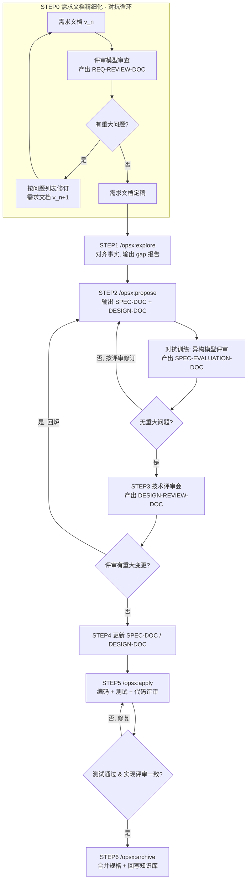
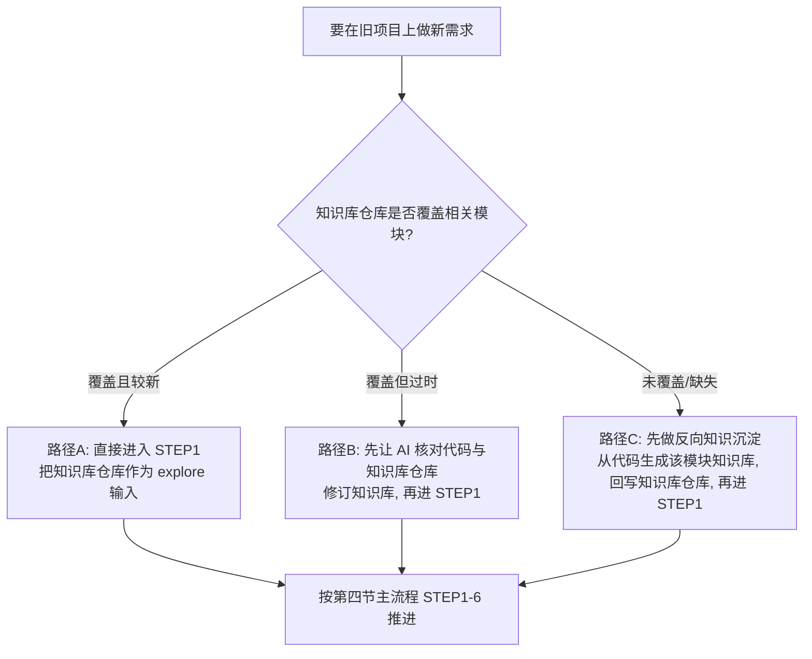

<p align="center">
  Languages:
  <a href="./README.md">English</a> ·
  <a href="./README_cn.md">中文</a>
</p>

# 规格驱动开发实战手册

> 本手册面向**有工程背景**的开发者，是一份可独立使用的完整手册。
> 它假设你从**一台干净的机器**开始，覆盖：环境搭建 → 工具选型 → 完整工作流 → 实例项目 → 旧项目（遗留系统）开发 → 提示词库 → 配置参考。

---

## 目录

1. [核心理念（为什么这么干）](#一核心理念为什么这么干)
2. [你的 AI 工具箱（CLI / Codex / Cursor / Windsurf / Copilot）](#二你的-ai-工具箱)
3. [环境搭建（从空环境开始）](#三环境搭建从空环境开始)
4. [完整工作流程（含修正后的流程图）](#四完整工作流程)
5. [实例项目：mini-kv（带 TTL 的内存缓存）](#五实例项目mini-kv带-ttl-的内存缓存)
6. [旧项目开发：系统知识库闭环](#六旧项目开发系统知识库闭环)
7. [提示词库](#七提示词库)
8. [配置参考（config.yaml / CLAUDE.md / 各工具规则）](#八配置参考)

---

## 一、核心理念（为什么这么干）

### 1.1 Agent = LLM + Tool use

AI 编码工具（Claude Code、Codex、Cursor 的 Agent、Windsurf Cascade、Copilot Agent）本质都是一个循环：
**LLM 调用工具（读文件、grep、跑命令）→ 不断扩充上下文中的"已知事实"→ 当已知事实趋于稳定，再基于事实推断如何写代码。**

> 推论：**喂给它的事实越准、越全，它的推断越靠谱。** 整套方法论都是围绕"如何高质量地供给事实"展开的。

### 1.2 文档驱动开发：三种文档

Vibe Coding 的问题是提示词太宽泛、需求不明确，AI 在巨大的自由度里"创造性"地写代码。解法是用文档把自由度收敛到正确轨道上。三种文档对应三类事实：

| 文档 | 定位 | 回答的问题 |
|---|---|---|
| **需求文档**（顶级提示词） | 描述 `系统状态 A → 新状态 B` 的抽象意图 | 「要变成什么样」 |
| **系统知识库 / TRUTH-DOC**（所有事实来源） | 现有系统所有代码的抽象概括、黑盒意图集合，长期维护 | 「现在是什么样（状态 A）」 |
| **代码**（真实数据流转） | 知识库的最终落地，内部数据的真实流转 | 「细节到底怎么跑」 |

> Agent 读了**需求文档**就知道目标状态 B；靠**系统知识库**还原绝大部分现状 A；再用**代码**补齐细节，就掌握了系统的大部分真相。
> **缺了系统知识库，Agent 只能从代码反推抽象意图——又慢又容易猜错。** 这正是第六节"旧项目开发"要解决的核心矛盾。

### 1.3 测试驱动开发

开发初期，依据需求文档 + 现有事实，先产出测试用例（场景化的 `如果…那么…`）：

```
如果 用户未登录，访问 /profile 页面
那么 应重定向到 /login，并携带 redirect 参数
```

AI 写完代码 + 测试后**自行运行测试**，保证代码闭环，同时消灭低级错误（编译错误、字段缺失、数据格式不对）。

> SPEC-DOC（§4.5）里的每个 scenario 就是一条这样的 `如果…那么…`，所以**规格的 scenario 本身就是测试用例**——STEP5 的实现必须逐条满足它。这里说的"测试驱动"，就是让规格的 scenario 来驱动测试。

### 1.4 对抗训练

> **对抗训练 = 用与"生产者"不同的模型，去审查产出物。** 同一个模型既当运动员又当裁判，会系统性地放过自己的盲区。

程序员手握多种 AI 工具，天然适合做对抗训练——**用 A 工具/模型生产，用 B 工具/模型挑刺**：

```
Claude Code (Opus/Claude)  ──产出──►  SPEC-DOC + DESIGN-DOC
        ▲                                      │
        │                                      ▼
   按评审修订  ◄──SPEC-EVALUATION-DOC──  Codex / Cursor 切到 GPT 评审
```

**真正让评审"对抗"起来的,是三个相互独立的杠杆:**

| 杠杆 | 为什么有用 | 需要第二个工具吗? |
|---|---|---|
| **不同模型权重** | 盲区不重叠(GPT vs Claude 最强) | 需要 |
| **全新上下文** | 评审方看不到生产方的推理链,不被其结论锚定 | 不需要 |
| **对抗性角色** | 生产方求"能跑通",评审方求"找它哪会崩" | 不需要 |

> 后两个杠杆比第一个**更**重要,而且都不需要第二个工具。一个**新开会话、被明确要求"证伪/挑刺"的 Claude**,即使跑的是和生产方相同的模型,也能逮到大半问题——因为它没有被自己之前的推理绑架。最糟的反模式是**在同一段对话里让模型"评审一下你刚写的"**:它的上下文里全是自己的理由,于是直接盖章。换了模型却留在同一会话,反而**不如**同模型但新开会话。若你只有 Claude Code,见 [§2.4](#24-只有-claude-code-时的对抗评审)。

对抗训练贯穿三个环节：**① 需求文档评审（STEP0）② 规格+设计评审（STEP2）③ 代码实现评审（STEP5）**。

---

## 二、你的 AI 工具箱

本方法论**与具体工具解耦**——任何"LLM + Tool use"型 Agent 都能跑。下面是常见工具的定位与配合方式。

### 2.1 工具一览

| 工具 | 形态 | 默认模型生态 | OpenSpec 接入方式 | 在本流程中的角色 |
|---|---|---|---|---|
| **Claude Code CLI** | 终端 | Claude（Opus/Sonnet/Haiku） | 生成斜杠命令 `/opsx:*` | 主力生产 + 复杂逻辑 |
| **Codex** | CLI / IDE | GPT 系 | 生成 `AGENTS.md` 等指令文件 | 对抗评审（换 GPT 视角） |
| **Cursor** | IDE（VSCode 衍生） | 多模型可选 | 生成 `.cursor/rules` 规则 | 生产或评审，按所选模型 |
| **Windsurf** | IDE | 多模型可选（Cascade） | 生成规则/工作流文件 | 生产或评审 |
| **Copilot** | IDE 插件 | 多模型可选 | 生成 `.github` instructions | 生产或评审、行内补全 |

> ⚠️ 不同工具调用 OpenSpec 的方式略有差异：支持自定义斜杠命令的（如 Claude Code）直接 `/opsx:explore`；其它工具 OpenSpec 会生成**等价的提示词/规则文件**，你在对话里引用即可。**四个阶段（explore/propose/apply/archive）是通用的，叫法因工具而异。**

### 2.2 多模型 / 多工具切换

**对抗训练的前提是能换模型。** 常用方式：

- **Claude Code CLI**（用环境变量在 **Anthropic 模型之间**切换）：
  ```shell
  # PowerShell
  $env:ANTHROPIC_MODEL="claude-opus-4-8"; claude
  $env:ANTHROPIC_MODEL="claude-sonnet-4-6"; claude

  # Linux / macOS / WSL
  ANTHROPIC_MODEL="claude-opus-4-8" claude
  ANTHROPIC_MODEL="claude-sonnet-4-6" claude
  ```
  > ⚠️ `ANTHROPIC_MODEL` **只在 Anthropic 自家模型间生效**。想让 Claude Code 改用非 Anthropic 模型（如 GPT），**不能**直接把它设成 `gpt-5.5`——默认端点不提供该模型，会直接报错。必须经由一个兼容 Anthropic 协议的网关/代理转发：
  > ```shell
  > # 例：用 LiteLLM / claude-code-router 之类的网关把请求转发到 GPT
  > ANTHROPIC_BASE_URL="https://your-gateway.example.com" ANTHROPIC_MODEL="gpt-5.5" claude
  > ```
  > 若只是想要 GPT 的评审视角，**更省事的做法是直接用 Codex / Cursor**（见下），无需折腾网关。
- **Cursor / Windsurf / Copilot**：在对话框的模型下拉里直接切换。
- **Codex**：通过其配置或 `-m` 启动参数指定模型；想从命令行真正驱动它做多轮评审，见 [§2.3](#23-用命令行驱动-codex多轮对抗评审)。

> 💡 推荐组合：**Claude Code（Opus）做生产 + Codex/Cursor 切 GPT 做评审**。两套模型的盲区不重叠，对抗效果最好。
> 🐧 Linux / macOS / WSL 是跑 CLI 类工具的最佳环境——命令资源丰富，LLM 训练语料里这类案例最多，行为最稳。

### 2.3 用命令行驱动 Codex（多轮对抗评审）

对抗评审的闭环（评审 → 修订 → 再评审）能成立，前提是评审工具**记得上一轮**。用 Codex 时,这件事直接在命令行完成——无需 IDE——靠 `codex exec` 开一个评审会话、`codex exec resume` 让每一轮都待在**同一段对话上下文**里。

**第一轮——开启会话：**
```shell
# -s read-only ：评审只审、不许改你的文件
# --skip-git-repo-check ：仅当你在 git 仓库之外运行时才需要
codex exec -s read-only "<你的评审提示词——例如 §7.3 的评审 prompt>"
```
输出头部会打印一行 `session id: 019f....`。**记下这个 id**——它是续接下一轮的句柄。

**第二轮…第 N 轮——续接同一上下文：**
```shell
# flag 必须放在 session id 之前，否则 Codex 会报错拒绝
codex exec resume -s read-only <session-id> "我已按你上轮意见修订；请重新评审并产出 v{N+1}。"
```
因为会话被保留，评审方仍记得它上一轮的发现——能核对"问题 #3 是否真的改好了",而不是每轮都从零重审。

> 不想记 id？`codex exec resume --last "..."` 会续接最近一次会话。但同时有多个评审在跑时它会有歧义,所以正式评审循环建议显式带 id。

**选评审模型**（务必与生产方**不同系**——这正是对抗的意义所在）：`codex exec -m <model> ...`,或在 Codex 配置里设默认值。

> ⚠️ **传输层告警是网关个例,不是失败。** 如果你的 Codex 指向了**自定义 / 自建网关**,可能看到 `failed to connect to websocket: 404`,随后 `Falling back ... to HTTPS`。这只说明*那个网关*不提供 WebSocket 传输——请求仍会经 HTTPS 正常完成,评审不受影响;官方端点上根本不会出现。嫌刷屏可过滤掉:
> ```shell
> codex exec ... 2>&1 | grep -v -E "websocket|Reconnecting|Falling back"
> ```

### 2.4 只有 Claude Code 时的对抗评审

没有 Codex、也没有第二个工具?照样能跑真正的对抗闭环——只是放弃"不同模型家族"这个杠杆([§1.4](#14-对抗训练)),靠**全新上下文 + 对抗角色**,而这两者本就占了大头。

**唯一铁律:评审方必须是*独立会话*——绝不能在生产方的对话里接一句"现在评审一下你刚写的"**(那里它满脑子都是自己的理由,只会盖章)。另开一个终端,用不同档位起一个全新的 `claude`,只喂给它产物(spec / design / code 路径)加上 §7 的评审提示词:

```shell
# 左边终端——生产方
claude                                    # 默认 Opus;产出 SPEC-DOC / 代码

# 右边终端——评审方:全新上下文 + 不同档位
ANTHROPIC_MODEL="claude-sonnet-4-6" claude
# 然后贴入 §7.3 / §7.4 的评审提示词,指向产物路径
```

这套"双终端"就是 Claude-only 版的 §2.3 `codex exec` / `resume` 循环:左边生产,把产物交给右边,再把评审意见贴回来,循环到「无重大问题」。

**按评审点匹配模型档位:**

| 评审点 | 它需要什么 | 建议评审模型 |
|---|---|---|
| STEP0 / STEP2(需求 / 设计) | 判断与推理 | **最强**可用模型(如 Opus),新会话 |
| STEP5(实现 vs spec 一致性) | 机械核对"spec 写的代码有没有" | **Sonnet 4.6 / Haiku 4.5**——快且便宜就够 |

> ⚠️ 别拿弱模型去审强模型的硬推理——用 Haiku 审 Opus 的设计,往往恰好漏掉 Haiku 本就跟不上的微妙问题。评审要*平级或向下*选模型,别陡峭向上。(`/model` 切的是当前会话,但评审务必**另起新会话**,让评审方保持新鲜视角。)

---

## 三、环境搭建（从空环境开始）

假设机器是干净的。下面每一步都给出**可直接执行的命令**与**验证命令**，不跳步。

### 3.1 安装 Node.js（一切的运行时）

OpenSpec 是 npm 包，必须先有 Node.js。**推荐用版本管理器装**，方便后续切换版本。

**macOS / Linux / WSL（推荐 nvm）：**
```shell
# 1. 安装 nvm（脚本里的 v0.40.1 为示例版本号，请以 nvm 官方仓库的最新 release 为准）
curl -o- https://raw.githubusercontent.com/nvm-sh/nvm/v0.40.1/install.sh | bash
# 2. 重新加载 shell 配置（或重开终端）
source ~/.bashrc   # zsh 用户用 source ~/.zshrc
# 3. 安装并启用最新 LTS 版 Node
nvm install --lts
nvm use --lts
```

**macOS（也可用 Homebrew）：**
```shell
brew install node
```

**Windows（二选一）：**
```powershell
# 方式 A：winget（Win10+ 自带）
winget install OpenJS.NodeJS.LTS

# 方式 B：nvm-windows —— 到 https://github.com/coreybutler/nvm-windows/releases 下载安装包后：
nvm install lts
nvm use lts
```

**验证（看到版本号即成功）：**
```shell
node -v   # 例如 v22.x.x
npm -v    # 例如 10.x.x
```

> 让 AI 代劳也可以：在你的 AI 工具里发「检查本机是否安装 Node.js LTS，没有就用本系统合适的方式装好并打印版本」。但建议你**至少手动跑通一次**，理解它在装什么。

### 3.2 安装 AI 编码工具（按需选 1～2 个）

- **Claude Code CLI**：`npm install -g @anthropic-ai/claude-code`，然后 `claude` 启动并登录。
- **Cursor / Windsurf**：官网下载安装包，登录账号。
- **Copilot**：在 VSCode / JetBrains 安装插件并登录 GitHub。
- **Codex**：按其官方说明安装 CLI / 插件并登录。

> 做对抗训练**至少装两个不同模型生态的工具**（例：Claude Code + Cursor，或 Claude Code + Codex）。

### 3.3 安装并初始化 OpenSpec

```shell
# 全局安装
npm install -g @fission-ai/openspec@latest
# 验证
openspec --version
```

进入你的项目根目录后初始化：
```shell
cd /path/to/your-project
openspec init
```

`openspec init` 会让你**勾选正在使用的 AI 工具**（可多选），并为每个工具生成对应的接入文件（Claude Code → 斜杠命令；Cursor → `.cursor/rules`；Copilot → `.github` instructions；等等）。生成的 `openspec/` 目录是流程的"说明书"，**纳入版本管理、不要随意删**。

> 官方仓库（含各工具最新接入说明）：https://github.com/Fission-AI/OpenSpec

### 3.4 命令速览

| 命令 | 用途 |
|---|---|
| `/opsx:explore` | 需求前期探索，对齐已知事实与设计 |
| `/opsx:propose` | 输出 SPEC-DOC、DESIGN-DOC 等实施文档 |
| `/opsx:apply` | 根据 SPEC-DOC 执行编码与测试 |
| `/opsx:archive` | 归档变更，把增量规格合并进 OpenSpec 规格库 |

---

## 四、完整工作流程

### 4.1 术语表

| 缩写 | 全称 | 说明 |
|---|---|---|
| TRUTH-DOC | 系统知识库文档 | 当前系统所有已知事实的抽象集合，长期维护（你团队长期维护的知识库仓库） |
| SPEC-DOC | 规格文档 | OpenSpec 生成的需求规格，描述本次变更的所有场景 |
| DESIGN-DOC | 设计文档 | 本次变更的技术方案，由 `/opsx:propose` 输出 |
| REQ-REVIEW-DOC | 需求评审文档 | **STEP0** 中由评审模型对需求文档输出的问题列表 |
| SPEC-EVALUATION-DOC | 规格评审文档 | **STEP2** 对抗训练中，另一模型对 SPEC-DOC + DESIGN-DOC 的审查意见 |
| DESIGN-REVIEW-DOC | 技术评审记录 | **STEP3** 人工技术评审会议的结论与修改意见 |

**各类产物放哪**（下列路径就是 §7 各提示词里通用的约定——按你的仓库调整）：

| 产物 | 默认位置 |
|---|---|
| 需求文档 | `requirement/req-v{N}.md`，定稿为 `requirement/req-final.md` |
| REQ-REVIEW-DOC | `doc/review/req-review-v{N}.md` |
| SPEC-DOC / DESIGN-DOC / tasks.md | `openspec/changes/<change>/specs/`、`…/design.md`、`…/tasks.md` |
| SPEC-EVALUATION-DOC | `doc/design/<change>-review-v{N}.md` |
| TRUTH-DOC（知识库） | 长期维护的知识库仓库，如 `../knowledge-base/<module>.md`（反向沉淀的草稿先落到 `doc/truth/<module>.md`） |

### 4.2 总览流程图

> 流程图显式画出了 **STEP0 需求文档对抗评审的循环**，以及各环节之间的**回环**。



> 图中每个循环都有机器可判定的退出条件，因此都能**交给 `/goal` 自动驱动**——见 [§4.10](#410-用-goal-自动化整个流程)。

### 4.3 STEP0｜需求文档精细化（对抗评审，最多 5 轮）

> 需求文档是 AI 开发的**顶层提示词**，力求精确。最好由产品先用 AI 自检一遍。

这一步本身就是一个对抗循环：

```
需求文档 v1.0 ──► 评审模型审查 ──► REQ-REVIEW-DOC（问题列表）
       ▲                                      │
       └────────── 修订 v2.0 ◄────────────────┘   …（最多 5 轮）
                                      │
                          直到「无重大问题」 ──► 定稿
```

- **评审用的模型，应与起草需求时不同**（例如需求初稿用 Claude，评审切 GPT）。
- 评审维度建议固定为清单：**目标状态 B 是否清晰 / 是否有歧义 / 边界与异常是否覆盖 / 是否隐含未声明的状态变更 / 验收标准是否可测**。
- **退出条件**：评审模型明确输出「无重大问题」，或达到 5 轮上限后人工裁决。

对应提示词见 [§7.1](#71-step0需求文档对抗评审)。

### 4.4 STEP1｜`/opsx:explore`（探索对齐）

根据所有已知事实进行探索，对齐设计。

- **输入**：TRUTH-DOC（知识库仓库）、上轮遗留的 SPEC-DOC（如有）、代码、定稿的需求文档。
- **输出**：对齐报告，列出**当前状态 A 与目标状态 B 之间的 gap**。

> 旧项目尤其依赖这一步：见第六节，先确保知识库仓库覆盖到相关模块，否则 explore 出来的事实会有缺口。

### 4.5 STEP2｜`/opsx:propose`（产出规格与设计 + 对抗训练）

产出提案、全部 Spec 文档（SPEC-DOC）与设计文档（DESIGN-DOC），然后进入对抗训练：

```
SPEC-DOC + DESIGN-DOC_V1  ──评审模型──►  SPEC-EVALUATION-DOC_V1
SPEC-EVALUATION-DOC_V1    ──生产模型修订──►  SPEC-DOC + DESIGN-DOC_V2
SPEC-DOC + DESIGN-DOC_V2  ──评审模型──►  SPEC-EVALUATION-DOC_V2
…（最多 N 轮）
```

**退出条件**：评审模型明确输出「无重大问题，可进入执行阶段」，或达上限后人工决策。提示词见 [§7.3](#73-step2对抗训练评审与修订)。

### 4.6 STEP3｜技术评审

开技术评审会，对 `DESIGN-DOC` 评审；同步把 `SPEC-DOC` 里的 `spec.md`（内含各类场景）交给测试。记录结论为 DESIGN-REVIEW-DOC。

> 若评审产生**重大设计变更**，回到 STEP2 重跑 `/opsx:propose`。

### 4.7 STEP4｜更新相关文档

依据 DESIGN-REVIEW-DOC 更新 SPEC-DOC 与 DESIGN-DOC，可再叠加一轮对抗训练。

### 4.8 STEP5｜`/opsx:apply`（编码 + 测试 + 实现评审）

根据 SPEC-DOC 编写代码，同步产出测试代码，**测试全部通过**为准。

- **复杂逻辑优先用更强模型（Opus），常规编码用更快更省的模型（Sonnet）。**
- 引入对抗训练：用**另一模型**（如 Sonnet 4.6 / GPT）评审 Spec 与代码实现的**一致性**——重点查"spec 里写了、代码里漏了"，以及"代码里有 `continue`/静默跳过/skip 分支但 spec 未声明对用户可见"。
- **测试分层**：逻辑用单元测试（始终要有）；**有界面的项目**再加 E2E 与视觉回归（如 Playwright 截图）。像 §5 的 mini-kv 这样的纯库没有界面，只需单元测试——[§7.7](#77-goal-配方自动化每个循环) 配方里的 Playwright 那一条可跳过。

### 4.9 STEP6｜`/opsx:archive`（归档并沉淀事实）

`/opsx:archive` 本身做的是：把本次 change 的**增量规格合并进 OpenSpec 自己的规格库（`openspec/specs/`）**并归档该 change，让 OpenSpec 的规格与最终实现保持一致。

> ⚠️ 注意区分：`/opsx:archive` **不会自动更新你那个独立维护的知识库仓库（TRUTH-DOC）**。把本次新增/变更的事实**回写到知识库仓库，是一个额外的步骤**（用 [§7.5](#75-step6archive) 的提示词显式让 AI 去做，或人工补写）。

**这一步是旧项目长期可维护的命脉**——每次变更都把新事实沉淀回知识库仓库，下次 explore 才不会有缺口。

### 4.10 用 /goal 自动化整个流程

上面每个循环本来就写了**机器可判定的退出条件**——这正是 Claude Code 的 `/goal` 所吃的东西。`/goal "<条件>"` 让 Claude **跨多轮无人值守地干，直到条件成立**；每轮结束后一个独立小模型（Haiku）读 transcript 判"做完没"，没完就再来一轮，直到达成或你手动停。

> **前置条件：** `/goal` 需 Claude Code ≥ v2.1.139，且已接受 hook 信任弹窗；若设了 `disableAllHooks` / `allowManagedHooksOnly` 则不可用。用 `claude --version` 查。（老版本就按 §2.3 / §2.4 手动驱动同样的循环。）

**让这套保持可靠的唯一架构铁律：**

> `/goal` 自带的评估器**只读 transcript**、只判 *"条件达到了吗"*——它是个弱模型，**不是**对抗评审。所以真正的检查必须在循环**内部**跑、并把结论**留在 transcript 里**。`/goal` 负责编排循环，它永远不替代测试、E2E 套件或异构评审本身。

正是这种分层，让你能在**不违反 [§1.4](#14-对抗训练)** 的前提下连**对抗评审都自动化**：每一轮里 Claude **主动调用评审方**（Codex 走 [§2.3](#23-用命令行驱动-codex多轮对抗评审)，或新开一个 Claude 会话走 [§2.4](#24-只有-claude-code-时的对抗评审)），把它的结论贴回来，而 goal 条件不过是 *"评审方判定为'无重大问题'，或满 N 轮"*。判断仍是异构+新上下文，`/goal` 只读"这个判断有没有落进 transcript"。

**哪些该自动化，哪些留作人工闸口：**

| 阶段 | 一个可靠的 `/goal` 条件（transcript 可判） | 循环内部由什么支撑 |
|---|---|---|
| STEP0 | REQ-REVIEW-DOC 已产出且判定 =「无重大问题」，或 5 轮 | 每轮一次异构评审调用 |
| STEP2 | SPEC-EVALUATION-DOC 判定 =「无重大问题，可进入执行」，或 N 轮 | 每轮一次异构评审调用 |
| STEP5 | `npm test` 退出码 0 **且** tasks.md 全 `[x]` **且** E2E/Playwright 全绿 **且** 一致性评审无缺口，或 N 轮 | 真跑测试 + E2E + 评审调用 |
| STEP6 | 增量规格已合并 **且** 该模块知识库文件已更新 | `/opsx:archive` + 回写 |
| **STEP3 技术评审 · 反向沉淀复核 · 知识库签字** | —— **不要塞进 goal** | 由人决定 |

> 务必加上限（`…或 N 轮后停`）：这个上限既对应手册的"≤5 轮"约束，也兜住成本——开放式 goal 可能跑得很贵。推荐上限：STEP0 ≈5、STEP2 ≈3–4、STEP5 ≈25。若某个循环**来回振荡**（判定反复横跳，或同一问题反复冒出来）或停滞不前，应把"触顶上限"当作**升级给人**的信号，而不是悄悄放低标准。**每段机器可判定的区间跑一个 `/goal`，到人工闸口就停**，再开下一个。具体条件与每轮的驱动提示词见 [§7.7](#77-goal-配方自动化每个循环)。

---

## 五、实例项目：mini-kv（带 TTL 的内存缓存）

用一个**有真实状态、易测试**的小库，把全流程跑通一遍。选它是因为它正好命中 OpenSpec 配置里那条关键规则——**"外部共享状态必须描述 初始化 / 更新 / 清理 三个时机"**（见 §8.1），是体会规格颗粒度的好例子。

> 目标：一个 Node.js 库 `mini-kv`，提供带过期时间（TTL）的内存键值存储。

### 5.0 建项目骨架

```shell
mkdir mini-kv && cd mini-kv
npm init -y
openspec init        # 勾选你在用的 AI 工具
git init             # 建议纳入版本管理，方便对照每步 diff
```

### 5.1 STEP0 · 写并评审需求

先写一份 `requirement/req-v1.md`（人话需求）：

```text
做一个内存键值缓存库 mini-kv：
1. set(key, value, ttlMs?)：写入键值；ttlMs 为可选过期毫秒数，省略表示永不过期；
2. get(key)：返回值；若 key 不存在或已过期，返回 undefined；
3. del(key)：删除指定 key；
4. 过期清理：过期的 key 不应再被 get 读到，也不应长期占用内存；
5. 覆盖写：对已存在的 key 再次 set，应覆盖旧值与旧 TTL。
```

然后让**评审模型**（与起草不同的模型/工具）按 [§7.1](#71-step0需求文档对抗评审) 的提示词审一轮，补全你没想到的边界（如 `ttlMs<=0` 怎么办、`get` 是否惰性清理还是定时清理、并发写入语义）。定稿为 `requirement/req-final.md`。

### 5.2 STEP1 · explore

在主力工具里：
```text
/opsx:explore
* 需求文档: requirement/req-final.md
* 系统知识库: （新项目，暂无 / 旧项目填知识库仓库路径）
* 代码: 当前仓库
请对齐事实，输出当前状态 A 与目标 B 的 gap 报告。
```

### 5.3 STEP2 · propose + 对抗评审

```text
/opsx:propose
```
重点检查产出的 `spec.md` 是否**为每个用户可见行为单独建 scenario**，且**外部共享状态（这里就是那张内存 map）描述了 初始化 / 运行中更新 / 清理失效 三个时机**。
然后切到评审工具/模型，按 [§7.3](#73-step2对抗训练评审与修订) 评审 → 修订，循环到「无重大问题」。具体可用 Codex 来驱动评审（[§2.3](#23-用命令行驱动-codex多轮对抗评审)）：
```shell
# 第一轮——开启评审会话（记下打印出来的 session id）
codex exec -s read-only "按 §7.3 评审清单，对照 requirement/req-final.md 评审 openspec/changes/<change>/specs/ 与 design.md，末尾给出结论行。"
# 之后每个修订轮——同一上下文，它能核对你的修复是否到位
codex exec resume -s read-only <session-id> "我已按上轮意见修订；请重新评审并产出 v{N+1}。"
```

### 5.4 STEP5 · apply

```text
/opsx:apply
开始实现，并自己运行测试，直到测试通过、覆盖率达标、功能完整为止。
```
预期它会产出类似：
- `src/mini-kv.js`：核心实现
- `test/mini-kv.test.js`：覆盖 set/get/del、TTL 过期、覆盖写、`ttlMs<=0` 等场景

跑一下确认：
```shell
npm test
```

想让"实现 → 测试"循环无人值守地跑，就用 goal 包起来——这是 [§7.7](#77-goal-配方自动化每个循环) STEP5 配方的 mini-kv 版（它是个库，所以没有 Playwright 那一条）：
```text
/goal "目标——以下全部成立:`npm test` 退出码 0;openspec/changes/<change>/tasks.md 每项均为 [x];且由另一个模型做的一致性评审(§7.4 提示词)报告无 spec-vs-代码 缺口。上限:15 轮。每一轮:按顺序实现 tasks.md 下一项,同步写测试,跑 `npm test` 并把输出打印出来。全部成立或满 15 轮则停。"
```

### 5.5 验收 & STEP6 · archive

手动验一把（下面假设导出的是一个类 `KV`，请按实际生成的导出方式调整）：
```shell
node -e "const KV=require('./src/mini-kv'); const k=new KV(); k.set('a',1,50); console.log(k.get('a')); setTimeout(()=>console.log(k.get('a')), 80);"
# 预期先打印 1，过期后打印 undefined
```
满意后归档：
```text
/opsx:archive
```
新项目第一次 archive 会**生成初版 TRUTH-DOC**——恭喜，你的 mini-kv 从此有了系统知识库，下个功能就能从第六节的"有知识库"路径起步。

---

## 六、旧项目开发：系统知识库闭环

> 这里的**系统知识库（TRUTH-DOC）**指一个与代码仓库并列、长期维护的文档仓库——它把现有系统每个模块的抽象意图、对外接口、数据流沉淀下来。下文统称「知识库仓库」。

旧项目的最大风险在 [§1.2](#12-文档驱动开发三种文档) 已点明：**缺了系统知识库，Agent 只能从代码反推意图，又慢又容易猜错。** 所以旧项目开发的第一性原则是——**先保证知识库仓库覆盖到你要改的模块，再开发。**

### 6.1 三种起点，三条路径



### 6.2 路径 A：知识库已覆盖（理想情况）

直接进 STEP1，把知识库仓库（克隆到本地的目录）作为事实来源喂进去：
```text
/opsx:explore
* 需求文档: requirement/req-final.md
* 系统知识库: ../knowledge-base 文件夹（对应模块: <模块名>）
* 技术详细设计文档: design.md
请基于知识库与代码对齐事实，输出 gap 报告。
```

### 6.3 路径 B：知识库过时

先让 AI 拿**代码当真相**去校对、修订知识库（提示词见 [§7.6](#76-旧项目反向知识沉淀--知识库校对)），把修订后的知识库仓库提交，再走路径 A。

### 6.4 路径 C：知识库缺失（最常见）

**反向知识沉淀**：让 AI 阅读目标模块代码，产出该模块的知识库文档（抽象意图、对外接口、数据流、依赖、副作用），评审后**回写知识库仓库**，再进入正常流程。提示词见 [§7.6](#76-旧项目反向知识沉淀--知识库校对)。

> ⚠️ 反向沉淀出来的知识库**必须人工或异构模型评审**——AI 从代码反推意图时会编造"看似合理但实则错误"的抽象。别让带毒的知识库污染后续所有开发。

### 6.5 闭环：每次开发都回写

旧项目能否越改越顺，取决于 **STEP6 是否老老实实回写知识库仓库**。把它写进团队约定：
**一次变更 = 一次代码提交 + 一次知识库仓库更新。** 长期坚持，知识库仓库会从"路径 C"逐步收敛到"路径 A"，开发效率持续提升。

---

## 七、提示词库

> 每条提示词统一结构：明确「角色 / 输入 / 任务 / 输出 / 约束」，并把版本号、循环、退出条件显式化。路径均为示例，使用时替换为实际路径。

### 7.1 STEP0｜需求文档对抗评审

> 用**与起草需求不同的模型/工具**执行。

```text
你是一名资深需求评审专家。请审查下面的需求文档，目标是让它精确到可以直接交给 AI 实现。

【输入】
* 需求文档: requirement/req-v{N}.md
* 系统知识库(如有): <知识库仓库路径 / 模块名>

【评审维度，逐条给结论】
1. 目标状态 B 是否清晰、无歧义
2. 边界条件与异常路径是否覆盖（空值、越界、并发、超时、失败回滚）
3. 是否存在"隐含但未声明"的状态变更或副作用
4. 每条验收标准是否可测（能写成「如果…那么…」）
5. 与系统现状 A 是否冲突（若提供了知识库）

【输出】
生成 REQ-REVIEW-DOC: doc/review/req-review-v{N}.md
* 按维度列出"问题清单"，每条含：问题描述 / 风险 / 修改建议
* 末尾给出总体结论：是否「无重大问题」可以定稿

不要修改需求文档本身，只产出评审意见。
```

修订与循环：
```text
评审意见在 doc/review/req-review-v{N}.md。请据此修订需求文档，输出 requirement/req-v{N+1}.md。
逐条说明每个问题如何处理（采纳/拒绝+理由）。
```
重复直到评审输出「无重大问题」，定稿为 `requirement/req-final.md`（最多 5 轮）。

### 7.2 STEP1｜explore

```text
/opsx:explore
我要在现有系统上实现一个新需求，请先对齐所有已知事实，不要写代码。
【输入】
* 需求文档: requirement/req-final.md
* 系统知识库: <知识库仓库路径>（相关模块: <模块名>；新项目则注明"暂无"）
* 技术详细设计文档: design.md（如有）
* 代码: 当前仓库
【输出】
一份 gap 报告：列出当前状态 A、目标状态 B，以及两者之间需要填补的差异点与风险。
```

### 7.3 STEP2｜对抗训练评审与修订

**生产（主力工具/模型）：**
```text
/opsx:propose
基于已对齐的事实编写提案与全部 Spec 文档(SPEC-DOC)，同步输出设计文档(DESIGN-DOC)。
要求：
* 每个"用户可见的输出"必须是独立 scenario，多个可见侧效果不得合并；
* 凡涉及外部共享状态(Redis/DB字段/全局单例/内存缓存)，必须分别描述 初始化 / 运行中更新 / 清理失效 三个时机。
完成后停下，等待评审。
```

**评审（异构模型/工具）：**
```text
你是技术评审专家，请评审下面这次变更的规格与设计，重点找“会导致返工或线上事故”的问题。
【输入】
* SPEC-DOC: openspec/changes/<change-name>/specs/
* DESIGN-DOC: openspec/changes/<change-name>/design.md
* 系统知识库: <知识库仓库路径>
* 需求文档: requirement/req-final.md
【检查清单】
1. scenario 是否覆盖需求的全部可见行为，有无遗漏的失败/边界场景
2. 外部共享状态的三个时机(初始化/更新/清理)是否完整
3. 设计与系统现状 A 是否冲突、是否破坏既有约定
4. 是否有 spec 写了但设计未落实、或设计引入了 spec 未声明的行为
【输出】
生成 SPEC-EVALUATION-DOC: doc/design/<change-name>-review-v{N}.md
逐条列出问题(描述/风险/建议)，末尾给出结论：是否「无重大问题，可进入执行阶段」。
```

**回到生产侧修订（注意：改的是 spec/design，不是源码）：**
```text
我用另一个模型评审了你的设计与 spec，评审意见在 doc/design/<change-name>-review-v{N}.md。
请逐条处理（采纳/拒绝+理由），修改需要修改的 spec 与 design 文件（不是源码）。
完成后再次进入评审，形成 v{N+1}。
```
循环直到评审输出「无重大问题，可进入执行阶段」。

> 💡 想用 Codex 从命令行跑这个评审循环——第一轮开会话,之后每轮 `resume <session-id>` 让评审方保有完整上下文——见 [§2.3](#23-用命令行驱动-codex多轮对抗评审)。

### 7.4 STEP5｜apply（编码 + 测试）

```text
/opsx:apply
严格按 tasks.md 顺序实现，每条任务完成立即标记 [x]。
要求：
* 同步编写测试，覆盖 spec 中的全部 scenario，尽量 100% 覆盖率；
* 复杂逻辑用更强模型，常规实现用更快模型；
* 关键分支与函数入口按日志规范打点；
* 全部完成后运行测试，直到全绿；若有 continue/skip/静默忽略分支，回查 spec 确认是否需要对用户可见。
完成后停下，等待 archive。
```

**实现一致性对抗评审（异构模型）：**
```text
请对照 SPEC-DOC 评审本次代码实现的一致性，重点找：
1. spec 要求但代码未实现的行为；
2. 代码中 continue/skip/静默忽略的分支，spec 是否要求其对用户可见；
3. 测试是否真正覆盖了每个 scenario（而非只跑主路径）。
逐条列出不一致项与修复建议。
```

> 💡 同 STEP2,用异构模型从命令行驱动;`codex exec` / `codex exec resume` 的具体机制见 [§2.3](#23-用命令行驱动-codex多轮对抗评审)。

### 7.5 STEP6｜archive

```text
/opsx:archive
归档本次变更，并同步更新系统知识库与规格：
* 把本次新增/变更的事实回写到知识库仓库对应模块(<模块名>)；
* 确保 TRUTH-DOC 与最终实现一致；
列出你更新了知识库仓库的哪些文件、哪些段落。
```

### 7.6 旧项目反向知识沉淀 / 知识库校对

```text
你是系统知识库工程师。请阅读以下模块的代码，产出/校对该模块的系统知识库文档。
【输入】
* 代码范围: <目录或文件清单>
* 现有知识库(如有): <知识库仓库中该模块文档路径>
【任务】
* 以代码为唯一真相，抽象出该模块的：对外职责/接口、核心数据流、关键状态与副作用、对外部模块的依赖、重要约定与坑；
* 若提供了现有知识库，逐条标出"与代码不符/已过时/缺失"之处并修订。
【输出】
按知识库仓库的现有文档风格，输出该模块知识库文档草稿到 doc/truth/<模块名>.md。
【约束】
* 只描述代码里确实存在的事实，不要臆测；不确定处显式标注"待人工确认"，不要编造抽象意图。
```
> 产出后**务必人工/异构模型复核**再回写知识库仓库（见 [§6.4](#64-路径-c知识库缺失最常见)）。

### 7.7 /goal 配方：自动化每个循环

> 提醒（[§4.10](#410-用-goal-自动化整个流程)）：`/goal` 驱动循环；真正的检查（评审 / 测试 / 截图）必须在每一轮**内部**跑，结果才会落进 transcript——Haiku 评估器只读"它过了没"。务必带轮数上限。把 `<change>` / `<module>` / 路径 / 模型名替换成你自己的。

**STEP0 —— 需求评审循环**（异构评审方在循环内运行）：
```text
/goal "目标：requirement/req-final.md 存在，且最新一轮评审判定为「无重大问题」。上限：5 轮。
每一轮：
1. 若 doc/review/req-review-v{N}.md 存在，据其修订 requirement/req-v{N}.md，升到 v{N+1}，逐条注明 采纳/拒绝+理由。
2. 用一个不同的模型对当前版本跑评审，输出存到 doc/review/req-review-v{N}.md，例如：
   codex exec -s read-only \"<§7.1 的评审提示词> —— 目标：requirement/req-v{N}.md\"
   （没有 Codex？按 §2.4 另开一个 claude，贴入 §7.1 提示词）
3. 把评审方的结论行贴回本对话。
当判定为「无重大问题」时停（并复制为 requirement/req-final.md），或满 5 轮停。"
```

**STEP2 —— 规格+设计对抗循环**（用 `codex exec resume <id>` 让评审方跨轮保有上下文，见 §2.3）：
```text
/goal "目标：openspec/changes/<change>/ 有 SPEC-DOC+DESIGN-DOC，且最新 SPEC-EVALUATION-DOC 判定为「无重大问题，可进入执行阶段」。上限：4 轮。
每一轮：
1. 据最新评审修订 spec/design 文件——绝不动源码。
2. 重跑异构评审（codex exec resume <session-id> 带 §7.3 评审提示词），产出 doc/design/<change>-review-v{N}.md。
3. 把评审结论行贴回这里。
当判定为「无重大问题，可进入执行阶段」时停，或满 4 轮停。"
```

**STEP5 —— apply：编码 + 测试 + E2E + Playwright，直到全绿：**
```text
/goal "目标 —— 以下全部成立：`npm test` 退出码 0；覆盖率达到项目门槛（§8.1；手册目标 100%）；openspec/changes/<change>/tasks.md 每项均为 [x]；（仅 UI 项目）Playwright E2E 套件通过且截图差异在阈值内；并且由一个不同模型做的一致性评审（§7.4 提示词）报告无 spec-vs-代码 缺口。上限：25 轮。
每一轮：按 tasks.md 顺序实现下一项，同步写测试，然后跑 `npm test`（有界面再跑 Playwright）并把命令输出打印出来，让结果进 transcript。代码完成后，跑一致性评审（codex exec / 新开 claude）并把结论贴回。
当全部条件成立时停，或满 25 轮停。"
```
> Playwright/视觉提示：这一条仅适用于**有界面的项目**，纯库（如 §5 的 mini-kv）跳过。评估器读的是**文本**，所以让视觉检查产出一个**文本化的通过/失败**（如把 pixelmatch 阈值结果打印到控制台）。若你依赖 Claude 自己看截图，它必须在 transcript 里**用文字给出结论**，否则评估器看不见。

**STEP6 —— 归档 + 知识库回写：**
```text
/goal "目标：本次变更已归档（增量规格合并进 openspec/specs/），且模块 <module> 的知识库文件已反映本次新增/变更的事实。上限：4 轮。
执行 /opsx:archive，然后更新 ../knowledge-base/<module>.md，并列出究竟改了哪些文件/段落。
当两者都成立时停。"
```
> 之后由**人工复核知识库 diff**——别让 goal 自我批准知识库回写（见 [§6.5](#65-闭环每次开发都回写)）。

---

## 八、配置参考

### 8.1 `openspec/config.yaml`

项目根目录的 OpenSpec 配置，定义语言、提案规则、任务粒度、实施约束。以下为一份通用基线，可按项目增删：

```yaml
schema: spec-driven

context: |
  语言：中文（简体）
  所有产出物必须用简体中文撰写。

rules:
  proposal:
    - 只创建 artifacts（proposal.md/design.md/specs/tasks.md），不得修改任何源代码文件
    - 完成后停下来，等待用户执行 /opsx:apply
    - 每个"用户可见的输出"必须有独立的 scenario；若同一个需求包含多个可见侧效果（如"过滤"与"展示被过滤结果"），必须分开写成两个 scenario，不得合并为一句描述
    - |
      凡 spec 中涉及"外部共享状态"（Redis、DB 字段、全局单例等），
      MUST 额外描述以下三个时机的行为：
      1. 初始化（run/session/请求开始时如何写入）
      2. 运行中更新
      3. 清理/失效（run 结束、超时、重置时如何处理）
      若缺少任一时机的描述，视为 spec 不完整。
  tasks:
    - 每条任务粒度不超过一个文件或一个功能点
    - 所有任务必须逐条列出，不得合并
  apply:
    - 严格按 tasks.md 中的任务顺序执行
    - 每条任务完成后立即标记为 [x]，再继续下一条
    - 全部完成后停下来，等待用户执行 /opsx:archive
    - 凡代码中出现 continue / 静默忽略 / skip 分支，必须回查 spec 确认该分支的内容是否需要对用户可见；若 spec 有要求，则必须产出对应记录，不能只满足"排除主路径"而遗漏"展示侧"
    - 代码中所有关键的分支或者函数开始，都需要打印日志，日志的格式是 `[UUID]-文字说明,XXX:[{}],YYY:[{}]`
```

### 8.2 项目规则文件（CLAUDE.md 及其它工具等价物）

规则文件是 Agent 的"常驻全局规范"，每个工具放置位置不同，但**内容一致**：

| 工具 | 规则文件位置 |
|---|---|
| Claude Code | `CLAUDE.md`（项目根目录） |
| Cursor | `.cursor/rules/*.mdc` |
| Windsurf | `.windsurf/rules`（或工作流文件） |
| Copilot | `.github/copilot-instructions.md` |
| Codex | `AGENTS.md` |

> **建议把同一份规范同时落到你团队在用的几个工具里**，保证不同工具行为一致。规则文件的内容**与技术栈强相关**，应由你按自己的项目编写。下面是一份**与语言无关的骨架模板**，照着填进你团队的真实约定即可（示例条目仅作占位，请替换）。

````markdown
# 基础约定

* 全程用中文回复，包括思考过程
* 不确定的地方先提问，不要臆测

# 项目架构

## 目录 / 模块结构

* `<目录A>`: <职责说明>
* `<目录B>`: <职责说明>
* …（列出关键目录与各自职责，让 Agent 知道"代码该放哪里"）

## 模块依赖与约定

* <模块间如何引用、构建/发布的注意事项>
* <跨模块改动时需要同步做的操作>

# 代码规范

* 命名：<命名约定>
* 工具库选用：<优先使用的标准库/工具库及其常用方法，例如判空、时间处理、随机数>
* 分层约束：<例如：数据库操作只写在数据访问层，不写在业务层>
* 依赖注入 / 资源管理：<团队偏好>
* 其它团队习惯：<逐条列出"需要靠人反复口头提醒"的约定>

# 日志规范

统一格式，便于全局检索与定位：

```text
[UUID]-文字说明,XXX:[{}],YYY:[{}]
```

* `UUID` 为真实生成的唯一字符串，作为 code tag，保证代码内全局唯一
* UUID 与打印的对象用 `[]` 包裹，方便复制
* 对象用 JSON 序列化打印；非对象直接打印
* 大集合先提取关键 ID 再打印，避免日志爆炸
* 关键分支与函数入口都应打点，一个方法内不允许完全没有日志

# 测试规范

* 测试文件位置：<约定>
* 基类 / 框架：<约定>
* mock 策略：<哪些该 mock（如外部远程调用）、哪些尽量不 mock（如本地数据访问，尽量真实操作）>
* 用例编号 / 命名：<约定，例如成功场景与失败场景的编号区间>
* 覆盖率要求：<例如尽量覆盖全部分支，目标 100%>
* 测试方法体模板：<给出一个空壳示例，统一风格>
````

> 填写建议：把团队里"需要靠人反复口头提醒"的约定，逐条沉淀进规则文件；**规则越具体、越可执行，Agent 产出越稳定。**

---

> 至此，你已经掌握：空环境搭建 → 多工具选型与对抗训练 → 完整 STEP0–STEP6 流程 → 实例项目 → 旧项目(遗留系统)闭环 → 提示词与配置。
