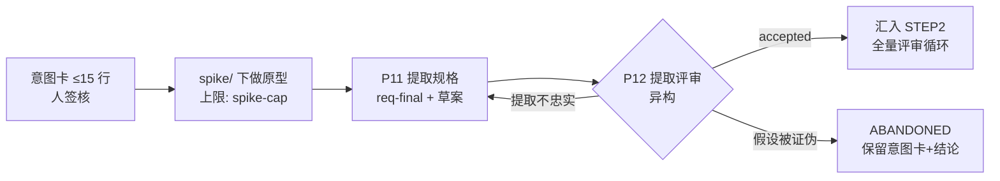
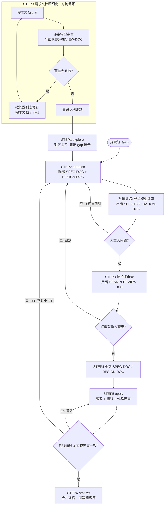
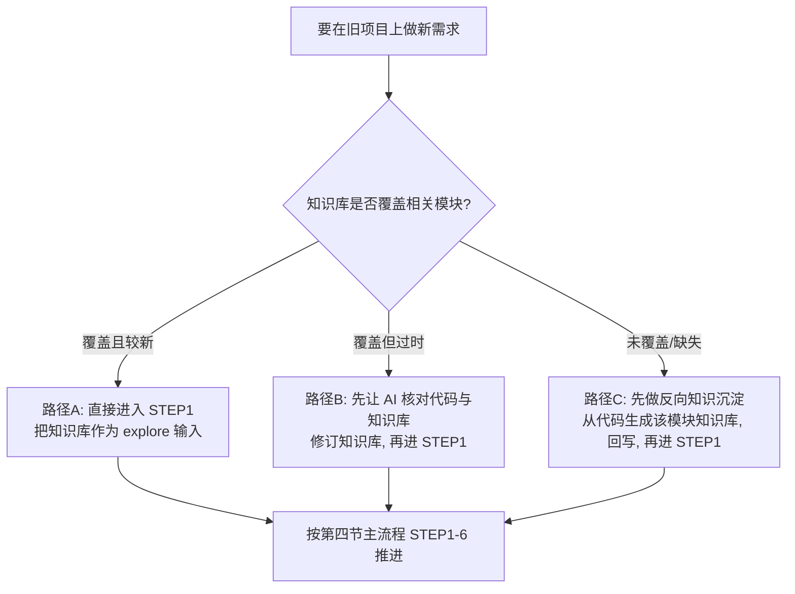

<p align="center">
  Languages:
  <a href="./README.md">English</a> ·
  <a href="./README_cn.md">中文</a>
</p>

# 规格驱动开发实战手册

## 这是什么 & 怎么用

**apriori** 是一套面向 AI 编程的规格驱动工作流,外加一个零依赖 CLI(`apriori-cli`),它让你的规格**可执行**:每条 scenario 都绑定到一个测试,于是"写了规格却没实现"是**跑一条命令**就查出来的,而不是靠人眼盯 diff。你驱动一个 AI agent 走状态机(精化规格 → 用*另一个*模型对抗评审 → 实现 → 归档),只在真正要紧的人工闸口停下。

```shell
npm i -g apriori-cli              # 零依赖;也可从 GitHub 装(见 §3.3)
cd your-project && apriori init   # 搭建工作流,勾选你用的 AI 工具
```

然后对你的 agent 说:*"按 apriori runbook 推进变更 `<名字>`。"* 它会跑到下一个人工闸口,停下汇报。三个确定性闸口是 CLI 命令:**`apriori verify`**(每条 scenario 有绿测试)、**`apriori archive`**(把变更的规格并入 living 规格库)、**`apriori check`**(CI 一致性)。下面是给人看的完整讲解——AI agent 读自包含的 [RUNBOOK_cn.md](./RUNBOOK_cn.md),不读本手册。

---

> 本手册面向**有工程背景**的开发者，是一份可独立使用的完整手册。
> 它假设你从**一台干净的机器**开始，覆盖：环境搭建 → 工具选型 → 完整工作流 → 实例项目 → 旧项目（遗留系统）开发 → 提示词库 → 配置参考。

> 🤖 **AI Agent 有自己的入口：[RUNBOOK_cn.md](./RUNBOOK_cn.md)**——自包含的可执行协议（铁律、状态机、提示词），Agent 不需要读本手册。想在自己的项目里使用这套流程：把 runbook 拷进项目，在项目规则文件里加一行引用（RUNBOOK §0）。人类请继续往下读。

---

## 目录

1. [核心理念（为什么这么干）](#一核心理念为什么这么干)
2. [你的 AI 工具箱（CLI / Codex / Cursor / Windsurf / Copilot）](#二你的-ai-工具箱)
3. [环境搭建（从空环境开始）](#三环境搭建从空环境开始)
4. [完整工作流程（含修正后的流程图）](#四完整工作流程)
5. [实例项目：mini-kv（带 TTL 的内存缓存）](#五实例项目mini-kv带-ttl-的内存缓存)
6. [旧项目开发：系统知识库闭环](#六旧项目开发系统知识库闭环)
7. [提示词库](#七提示词库)
8. [配置参考（config.yaml / CLAUDE.md / 各工具规则）](#八配置参考)

---

## 一、核心理念（为什么这么干）

### 1.1 Agent = LLM + Tool use

AI 编码工具（Claude Code、Codex、Cursor 的 Agent、Windsurf Cascade、Copilot Agent）本质都是一个循环：
**LLM 调用工具（读文件、grep、跑命令）→ 不断扩充上下文中的"已知事实"→ 当已知事实趋于稳定，再基于事实推断如何写代码。**

> 推论：**喂给它的事实越准、越全，它的推断越靠谱。** 整套方法论都是围绕"如何高质量地供给事实"展开的。

### 1.2 文档驱动开发：三种文档

Vibe Coding 的问题是提示词太宽泛、需求不明确，AI 在巨大的自由度里"创造性"地写代码。解法是用文档把自由度收敛到正确轨道上。三种文档对应三类事实：

| 文档 | 定位 | 回答的问题 |
|---|---|---|
| **需求文档**（顶级提示词） | 描述 `系统状态 A → 新状态 B` 的抽象意图 | 「要变成什么样」 |
| **系统知识库 / TRUTH-DOC**（所有事实来源） | 现有系统所有代码的抽象概括、黑盒意图集合，长期维护 | 「现在是什么样（状态 A）」 |
| **代码**（真实数据流转） | 知识库的最终落地，内部数据的真实流转 | 「细节到底怎么跑」 |

> Agent 读了**需求文档**就知道目标状态 B；靠**系统知识库**还原绝大部分现状 A；再用**代码**补齐细节，就掌握了系统的大部分真相。
> **缺了系统知识库，Agent 只能从代码反推抽象意图——又慢又容易猜错。** 这正是第六节"旧项目开发"要解决的核心矛盾。

**北极星:**本工作流属 **Spec-Anchored**(规格作为活文档常驻);它铺路通往的终局——scenario 可执行化、"spec *就是*测试套件"、朝 Spec-as-Source 一档演进——写在 [VISION_cn.md](./VISION_cn.md)。它是非阻塞指引:没有任何闸口读它;与它冲突的改动只需记录理由。§4.8 的 scenario-ID↔测试名映射就是第一块铺路石。

### 1.3 测试驱动开发

开发初期，依据需求文档 + 现有事实，先产出测试用例（场景化的 `如果…那么…`）：

```
如果 用户未登录，访问 /profile 页面
那么 应重定向到 /login，并携带 redirect 参数
```

AI 写完代码 + 测试后**自行运行测试**，保证代码闭环，同时消灭低级错误（编译错误、字段缺失、数据格式不对）。

> SPEC-DOC（§4.5）里的每个 scenario 就是一条这样的 `如果…那么…`，所以**规格的 scenario 本身就是测试用例**——STEP5 的实现必须逐条满足它。这里说的"测试驱动"，就是让规格的 scenario 来驱动测试。

### 1.4 对抗训练

> **对抗训练 = 用与"生产者"不同的模型，去审查产出物。** 同一个模型既当运动员又当裁判，会系统性地放过自己的盲区。

程序员手握多种 AI 工具，天然适合做对抗训练——**用 A 工具/模型生产，用 B 工具/模型挑刺**：

```
Claude Code (Opus/Claude)  ──产出──►  SPEC-DOC + DESIGN-DOC
        ▲                                      │
        │                                      ▼
   按评审修订  ◄──SPEC-EVALUATION-DOC──  Codex / Cursor 切到 GPT 评审
```

**真正让评审"对抗"起来的,是三个相互独立的杠杆:**

| 杠杆 | 为什么有用 | 需要第二个工具吗? |
|---|---|---|
| **不同模型权重** | 盲区部分不重叠(最直观的杠杆——见下方注意) | 需要 |
| **全新上下文** | 评审方看不到生产方的推理链,不被其结论锚定 | 不需要 |
| **对抗性角色** | 生产方求"能跑通",评审方求"找它哪会崩" | 不需要 |

> 后两个杠杆比第一个**更**重要,而且都不需要第二个工具。一个**新开会话、被明确要求"证伪/挑刺"的 Claude**,即使跑的是和生产方相同的模型,也能逮到大半问题——因为它没有被自己之前的推理绑架。最糟的反模式是**在同一段对话里让模型"评审一下你刚写的"**:它的上下文里全是自己的理由,于是直接盖章。换了模型却留在同一会话,反而**不如**同模型但新开会话。若你只有 Claude Code,见 [§2.4](#24-只有-claude-code-时的对抗评审)。

**全新上下文 vs 跨轮记忆——用问题台账化解。** 多轮评审有个内生矛盾:每一轮的评审方应当是*新鲜的*(第二个杠杆),但它又必须记得前几轮,才能核对"问题 #3 是否真的修好了"。让评审方常驻同一个会话,是拿新鲜度换记忆——第 1 轮之后,它也开始被*自己*过去的结论锚定。解法是把记忆从会话挪进文件:每个变更维护一份累积的**问题台账**([§7.0](#70-问题台账所有评审循环共用)),每条问题带 ID 和状态(`open / fixed / rejected+理由 / verified`)。这样每一轮的评审方都可以是全新会话:读台账核对修复、追加新发现,同时不被锚定。台账还兼作人工闸口的审计记录——被拒绝的问题连同理由一直可见;反复出现的问题会重开旧 ID,而不是每轮都伪装成"新发现"。

对抗训练贯穿三个环节：**① 需求文档评审（STEP0）② 规格+设计评审（STEP2）③ 代码实现评审（STEP5）**——三处的每一轮都写入同一份变更级问题台账。

**关于 LLM 判官的诚实注意。** 异构降低偏差但不消除它:LLM 判官的自我偏好由*熟悉度*(困惑度)驱动而非作者身份——换模型只能部分逃脱;代码缺陷部分是**跨模型共享的系统性弱点**,跨模型评审会继承生产方的部分盲区;一项四工具评审对比中,93.4% 的发现只被单一工具捕获——评审覆盖天然不完整。推论:确定性验证恒为主力仪器。

LLM 对抗评审是更大的验证组合中的一件仪器——质量在各阶段究竟来自哪里,统一陈述见 [§1.5](#15-质量从哪里来)。

### 1.5 质量从哪里来

本手册(及 RUNBOOK)的每个机制都是以下四条原则的实例:

1. **质量在不同阶段来自不同仪器。** 在变更的需求/规格**文档阶段**(STEP0/2),LLM 评审是唯一可用的仪器——在那里它是主力,且每变更每环节绝不低于一轮。在**实现阶段**(STEP5),可执行验证是主力(v1.0 本就如此);LLM 评审负责执行判断不了的部分。
2. **意图先行,规格形式可以迟到。** 任何轨道上,一份经人认可的意图声明先于代码存在;两条轨道(§4.0)的区别只是完整规格何时成形——**规格是合并时的守恒量**。
3. **监督参数不由被监督者书写。** 轮次上限与收缩决策放在人持有的配置和人工闸口里;agent 只报告数据,绝不调整对自己的监督。
4. **反向提取的描述在评审前只是草稿。** 凡从代码或原型反推出的东西(P10、P11),必须过评审才能被下游消费。

**相对 V1 基线(v1.0)的兼容性,诚实地说:**加固轨的路径、闸口、退出条件、提示词编号不变(默认配置下路径零漂移);退出条件仅对 v1.0 从未定义过的项目类型(纯文档项目)新增了映射变体。探索轨是**新增**路径,其命名决策点——`intent-card sign-off`、`extraction review`、`STEP2 full review`——具有闸口地位。闸口整合(RUNBOOK §1)是显式、留痕、可撤销的人工授权,永远不覆盖收缩决策、知识库签核与意图卡签核——但这三者仍可经"先呈报、后授权"的显式代行来决定(RUNBOOK §1)。

---

## 二、你的 AI 工具箱

本方法论**与具体工具解耦**——任何"LLM + Tool use"型 Agent 都能跑。下面是常见工具的定位与配合方式。

### 2.1 工具一览

| 工具 | 形态 | 默认模型生态 | `apriori init` 入口 | 在本流程中的角色 |
|---|---|---|---|---|
| **Claude Code CLI** | 终端 | Claude（Opus/Sonnet/Haiku） | `CLAUDE.md` + `/apriori` 命令 | 主力生产 + 复杂逻辑 |
| **Codex** | CLI / IDE | GPT 系 | `AGENTS.md` + `.codex/prompts` | 对抗评审（换 GPT 视角） |
| **Cursor** | IDE（VSCode 衍生） | 多模型可选 | `.cursor/rules/apriori.mdc`（规则级） | 生产或评审，按所选模型 |
| **Windsurf** | IDE | 多模型可选（Cascade） | `.windsurf/rules` + 工作流 | 生产或评审 |
| **Copilot** | IDE 插件 | 多模型可选 | `.github/copilot-instructions.md` | 生产或评审、行内补全 |

> ⚠️ `apriori init` 把一行指向唯一自包含 `apriori/runbook.md` 的**指针**写进每个工具的原生位置——工具支持斜杠命令的给命令(Claude Code、Codex、Windsurf),否则给规则级入口(Cursor、Copilot)。**协议只存一份;每个工具只是入口不同。** 四个步骤动作(explore/propose/apply/archive,RUNBOOK §4)是通用的。

> **过程技能层可替换——产物机制不可。** RUNBOOK 的 P1~P12 提示词*就是*本工作流自带的 SDD skill 层;Claude Code 的 superpowers(TDD、调试、规划)这类技能体系位于其下的实现层——兼容,但不能替代产物机制(规格库/台账/闸口)。指令冲突时,RUNBOOK 恒为准绳。

### 2.2 多模型 / 多工具切换

**对抗训练的前提是能换模型。** 常用方式：

- **Claude Code CLI**（用环境变量在 **Anthropic 模型之间**切换）：
  ```shell
  # PowerShell
  $env:ANTHROPIC_MODEL="claude-opus-4-8"; claude
  $env:ANTHROPIC_MODEL="claude-sonnet-4-6"; claude

  # Linux / macOS / WSL
  ANTHROPIC_MODEL="claude-opus-4-8" claude
  ANTHROPIC_MODEL="claude-sonnet-4-6" claude
  ```
  > ⚠️ `ANTHROPIC_MODEL` **只在 Anthropic 自家模型间生效**。想让 Claude Code 改用非 Anthropic 模型（如 GPT），**不能**直接把它设成 `gpt-5.5`——默认端点不提供该模型，会直接报错。必须经由一个兼容 Anthropic 协议的网关/代理转发：
  > ```shell
  > # 例：用 LiteLLM / claude-code-router 之类的网关把请求转发到 GPT
  > ANTHROPIC_BASE_URL="https://your-gateway.example.com" ANTHROPIC_MODEL="gpt-5.5" claude
  > ```
  > 若只是想要 GPT 的评审视角，**更省事的做法是直接用 Codex / Cursor**（见下），无需折腾网关。
- **Cursor / Windsurf / Copilot**：在对话框的模型下拉里直接切换。
- **Codex**：通过其配置或 `-m` 启动参数指定模型；想从命令行真正驱动它做多轮评审，见 [§2.3](#23-用命令行驱动-codex多轮对抗评审)。

> 💡 推荐组合：**Claude Code（Opus）做生产 + Codex/Cursor 切 GPT 做评审**。两套模型的盲区不重叠，对抗效果最好。
> 🐧 Linux / macOS / WSL 是跑 CLI 类工具的最佳环境——命令资源丰富，LLM 训练语料里这类案例最多，行为最稳。

### 2.3 用命令行驱动 Codex（多轮对抗评审）

对抗评审的闭环（评审 → 修订 → 再评审）能成立，前提是评审工具**记得上一轮**。用 Codex 时,这件事直接在命令行完成——无需 IDE——靠 `codex exec` 开一个评审会话、`codex exec resume` 让每一轮都待在**同一段对话上下文**里。

**第一轮——开启会话：**
```shell
# -s read-only ：评审只审、不许改你的文件
# --skip-git-repo-check ：仅当你在 git 仓库之外运行时才需要
codex exec -s read-only "<你的评审提示词——例如 RUNBOOK P5 的评审 prompt>"
```
输出头部会打印一行 `session id: 019f....`。**记下这个 id**——它是续接下一轮的句柄。(脚本或后台调用 codex 时要关闭 stdin——命令末尾加 `< /dev/null`——否则它会等待输入而挂起。)

**第二轮…第 N 轮——续接同一上下文：**
```shell
# codex CLI ≥ 0.14x:resume 不接受 -s——沙箱改用配置覆盖传入
codex exec resume -c sandbox_mode="read-only" <session-id> "我已按你上轮意见修订；请重新评审并产出 v{N+1}。"
# 旧版 CLI:-s 可用,但 flag 必须放在 session id 之前
codex exec resume -s read-only <session-id> "..."
```
因为会话被保留，评审方仍记得它上一轮的发现——能核对"问题 #3 是否真的改好了",而不是每轮都从零重审。

> 不想记 id？`codex exec resume --last "..."` 会续接最近一次会话。但同时有多个评审在跑时它会有歧义,所以正式评审循环建议显式带 id。

**选评审模型**（务必与生产方**不同系**——这正是对抗的意义所在）：`codex exec -m <model> ...`,或在 Codex 配置里设默认值。

> ⚠️ **传输层告警是网关个例,不是失败。** 如果你的 Codex 指向了**自定义 / 自建网关**,可能看到 `failed to connect to websocket: 404`,随后 `Falling back ... to HTTPS`。这只说明*那个网关*不提供 WebSocket 传输——请求仍会经 HTTPS 正常完成,评审不受影响;官方端点上根本不会出现。嫌刷屏可过滤掉:
> ```shell
> codex exec ... 2>&1 | grep -v -E "websocket|Reconnecting|Falling back"
> ```

> 💡 即便用了 `resume`,也请每轮同步更新**问题台账**([§7.0](#70-问题台账所有评审循环共用))——会话给的是*评审方*的记忆,台账给的是*你*(以及每个人工闸口)的审计记录;而且有了它,任何一轮都能换上全新的评审会话而不丢状态。

### 2.4 只有 Claude Code 时的对抗评审

没有 Codex、也没有第二个工具?照样能跑真正的对抗闭环——只是放弃"不同模型家族"这个杠杆([§1.4](#14-对抗训练)),靠**全新上下文 + 对抗角色**,而这两者本就占了大头。

**唯一铁律:评审方必须是*独立会话*——绝不能在生产方的对话里接一句"现在评审一下你刚写的"**(那里它满脑子都是自己的理由,只会盖章)。另开一个终端,用不同档位起一个全新的 `claude`,只喂给它产物(spec / design / code 路径)加上 RUNBOOK(§5)的评审提示词:

```shell
# 左边终端——生产方
claude                                    # 默认 Opus;产出 SPEC-DOC / 代码

# 右边终端——评审方:全新上下文 + 不同档位
ANTHROPIC_MODEL="claude-sonnet-4-6" claude
# 然后贴入 RUNBOOK P5 / P8 的评审提示词,指向产物路径
```

这套"双终端"就是 Claude-only 版的 §2.3 `codex exec` / `resume` 循环:左边生产,把产物交给右边,再把评审意见贴回来,循环到 "VERDICT: no major issues"(无重大问题)。与 `resume` 的一点差别:全新的 `claude` 不记得之前几轮——所以把**问题台账**([§7.0](#70-问题台账所有评审循环共用))连同产物一起交给评审方,它靠台账核对早前的修复是否落地,同时保持新鲜视角;按 [§1.4](#14-对抗训练) 的逻辑,即便有 `resume` 可用,这个组合也值得用。

**按评审点匹配模型档位:**

| 评审点 | 它需要什么 | 建议评审模型 |
|---|---|---|
| STEP0 / STEP2(需求 / 设计) | 判断与推理 | **最强**可用模型(如 Opus),新会话 |
| STEP5(实现 vs spec 一致性) | 语义忠实(绑定已由 apriori verify 机械完成) | **Sonnet 4.6 / Haiku 4.5**——快且便宜就够 |

> ⚠️ 别拿弱模型去审强模型的硬推理——用 Haiku 审 Opus 的设计,往往恰好漏掉 Haiku 本就跟不上的微妙问题。评审要*平级或向下*选模型,别陡峭向上。(`/model` 切的是当前会话,但评审务必**另起新会话**,让评审方保持新鲜视角。)

---

## 三、环境搭建（从空环境开始）

假设机器是干净的。下面每一步都给出**可直接执行的命令**与**验证命令**，不跳步。

### 3.1 安装 Node.js（一切的运行时）

`apriori` CLI 跑在 Node.js 上，必须先有 Node。**推荐用版本管理器装**，方便后续切换版本。

**macOS / Linux / WSL（推荐 nvm）：**
```shell
# 1. 安装 nvm（脚本里的 v0.40.1 为示例版本号，请以 nvm 官方仓库的最新 release 为准）
curl -o- https://raw.githubusercontent.com/nvm-sh/nvm/v0.40.1/install.sh | bash
# 2. 重新加载 shell 配置（或重开终端）
source ~/.bashrc   # zsh 用户用 source ~/.zshrc
# 3. 安装并启用最新 LTS 版 Node
nvm install --lts
nvm use --lts
```

**macOS（也可用 Homebrew）：**
```shell
brew install node
```

**Windows（二选一）：**
```powershell
# 方式 A：winget（Win10+ 自带）
winget install OpenJS.NodeJS.LTS

# 方式 B：nvm-windows —— 到 https://github.com/coreybutler/nvm-windows/releases 下载安装包后：
nvm install lts
nvm use lts
```

**验证（看到版本号即成功）：**
```shell
node -v   # 例如 v22.x.x
npm -v    # 例如 10.x.x
```

> 让 AI 代劳也可以：在你的 AI 工具里发「检查本机是否安装 Node.js LTS，没有就用本系统合适的方式装好并打印版本」。但建议你**至少手动跑通一次**，理解它在装什么。

### 3.2 安装 AI 编码工具（按需选 1～2 个）

- **Claude Code CLI**：`npm install -g @anthropic-ai/claude-code`，然后 `claude` 启动并登录。
- **Cursor / Windsurf**：官网下载安装包，登录账号。
- **Copilot**：在 VSCode / JetBrains 安装插件并登录 GitHub。
- **Codex**：按其官方说明安装 CLI / 插件并登录。

> 做对抗训练**至少装两个不同模型生态的工具**（例：Claude Code + Cursor，或 Claude Code + Codex）。

### 3.3 安装并初始化 apriori

两种安装方式——都给你同一个 `apriori` 命令。CLI 自包含(**零运行时依赖**,纯 Node)。

**A. 从 npm(推荐):**
```shell
npm install -g apriori-cli        # 或用 `npx apriori-cli …` 跑任一命令
apriori --help                    # 验证
```

**B. 从 GitHub(不需要 npm registry):**
```shell
npm install -g github:Apriorhythm/apriori-spec-development#v3
```
> 如果 GitHub 装出旧版本(npm 会缓存 git 安装),先清缓存:`npm cache clean --force`。

进入你的项目根目录后搭建工作流：
```shell
cd /path/to/your-project
apriori init
```

`apriori init` 会让你**勾选正在使用的 AI 工具**（可多选），并为每个工具把一行指向唯一 `apriori/runbook.md` 的指针写进其原生位置（Claude Code → `CLAUDE.md` + 斜杠命令；Cursor → `.cursor/rules`；Copilot → `.github` instructions；等等）。它创建单一 `apriori/` 根(`runbook.md`、`process-config.md`,以及 `specs/ changes/ review/ truth/` 工作目录)。增量写入、绝不覆盖——**把 `apriori/` 纳入版本管理**。

> 上游仓库（含各工具最新接入说明）：https://github.com/Apriorhythm/apriori-spec-development

### 3.4 命令速览

| `apriori` 命令 | 何时 | 用途 |
|---|---|---|
| `apriori init` | 每项目一次 | 搭建 `apriori/` + 各工具指针 |
| `apriori verify` | STEP5 退出闸口 | 把每条 scenario ID 绑定到绿测试(GREEN 或 GAPS) |
| `apriori archive` | STEP6 | 把变更的增量规格并入 living 规格库 |
| `apriori check` | CI / pre-commit | 结构一致性(锚点、scenario ID、漂移) |

runbook 提到的四个**步骤动作**——explore(STEP1)、propose(STEP2)、apply(STEP5)、archive(STEP6)——是 agent 执行的提示词(RUNBOOK §5);只有 archive 另有确定性 CLI(`apriori archive`)。

---

## 四、完整工作流程

### 4.0 先给变更定级

下面的 STEP0–STEP6 描述的是**完整**流水线。给一个改错别字级别的修复也跑全流程,是团队最终彻底绕开流程的常见原因——所以动手之前,先给变更定级,只跑值回成本的步骤:

| 级别 | 典型形态 | 要跑的步骤 |
|---|---|---|
| **小型** | bugfix / 单文件;无新的用户可见行为;不动共享状态 | 轻量 `explore`(只对齐事实)→ STEP5 `apply` 带测试 + 一轮一致性评审 → 若有事实变化则 STEP6 回写 |
| **中型** | 单模块;有新的用户可见行为 | STEP0(1–2 轮)→ STEP1 → STEP2(1–2 轮评审)→ STEP5 → STEP6;STEP3 缩为异步的设计过目 |
| **大型** | 跨模块 / 触及外部共享状态 / 数据迁移 / 新子系统 | 完整 STEP0–STEP6,所有闸口都过 |

两条经验法则:**凡触及外部共享状态(§8.1 的三时机规则)或跨模块边界的,不管 diff 多小,一律按大型走**;拿不准时先按低一级起步,一旦 `explore` 或评审冒出意外就立刻升级——提早升级很便宜,规格缺口漏到线上很贵。

**第二轴:目标确定性。** 定级决定跑多少流程;确定性决定*走哪条轨*。两条轨上都是意图先行,且**规格是合并时的守恒量**——区别只是它何时成形([§1.5](#15-质量从哪里来))。

| 情形 | 轨道 |
|---|---|
| 目标与验收说得出来(哪怕粗糙) | **加固轨**(默认)——STEP0 循环负责精化 |
| 目标明确、方案未知 | **加固轨**——方案不确定是设计问题,不是目标问题 |
| 目标和验收都说不清 | **探索轨** |
| 探索中发现目标其实明确 | 立即转加固轨 |

**绊线优先于确定性轴**:共享状态 / 生产数据 / 跨模块 / 迁移类变更,不管多模糊都不许走探索轨——走加固轨,可选调研 spike(RUNBOOK §4 的 STEP1 变体)。拿不准:**加固**——与尺寸轴的默认方向相反,因为两轴的风险方向相反。轨道与理由写入状态文件,下一个人工闸口必报。

探索轨一图流——它在 STEP2 汇入主流程([§4.2](#42-总览流程图)):


```mermaid
graph LR
    IC[意图卡 ≤15 行<br/>人签核] --> SP[spike/ 下做原型<br/>上限: spike-cap]
    SP --> P11[P11 提取规格<br/>req-final + 草案]
    P11 --> P12{P12 提取评审<br/>异构}
    P12 -- accepted --> S2[汇入 STEP2<br/>全量评审循环]
    P12 -- 提取不忠实 --> P11
    P12 -- 假设被证伪 --> AB[ABANDONED<br/>保留意图卡+结论]
```

### 4.1 术语表

| 缩写 | 全称 | 说明 |
|---|---|---|
| TRUTH-DOC | 系统知识库文档 | 当前系统所有已知事实的抽象集合，长期维护（默认放在代码仓库内的 `apriori/truth/`——见第六节） |
| SPEC-DOC | 规格文档 | 由 propose 动作产出的需求规格，描述本次变更的所有场景 |
| DESIGN-DOC | 设计文档 | 本次变更的技术方案，由 propose 动作输出 |
| REQ-REVIEW-DOC | 需求评审文档 | **STEP0** 中由评审模型对需求文档输出的问题列表 |
| SPEC-EVALUATION-DOC | 规格评审文档 | **STEP2** 对抗训练中，另一模型对 SPEC-DOC + DESIGN-DOC 的审查意见 |
| DESIGN-REVIEW-DOC | 技术评审记录 | **STEP3** 人工技术评审会议的结论与修改意见 |
| 问题台账 | 累积问题表 | 每个变更一份，所有评审循环共用；每条问题带 ID 与状态——见 [§7.0](#70-问题台账所有评审循环共用) |
| 意图卡 | 探索轨意图声明 | ≤15 行:目标假设 / 成功判据 / spike 问题清单;任何 spike 之前**须经人签核**(RUNBOOK §4) |
| P11 / P12 | 提取与其评审 | P11 从已验证的原型提取规格;P12(异构)对照意图卡评审该提取 |
| track | 确定性轴分轨 | `harden` 或 `explore`,连同理由记入状态文件([§4.0](#40-先给变更定级)) |

**各类产物放哪**（下列路径就是 RUNBOOK 各提示词里通用的约定——按你的仓库调整；过程产物也可经状态文件的 `artifact-root` 字段整体外置，语义以 RUNBOOK §3 为准）：

| 产物 | 默认位置 |
|---|---|
| 需求文档 | `requirement/req-v{N}.md`，定稿为 `requirement/req-final.md` |
| REQ-REVIEW-DOC | `apriori/review/<change>-req-review-v{N}.md`（带上变更名前缀——并行的变更不能互相覆盖） |
| gap 报告（STEP1 产出） | `apriori/explore/<change>-gap-report.md` |
| 问题台账 | `apriori/review/<change>-issues.md` |
| SPEC-DOC / DESIGN-DOC / tasks.md | `apriori/changes/<change>/specs/`、`…/design.md`、`…/tasks.md` |
| SPEC-EVALUATION-DOC | `apriori/design/<change>-review-v{N}.md` |
| 意图卡（探索轨） | `requirement/intent-card.md` |
| 提取评审（探索轨） | `apriori/review/<change>-extraction-review-v{N}.md` |
| 原型（探索轨） | `spike/`——archive 时删除或隔离;tasks.md 绝不引用 |
| TRUTH-DOC（知识库） | `apriori/truth/<module>.md`，**与代码同仓库**（独立知识库仓库也可以，但每份文档必须带 `source-commit` 标记——见第六节） |

### 4.2 总览流程图

> 流程图显式画出了 **STEP0 需求文档对抗评审的循环**，以及各环节之间的**回环**。

> **本图是加固轨——默认轨道。** 目标模糊的变更走探索轨([§4.0](#40-先给变更定级) 的小图),在 STEP2 汇入本图——即下图的虚线到达。


```mermaid
graph TD
    X0([探索轨, §4.0]) -.-> C
    subgraph S0[STEP0 需求文档精细化 · 对抗循环]
        A1[需求文档 v_n] --> A2[评审模型审查<br/>产出 REQ-REVIEW-DOC]
        A2 --> A3{有重大问题?}
        A3 -- 是 --> A4[按问题列表修订<br/>需求文档 v_n+1]
        A4 --> A1
        A3 -- 否 --> A5[需求文档定稿]
    end

    A5 --> B[STEP1 explore<br/>对齐事实, 输出 gap 报告]
    B --> C[STEP2 propose<br/>输出 SPEC-DOC + DESIGN-DOC]

    C --> D[对抗训练: 异构模型评审<br/>产出 SPEC-EVALUATION-DOC]
    D --> D2{无重大问题?}
    D2 -- 否, 按评审修订 --> C

    D2 -- 是 --> E[STEP3 技术评审会<br/>产出 DESIGN-REVIEW-DOC]
    E --> F{评审有重大变更?}
    F -- 是, 回炉 --> C
    F -- 否 --> G[STEP4 更新 SPEC-DOC / DESIGN-DOC]
    G --> H[STEP5 apply<br/>编码 + 测试 + 代码评审]
    H --> H2{测试通过 & 实现评审一致?}
    H2 -- 否, 修复 --> H
    H2 -- 否, 设计本身不可行 --> C
    H2 -- 是 --> I[STEP6 archive<br/>合并规格 + 回写知识库]
```

> 图中每个循环都有机器可判定的退出条件，因此都能**交给 `/goal` 自动驱动**——见 [§4.10](#410-用-goal-自动化整个流程)。

> 还有一条图上没画的回边：如果实现阶段发现**需求本身**就错了，要一路退回 STEP0——绕着错误的目标写代码，是整张图里最贵的循环。

### 4.3 STEP0｜需求文档精细化（对抗评审，最多 5 轮）

> 需求文档是 AI 开发的**顶层提示词**，力求精确。最好由产品先用 AI 自检一遍。若缺「目标 / 范围外 / 可测验收」三要素之一,先让 AI 用结构化提问采访你,再起草。（本节标题及下文中的轮数为默认值——以 `process-config.md` 为准。）

这一步本身就是一个对抗循环：

```
需求文档 v1.0 ──► 评审模型审查 ──► REQ-REVIEW-DOC（问题列表）
       ▲                                      │
       └────────── 修订 v2.0 ◄────────────────┘   …（最多 5 轮）
                                      │
                          直到 "VERDICT: no major issues" ──► 定稿
```

- **评审用的模型，应与起草需求时不同**（例如需求初稿用 Claude，评审切 GPT）。
- 评审维度建议固定为清单：**目标状态 B 是否清晰 / 是否有歧义 / 边界与异常是否覆盖 / 是否隐含未声明的状态变更 / 验收标准是否可测**。
- **退出条件**：评审模型明确输出 "VERDICT: no major issues"（无重大问题），或达到 5 轮上限后人工裁决。
- **每一轮同时写入问题台账**（`apriori/review/<change>-issues.md`，[§7.0](#70-问题台账所有评审循环共用)）：新发现领新 ID、修复翻状态；一旦有 ID 被重开，就是循环不收敛的预警。

对应提示词见 [§7.1](#71-step0需求文档对抗评审)。

### 4.4 STEP1｜探索对齐

本节即 **explore 接口动作**。根据所有已知事实进行探索，对齐设计。

- **输入**：TRUTH-DOC（知识库，`apriori/truth/`）、上轮遗留的 SPEC-DOC（如有）、代码、定稿的需求文档。
- **输出**：对齐报告，列出**当前状态 A 与目标状态 B 之间的 gap**，落盘为 `apriori/explore/<change>-gap-report.md`。

> **跑 propose 之前先扫一眼 gap 报告**——这是全流程里最便宜的一道闸口。错误或缺失的事实在这里被抓住，代价是一分钟阅读；留给 STEP2 评审方去抓，代价是一整轮评审；漏到 STEP5，代价就是返工。

> 旧项目尤其依赖这一步：见第六节，先确保知识库覆盖到相关模块，否则 explore 出来的事实会有缺口。

### 4.5 STEP2｜产出规格与设计 + 对抗训练

本节即 **propose 接口动作**。产出提案、全部 Spec 文档（SPEC-DOC）与设计文档（DESIGN-DOC），然后进入对抗训练：

```
SPEC-DOC + DESIGN-DOC_V1  ──评审模型──►  SPEC-EVALUATION-DOC_V1
SPEC-EVALUATION-DOC_V1    ──生产模型修订──►  SPEC-DOC + DESIGN-DOC_V2
SPEC-DOC + DESIGN-DOC_V2  ──评审模型──►  SPEC-EVALUATION-DOC_V2
…（最多 N 轮）
```

每一轮的发现都会同步进问题台账（[§7.0](#70-问题台账所有评审循环共用)），生产方的采纳/拒绝决定对 STEP3 的人工闸口全程可见。

**退出条件**：评审模型明确输出 "VERDICT: no major issues, ready to proceed to execution"（无重大问题，可进入执行阶段），或达上限后人工决策。提示词见 [§7.3](#73-step2对抗训练评审与修订)。

### 4.6 STEP3｜技术评审

开技术评审会，对 `DESIGN-DOC` 评审；同步把 `SPEC-DOC` 里的 `spec.md`（内含各类场景）交给测试。记录结论为 DESIGN-REVIEW-DOC。

> 若评审产生**重大设计变更**，回到 STEP2 重跑 propose 动作。

> **个人开发者？** 没有会可开——就换成对着固定清单做自查（[§7.3](#73-step2对抗训练评审与修订) 的评审清单即可用），再加一轮全新会话的异构评审，结论照样记成 DESIGN-REVIEW-DOC。STEP3 的意义在于*在生产方上下文之外*形成一份决策记录，而不在于开会这个形式。

### 4.7 STEP4｜更新相关文档

依据 DESIGN-REVIEW-DOC 更新 SPEC-DOC 与 DESIGN-DOC，可再叠加一轮对抗训练。

### 4.8 STEP5｜编码 + 测试 + 实现评审

本节即 **apply 接口动作**。根据 SPEC-DOC 编写代码——**测试先行**：先从 spec 的每个 scenario 派生一条失败测试（测试名带 scenario ID），再按 tasks.md 顺序实现到全绿。标准仍是**测试全部通过**，而先失败的那次运行恰好证明这些测试真的能失败。

- **可追溯性优先于覆盖率数字**：硬性要求是 *scenario 覆盖*——每个 spec scenario 至少有一条带其 ID 的测试，一个 grep 级的 CI 检查就能强制（[§4.11](#411-把流程落到-git--pr--ci)）。行覆盖率是值得盯的信号，不是目标：被要求"冲 100%"的模型，会乐呵呵地拿无断言测试凑数。高风险逻辑可用变异测试（mutation testing）抽查测试质量。
- **按项目类型的验证矩阵**：所有代码项目——lint/静态分析全绿(安全敏感加 SAST)——where configured；后端/库——单测+属性测试+变异抽查；UI——另加 E2E/视觉回归；有部署面的服务——另加运行时契约与金丝雀+回滚（一小时投入回滚能力,通常比多开一轮评审买到更多安全——但这个取舍只存在于实现阶段,且金丝雀捕获的是回归和崩溃,不是"造对了一个错东西"）；**纯文档项目——校验脚本与示例命令静态检查就是测试套件**。某仪器的前提缺失时(无部署面、solo、库、文档),LLM 评审在该处就是主力——不是降级（[§1.5](#15-质量从哪里来)）。
- **复杂逻辑优先用更强模型（Opus），常规编码用更快更省的模型（Sonnet）。**
- 引入对抗训练：用**另一模型**（如 Sonnet 4.6 / GPT）评审 Spec 与代码实现的**一致性**——重点查"spec 里写了、代码里漏了"，以及"代码里有 `continue`/静默跳过/skip 分支但 spec 未声明对用户可见"。
- **测试分层**：逻辑用单元测试（始终要有）；**有界面的项目**再加 E2E 与视觉回归（如 Playwright 截图）。像 §5 的 mini-kv 这样的纯库没有界面，只需单元测试——[§7.7](#77-goal-配方自动化每个循环) 配方里的 Playwright 那一条可跳过。

### 4.9 STEP6｜归档并沉淀事实

**archive 接口动作**(`apriori archive`)做的是：按接口的 archive 算法(RUNBOOK §4)把本次 change 的**增量规格合并进 living 规格库**(`apriori/specs/`)并归档该 change，让规格库与最终实现保持一致。

> ⚠️ 注意区分：archive 动作**不会自动更新你自己的 TRUTH-DOC**（`apriori/truth/` 或独立知识库仓库——见第六节）。把本次新增/变更的事实**回写到知识库，是一个额外的步骤**（用 [§7.5](#75-step6archive) 的提示词显式让 AI 去做，或人工补写）。

**这一步是旧项目长期可维护的命脉**——每次变更都把新事实沉淀回知识库，下次 explore 才不会有缺口。知识库与代码同仓库时（见第六节），回写和代码走同一个 PR，评审者真的看得见——强制手段的映射见 [§4.11](#411-把流程落到-git--pr--ci)。

### 4.10 用 /goal 自动化整个流程

上面每个循环本来就写了**机器可判定的退出条件**——这正是 Claude Code 的 `/goal` 所吃的东西。`/goal "<条件>"` 让 Claude **跨多轮无人值守地干，直到条件成立**；每轮结束后一个独立小模型（Haiku）读 transcript 判"做完没"，没完就再来一轮，直到达成或你手动停。

> **前置条件：** `/goal` 需 Claude Code ≥ v2.1.139，且已接受 hook 信任弹窗；若设了 `disableAllHooks` / `allowManagedHooksOnly` 则不可用。用 `claude --version` 查。（老版本就按 §2.3 / §2.4 手动驱动同样的循环。）

**让这套保持可靠的唯一架构铁律：**

> `/goal` 自带的评估器**只读 transcript**、只判 *"条件达到了吗"*——它是个弱模型，**不是**对抗评审。所以真正的检查必须在循环**内部**跑、并把结论**留在 transcript 里**。`/goal` 负责编排循环，它永远不替代测试、E2E 套件或异构评审本身。

正是这种分层，让你能在**不违反 [§1.4](#14-对抗训练)** 的前提下连**对抗评审都自动化**：每一轮里 Claude **主动调用评审方**（Codex 走 [§2.3](#23-用命令行驱动-codex多轮对抗评审)，或新开一个 Claude 会话走 [§2.4](#24-只有-claude-code-时的对抗评审)），把它的结论贴回来，而 goal 条件不过是 *"评审方结论行为 'VERDICT: no major issues'，或满 N 轮"*。判断仍是异构+新上下文，`/goal` 只读"这个判断有没有落进 transcript"。

**哪些该自动化，哪些留作人工闸口：**

| 阶段 | 一个可靠的 `/goal` 条件（transcript 可判） | 循环内部由什么支撑 |
|---|---|---|
| STEP0 | REQ-REVIEW-DOC 已产出且结论行 = `VERDICT: no major issues`，或 step0-cap 轮（默认 5） | 每轮一次异构评审调用 |
| STEP2 | SPEC-EVALUATION-DOC 结论行 = `VERDICT: no major issues, ready to proceed to execution`，或 N 轮 | 每轮一次异构评审调用 |
| STEP5 | `npm test` 退出码 0 **且** lint/静态分析全绿(where configured) **且** tasks.md 全 `[x]` **且** E2E/Playwright 全绿 **且** 一致性评审无缺口，或 N 轮——按 §4.8 项目类型矩阵替换（纯文档：`apriori check`） | 真跑测试 + E2E + 评审调用 |
| STEP6 | 增量规格已合并 **且** 该模块知识库文件已更新 | archive 动作+ 回写 |
| **STEP3 技术评审 · 反向沉淀复核 · 知识库签字** | —— **不要塞进 goal** | 由人决定 |

> 务必加上限（`…或 N 轮后停`）：这个上限既对应手册的"≤5 轮"约束，也兜住成本——开放式 goal 可能跑得很贵。上限放在 `process-config.md`——人类持有、agent 只读——默认 STEP0 5、STEP2 4、STEP5 25,每评审环节硬性地板 1 轮。若某个循环**来回振荡**（判定反复横跳，或同一个台账 ID 反复被重开——[§7.0](#70-问题台账所有评审循环共用) 让这一点变得可见）或停滞不前，应把"触顶上限"当作**升级给人**的信号，而不是悄悄放低标准。**每段机器可判定的区间跑一个 `/goal`，到人工闸口就停**，再开下一个。可直接粘贴的配方在 [RUNBOOK_cn.md](./RUNBOOK_cn.md) §6；设计说明见 [§7.7](#77-goal-配方自动化每个循环)。

> **用数据调上限——在治理之下，不是自动驾驶。** 每 N 个变更(默认 5)由 agent *汇报*一份收缩/恢复建议,数据包必含:verified 数、rejected 数(附理由抽样)、reopened ID 数(含 advisory 升级行)、advisory 占比(仅监控)、每变更与各评审环节的墙钟时长(取自状态文件时间戳;墙钟含人工闸口等待——注明,否则成本曲线误导;缺失记 `n/a`,绝不估算)。rejected 占比守卫只计正式发现——advisory 双侧排除,改标无法稀释它。收缩是**人工闸口决策**——守卫触发或变更类别触绊线时一律不得收缩。收缩=下调该环节轮次上限,硬性地板 1 轮,任何环节绝不归零,退出条件因此完好——且**可收缩评审轮数,绝不可用它置换确定性检查**;合并后复查发现高风险漏网(含被误标 advisory 的真缺口)即恢复原上限。两个方向都要提防:生产方靠拒单可以把指标压零(守卫防的就是这个);评审方轻率 verify 只会推迟收缩。另外,第 5 轮还在冒真问题,要修的是上游——需求质量——而不是把上限调高。

### 4.11 把流程落到 Git / PR / CI

上面的一切都还只是约定；配上分支 + CI 的映射，它们才变成*强制*：

| 流程要素 | Git / CI 落点 |
|---|---|
| 一个变更 | 一个分支（`change/<change-name>`）、一个 PR |
| SPEC-DOC / DESIGN-DOC / 评审文档 / 问题台账 | 随分支提交——评审者在同一个 diff 里同时看到文档与代码 |
| STEP5 退出条件 | PR 上的 CI 任务：测试全绿；lint/静态分析全绿(where configured)；每个 spec scenario ID 至少出现在一个测试名里（grep 即可查的追溯检查）；tasks.md 全 `[x]`——纯文档项目的"测试"映射为 `apriori check`（§4.8） |
| 一致性评审结论（§7.4） | 以评论 / 必过检查的形式挂在 PR 上，过不了不许合并 |
| STEP6 知识库回写 | 同一个 PR 的一部分——"代码合了、知识库没更"在评审里一眼可见，而不是悄悄积累 |

**并行变更。** 每个变更还可用 `git worktree` 获得隔离工作副本——SDD 工具已多将其自动化。多谱系仓库(多条长期版本线并存)中,每份需求及其 flow-state 都预先声明**目标谱系**(分支/线)——变更中途发现谱系冲突是立即停下的信号,不是合并编辑器里现场解决的事。分支隔离了代码，但归档时仍有两处会撞车：living 规格库(`apriori/specs/`)和按模块的知识库文件。按模块串行归档——后合并的一方负责 rebase 自己的增量规格与知识库 diff；把知识库文件冲突当作"两个变更动了同一批事实"的信号：要有意识地调和，而不是在合并编辑器里随手选一边。

---

## 五、实例项目：mini-kv（带 TTL 的内存缓存）

用一个**有真实状态、易测试**的小库，把全流程跑通一遍。选它是因为它正好命中一条关键规格规则——**"外部共享状态必须描述 初始化 / 更新 / 清理 三个时机"**（见 §8.1），是体会规格颗粒度的好例子。

> 目标：一个 Node.js 库 `mini-kv`，提供带过期时间（TTL）的内存键值存储。

### 5.0 建项目骨架

```shell
mkdir mini-kv && cd mini-kv
npm init -y
apriori init         # 搭建 apriori/ 根与各工具指针
git init             # 建议纳入版本管理，方便对照每步 diff
```

### 5.1 STEP0 · 写并评审需求

先写一份 `requirement/req-v1.md`（人话需求）：

```text
做一个内存键值缓存库 mini-kv：
1. set(key, value, ttlMs?)：写入键值；ttlMs 为可选过期毫秒数，省略表示永不过期；
2. get(key)：返回值；若 key 不存在或已过期，返回 undefined；
3. del(key)：删除指定 key；
4. 过期清理：过期的 key 不应再被 get 读到，也不应长期占用内存；
5. 覆盖写：对已存在的 key 再次 set，应覆盖旧值与旧 TTL。
```

然后让**评审模型**（与起草不同的模型/工具）按 [§7.1](#71-step0需求文档对抗评审) 的提示词审一轮，补全你没想到的边界（如 `ttlMs<=0` 怎么办、`get` 是否惰性清理还是定时清理、并发写入语义）。定稿为 `requirement/req-final.md`。

### 5.2 STEP1 · explore

在主力工具里：
```text
* 需求文档: requirement/req-final.md
* 系统知识库: （新项目，暂无 / 旧项目填 apriori/truth/ 或知识库路径）
* 代码: 当前仓库
请对齐事实，输出当前状态 A 与目标 B 的 gap 报告到 apriori/explore/<change>-gap-report.md。
```

### 5.3 STEP2 · propose + 对抗评审

```text
```
重点检查产出的 `spec.md` 是否**为每个用户可见行为单独建 scenario**，且**外部共享状态（这里就是那张内存 map）描述了 初始化 / 运行中更新 / 清理失效 三个时机**。
然后切到评审工具/模型，按 [§7.3](#73-step2对抗训练评审与修订) 评审 → 修订，循环到 "VERDICT: no major issues"。具体可用 Codex 来驱动评审（[§2.3](#23-用命令行驱动-codex多轮对抗评审)）：
```shell
# 第一轮——开启评审会话（记下打印出来的 session id）
codex exec -s read-only "按 RUNBOOK P5 评审清单，对照 requirement/req-final.md 评审 apriori/changes/<change>/specs/ 与 design.md，末尾给出结论行。"
# 之后每个修订轮——同一上下文，它能核对你的修复是否到位
codex exec resume -c sandbox_mode="read-only" <session-id> "我已按上轮意见修订；请重新评审并产出 v{N+1}。"
```

### 5.4 STEP5 · apply

> mini-kv 是单人项目，STEP3/STEP4 折叠成 [§4.6](#46-step3技术评审) 的个人自查——对设计做一次全新会话的过目就够；有改动就记下来，然后继续。

```text
先从 spec 的每个 scenario 派生一条失败测试（测试名带 scenario ID），把失败的运行结果给我看。
然后按 tasks.md 顺序实现，直到测试全部通过、功能完整。
```
预期它会产出类似：
- `src/mini-kv.js`：核心实现
- `test/mini-kv.test.js`：覆盖 set/get/del、TTL 过期、覆盖写、`ttlMs<=0` 等场景

跑一下确认：
```shell
npm test
```

想让"实现 → 测试"循环无人值守地跑，就用 goal 包起来——这是 [§7.7](#77-goal-配方自动化每个循环) STEP5 配方的 mini-kv 版（它是个库，所以没有 Playwright 那一条）：
```text
/goal "目标——以下全部成立:`npm test` 退出码 0;每个 spec scenario ID 至少出现在一个测试名里;apriori/changes/<change>/tasks.md 每项均为 [x];且由另一个模型做的一致性评审(RUNBOOK P8 提示词)报告 'VERDICT: no spec-vs-code gaps'。上限:15 轮。第 1 轮:为每个 spec scenario 生成一条失败测试(以其 ID 命名)并把失败运行结果打印出来。之后每一轮:按顺序实现 tasks.md 下一项,跑 `npm test` 并把输出打印出来。全部成立或满 15 轮则停。"
```
> 配方里的轮数是示例默认值——以 `process-config.md` 为准。

### 5.5 验收 & STEP6 · archive

手动验一把（下面假设导出的是一个类 `KV`，请按实际生成的导出方式调整）：
```shell
node -e "const KV=require('./src/mini-kv'); const k=new KV(); k.set('a',1,50); console.log(k.get('a')); setTimeout(()=>console.log(k.get('a')), 80);"
# 预期先打印 1，过期后打印 undefined
```
满意后归档：
```text
```
新项目第一次 archive 会**生成初版 TRUTH-DOC**（按第六节的默认约定：`apriori/truth/mini-kv.md`，与代码同仓库）——恭喜，你的 mini-kv 从此有了系统知识库，下个功能就能从第六节的"有知识库"路径起步。为了校准颗粒度，第一份知识库文档大致应长这样：

```markdown
---
module: mini-kv
source-commit: <归档时的 commit sha>   # 只覆盖契约节
---
# mini-kv —— 带 TTL 的内存 KV 缓存

## 契约(code-is-truth)

**意图**:小型进程内缓存;单进程,不持久化,不保证跨实例一致性。

**接口**
- `set(key, value, ttlMs?)` —— 覆盖写同时替换值与 TTL;`ttlMs <= 0` 立即删除该 key
- `get(key)` —— key 不存在*或已过期*返回 `undefined`;读到过期 key 时顺手删除(惰性过期)
- `del(key)` —— 幂等,删除不存在的 key 不报错

**状态与三个时机**:一张内存 `Map`,`key → { value, expiresAt }`——初始化:构造时为空,首次 `set` 启动清扫定时器;更新:每次 `set`/`del`,`get` 可能触发删除(惰性过期);清理:`get` 惰性删除 + 周期清扫,定时器已 `unref()`,不拖进程退出。

**坑(代码派生)**:两次清扫之间,过期但从未被读的 key 仍占内存(上界由清扫间隔决定);跨 worker 线程不安全。

## 决策(doc-is-truth)

- **DEC-1(active)**—— 过期 = 惰性删除**加**周期清扫。*被否决方案*:纯惰性——否决理由是需求第 4 条对死键的长期内存占用设了上限,从不被读的键会泄漏。推论:清扫定时器必须 `unref()`。
- **INV-1(active,不变式)**—— 过期的 key **绝不能**被 `get` 观察到。代码违反它就报 bug,永远不是改文档。
- **CON-1(active,产品约束)**—— 零运行时依赖;这个库必须保持可嵌入。
```

注意两个固定小节和它们**相反的真相方向**:契约节*从*代码校对、由 `source-commit` 标记覆盖;决策节高于代码——它靠被后继决策取代而过期,不靠代码漂移。也注意这份文档不是什么:没有代码清单、没有逐行讲解。这就是之后每次 `explore` 要消费的颗粒度。

---

## 六、旧项目开发：系统知识库闭环

> 这里的**系统知识库（TRUTH-DOC）**指长期维护、沉淀每个模块抽象意图、对外接口、数据流的文档。**默认位置：与代码同仓库，放在 `apriori/truth/<module>.md`**——这样一个 PR 原子地同时携带代码变更*和*知识库更新，评审者在同一个 diff 里两边都看得到（[§4.11](#411-把流程落到-git--pr--ci)）。独立的知识库仓库也可以（例如一份知识库覆盖多个代码仓库），但会失去这种原子性——补救办法是给每份知识库文档打上它核对时对应的代码 commit 标记（`source-commit:`，供 §6.1 的新鲜度检查使用）。下文所说「知识库」兼指两种布局。

**知识库欠你什么——不欠你什么:**

| 维护义务 | 豁免——按需再生 |
|---|---|
| 接口契约 + 三个时机 | 实现走读 |
| 决策与被否决方案(带理由) | 代码清单 |
| 不变式与产品约束 | 强模型能从代码廉价还原的一切 |
| 坑——按其真相方向归节 | |

每份知识库文档有两个**真相方向相反**的固定小节:`## 契约(code-is-truth)`——从代码校对、由 `source-commit` 标记覆盖;`## 决策(doc-is-truth)`——代码违反 `active` 不变式是要上报的 bug,条目只因被后继决策取代而过期(`superseded-by: <id>`),绝不因代码漂移。

旧项目的最大风险在 [§1.2](#12-文档驱动开发三种文档) 已点明：**缺了系统知识库，Agent 只能从代码反推意图，又慢又容易猜错。** 所以旧项目开发的第一性原则是——**先保证知识库覆盖到你要改的模块，再开发。**

### 6.1 三种起点，三条路径


```mermaid
graph TD
    X[要在旧项目上做新需求] --> Y{知识库是否覆盖相关模块?}
    Y -- 覆盖且较新 --> P1[路径A: 直接进入 STEP1<br/>把知识库作为 explore 输入]
    Y -- 覆盖但过时 --> P2[路径B: 先让 AI 核对代码与知识库<br/>修订知识库, 再进 STEP1]
    Y -- 未覆盖/缺失 --> P3[路径C: 先做反向知识沉淀<br/>从代码生成该模块知识库, 回写, 再进 STEP1]
    P1 --> Z[按第四节主流程 STEP1-6 推进]
    P2 --> Z
    P3 --> Z
```

**怎么*知道*它新不新鲜？** 别猜——**契约节**带 `source-commit` 标记（上次核对时对应的代码 commit;决策节豁免——它靠被取代过期,不靠代码漂移），检查是机械的：

```shell
# 有任何输出 = 模块代码在知识库上次核对之后动过 → 走路径 B
git log --oneline <source-commit>..HEAD -- src/<module>/
```

用一个小 CI 任务按模块跑这条命令、标出"知识库已过期"，路径 A/B 的分流就从主观判断变成了查表。

### 6.2 路径 A：知识库已覆盖（理想情况）

直接进 STEP1，把知识库作为事实来源喂进去：
```text
* 需求文档: requirement/req-final.md
* 系统知识库: apriori/truth/（对应模块: <模块名>；独立仓库布局则填其本地路径）
* 技术详细设计文档: design.md
请基于知识库与代码对齐事实，输出 gap 报告到 apriori/explore/<change>-gap-report.md。
```

### 6.3 路径 B：知识库过时

先让 AI 拿**代码当真相**去校对、修订知识库（提示词见 [§7.6](#76-旧项目反向知识沉淀--知识库校对)），把修订后的知识库文档连同刷新的 `source-commit` 标记一起提交，再走路径 A。

### 6.4 路径 C：知识库缺失（最常见）

**反向知识沉淀**：让 AI 阅读目标模块代码，产出该模块的知识库文档（抽象意图、对外接口、数据流、依赖、副作用）。它直接落在变更分支的 `apriori/truth/<模块名>.md`，于是**评审就发生在评审本来就发生的地方——PR diff 里**；通过后再进入正常流程。提示词见 [§7.6](#76-旧项目反向知识沉淀--知识库校对)。

> ⚠️ 反向沉淀出来的知识库**必须人工或异构模型评审**——AI 从代码反推意图时会编造"看似合理但实则错误"的抽象。别让带毒的知识库污染后续所有开发。

### 6.5 闭环：每次开发都回写

旧项目能否越改越顺，取决于 **STEP6 是否老老实实回写知识库**。把它写进团队约定：
**一次变更 = 一个同时包含代码 diff 与知识库 diff 的 PR。** 知识库与代码同仓库时（第六节的默认），这条在评审里就能强制——动了 `src/<module>/` 却没动 `apriori/truth/<module>.md` 的 PR，会被问一句为什么（[§4.11](#411-把流程落到-git--pr--ci)）。用独立仓库的团队只能靠约定加 `source-commit` 新鲜度检查事后兜底。长期坚持，知识库会从"路径 C"逐步收敛到"路径 A"，开发效率持续提升。

---

## 七、提示词库

> **提示词正文只存一份，在 [RUNBOOK_cn.md](./RUNBOOK_cn.md) §5（P0–P10）**——随协议分发，Agent 无需读本手册。本节只保留设计说明:每条提示词要达成什么、为什么长成那样。所有提示词统一结构:明确「角色 / 输入 / 任务 / 输出 / 约束」,并把版本号、循环、退出条件显式化。

### 7.0 问题台账（所有评审循环共用）

每个变更一份累积台账 `apriori/review/<change>-issues.md`（格式:RUNBOOK **P0**）。评审执行**范围纪律**(依据 Anthropic 全票验证的警告:被要求找缺口的评审者对健康工作也会报缺口):只有正确性/安全/既定需求类缺口立正式行;其余为 `advisory`——逐条清单留在评审文档,台账每轮只落一行批量行。它存在的理由:跨轮记忆放在文件里而不是会话里,于是每一轮的评审方都可以是**全新**会话而不丢线索（[§1.4](#14-对抗训练)）。谁写什么:评审方追加新行并把 `fixed → verified`;生产方把 `open → fixed/rejected`——拒绝必须给理由,因为人工闸口最先看的就是拒绝项。再次发现的问题**重开旧 ID**而不是另起新行;被重开的 ID 正是 [§4.10](#410-用-goal-自动化整个流程) 盯的振荡警报。

### 7.1 STEP0｜需求文档对抗评审

提示词:RUNBOOK **P1**（评审方）/ **P2**（生产方修订）。设计说明:

- P1 用**与起草需求不同的模型/工具**执行,并把台账一并喂给它,让它能核验早前的修复。
- 五个评审维度是刻意固定的——目标态清晰度 / 边界与异常覆盖 / 未声明的状态变更 / 验收标准可测性 / 与现状 A 的冲突——清单稳定,各轮才可比。
- 评审方只评审、绝不改需求文档;生产方对每条正式问题给出采纳/拒绝+理由(advisory 整批确认即可,RUNBOOK P0)。循环到 "VERDICT: no major issues",定稿为 `requirement/req-final.md`（最多 5 轮）。

### 7.2 STEP1｜explore

提示词:RUNBOOK **P3**。设计说明:只对齐事实——不写代码。知识库与定稿需求作为输入,输出固定落盘到 `apriori/explore/<change>-gap-report.md`,让 propose 前那道便宜闸口（[§4.4](#44-step1探索对齐)）有实物可读。唯一豁免:**调研 spike 变体**(模糊但触绊线的变更,[§4.0](#40-先给变更定级))允许在 `spike/` 下写探针代码,结论作为 gap 报告附录。

### 7.3 STEP2｜对抗训练评审与修订

提示词:RUNBOOK **P4**（propose）/ **P5**（评审方）/ **P6**（生产方修订）。设计说明:

- P4 内置了 §8.1 的两条规格质量规则:每个用户可见输出一个独立 scenario（带稳定 ID）,外部共享状态必须写三个时机。
- P5 专找「会导致返工或线上事故」的问题——变更触及外部输入或权限时还带安全维度;它的结论行（"VERDICT: no major issues, ready to proceed to execution"）就是循环的机器可判退出条件。
- P6 只改 spec/design 文件——绝不动源码——且必须对台账里每条正式问题给出采纳/拒绝+理由;范围条款(什么计入各结论行)写在 P 提示词里。

> 💡 想用 Codex 从命令行跑这个评审循环——第一轮开会话,之后每轮 `resume <session-id>` 让评审方保有完整上下文——见 [§2.3](#23-用命令行驱动-codex多轮对抗评审)。

### 7.4 STEP5｜apply（编码 + 测试）

提示词:RUNBOOK **P7**（apply）/ **P8**（一致性评审方）。设计说明:

- P7 测试先行:每个 spec scenario 一条失败测试,测试名带 scenario ID,在实现*之前*先展示失败运行——然后按 tasks.md 顺序实现。scenario 覆盖是硬标准,行覆盖率只是信号（[§4.8](#48-step5编码--测试--实现评审)）。
- `apriori verify` 已做完机械绑定检查(每条 scenario 有绿测试),所以 P8 收窄为**语义忠实**——每条测试是否真的检验了 scenario 的意图,而不只是共享 ID;其范围条款把风格类发现留在 advisory;和所有评审一样跑在异构模型上（[§2.3](#23-用命令行驱动-codex多轮对抗评审)）。
- 探索轨的 **P11**(规格提取)与 **P12**(提取评审,异构)沿用同一模式:评审基准是意图卡——绝不是原型本身;P12 跑 P1 五维度外加意图符合性与无凭空发明检查;其结论行(`VERDICT: extraction accepted`)就是该轨机器可判的汇入条件(RUNBOOK §4/§5)。提取时决策——意图卡与 spike 观察都不支撑的行为——以显式 `EXT-n` 提案声明:P12 给推荐,人在提取评审决策点终裁(机制见 RUNBOOK P11/P12)。

### 7.5 STEP6｜archive

提示词:RUNBOOK **P9**。设计说明:archive 动作按 RUNBOOK §4 的算法把增量规格并入 living 规格库（`apriori/specs/`,[§4.9](#49-step6归档并沉淀事实)）——P9 额外强制知识库回写到 `apriori/truth/<module>.md`、刷新 `source-commit` 标记,并列出改了什么(含每条 merged/modified/deprecated 的 ID),让人工闸口有一份具体的 diff 可批。

### 7.6 旧项目反向知识沉淀 / 知识库校对

提示词:RUNBOOK **P10**。设计说明:代码是唯一真相——不确定处标「待人工确认」而不是编造意图;产出落在变更分支的 `apriori/truth/<module>.md`,于是那道强制复核（[§6.4](#64-路径-c知识库缺失最常见)）就发生在评审本来就发生的地方:PR diff 里。

### 7.7 /goal 配方：自动化每个循环

四条可直接粘贴的配方（STEP0 / STEP2 / STEP5 / STEP6）在 **[RUNBOOK_cn.md](./RUNBOOK_cn.md) §6 人类操作员附录**——它们由*你*执行,永远不由 Agent 执行,而且这样它们就随你项目里已有的协议文件一起分发。无论哪条配方,以下几点恒成立（[§4.10](#410-用-goal-自动化整个流程)）:

- `/goal` 只负责编排;真正的检查（评审 / 测试 / 截图）在每一轮**内部**跑,结果必须落进 transcript——Haiku 评估器只读"它过了没"。
- 务必带轮数上限;触顶或台账 ID 被重开,一律升级给人,绝不是放低标准的许可。
- 视觉检查必须产出**文本化**的通过/失败（如把 pixelmatch 阈值结果打印到控制台）,否则评估器看不见;纯库（如 §5 的 mini-kv）直接去掉 Playwright 条款。
- 知识库回写永远不自我批准——**人工复核知识库 diff**（[§6.5](#65-闭环每次开发都回写)）。

---

## 八、配置参考

### 8.1 规格撰写规则

这些是 propose 动作(STEP2)与 apply 动作(STEP5)所强制的规格质量规则。V3 里它们放在你的**项目规则文件**(§8.2)——没有独立的工具配置。以下为一份通用基线，可按项目增删：

```yaml
# 规格撰写规则——并入你的项目规则文件(§8.2)
context: |
  语言：中文（简体）
  所有产出物必须用简体中文撰写。

rules:
  proposal:
    - 只创建 artifacts（proposal.md/design.md/specs/tasks.md），不得修改任何源代码文件
    - 完成后停下来，等待评审,然后进 apply 步骤(STEP5)
    - 每个"用户可见的输出"必须有独立的 scenario；若同一个需求包含多个可见侧效果（如"过滤"与"展示被过滤结果"），必须分开写成两个 scenario，不得合并为一句描述
    - 给每个 scenario 一个稳定 ID（如 KV-03）；后续测试必须引用这些 ID(`apriori verify` 据此绑定,`apriori check` 拒绝无 ID 的 scenario)
    - |
      凡 spec 中涉及"外部共享状态"（Redis、DB 字段、全局单例等），
      MUST 额外描述以下三个时机的行为：
      1. 初始化（run/session/请求开始时如何写入）
      2. 运行中更新
      3. 清理/失效（run 结束、超时、重置时如何处理）
      若缺少任一时机的描述，视为 spec 不完整。
  tasks:
    - 每条任务粒度不超过一个文件或一个功能点
    - 所有任务必须逐条列出，不得合并
  apply:
    - 严格按 tasks.md 中的任务顺序执行
    - 每条任务完成后立即标记为 [x]，再继续下一条
    - 全部完成、`apriori verify` GREEN 后停下,变更就绪待归档(STEP6)
    - 凡代码中出现 continue / 静默忽略 / skip 分支，必须回查 spec 确认该分支的内容是否需要对用户可见；若 spec 有要求，则必须产出对应记录，不能只满足"排除主路径"而遗漏"展示侧"
    - 每条测试都以其覆盖的 scenario ID 命名（如 `test('KV-03 …')`）；存在没有对应测试的 spec scenario,即视为未通过 `apriori verify`
    - 代码中所有关键的分支或者函数开始，都需要打印日志，日志的格式是 `[UUID]-文字说明,XXX:[{}],YYY:[{}]`（该格式是示例——请换成你团队自己的日志规范，见 §8.2 规则文件）
```

### 8.2 项目规则文件（CLAUDE.md 及其它工具等价物）

规则文件是 Agent 的"常驻全局规范"，每个工具放置位置不同，但**内容一致**：

| 工具 | 规则文件位置 |
|---|---|
| Claude Code | `CLAUDE.md`（项目根目录） |
| Cursor | `.cursor/rules/*.mdc` |
| Windsurf | `.windsurf/rules`（或工作流文件） |
| Copilot | `.github/copilot-instructions.md` |
| Codex | `AGENTS.md` |

> 不管你用哪些工具，都在各自的规则文件里加一行，引用项目内那份 runbook（`apriori/runbook.md`，安装步骤见 [RUNBOOK_cn.md](./RUNBOOK_cn.md) §0）——正是这一行让每个会话自动加载协议。

> **建议把同一份规范同时落到你团队在用的几个工具里**，保证不同工具行为一致。规则文件的内容**与技术栈强相关**，应由你按自己的项目编写。下面是一份**与语言无关的骨架模板**，照着填进你团队的真实约定即可（示例条目仅作占位，请替换）。

````markdown
# 基础约定

* 全程用中文回复，包括思考过程
* 不确定的地方先提问，不要臆测

# 项目架构

## 目录 / 模块结构

* `<目录A>`: <职责说明>
* `<目录B>`: <职责说明>
* …（列出关键目录与各自职责，让 Agent 知道"代码该放哪里"）

## 模块依赖与约定

* <模块间如何引用、构建/发布的注意事项>
* <跨模块改动时需要同步做的操作>

# 代码规范

* 命名：<命名约定>
* 工具库选用：<优先使用的标准库/工具库及其常用方法，例如判空、时间处理、随机数>
* 分层约束：<例如：数据库操作只写在数据访问层，不写在业务层>
* 依赖注入 / 资源管理：<团队偏好>
* 其它团队习惯：<逐条列出"需要靠人反复口头提醒"的约定>

# 日志规范

统一格式，便于全局检索与定位：

```text
[UUID]-文字说明,XXX:[{}],YYY:[{}]
```

* `UUID` 为真实生成的唯一字符串，作为 code tag，保证代码内全局唯一
* UUID 与打印的对象用 `[]` 包裹，方便复制
* 对象用 JSON 序列化打印；非对象直接打印
* 大集合先提取关键 ID 再打印，避免日志爆炸
* 关键分支与函数入口都应打点，一个方法内不允许完全没有日志

# 测试规范

* 测试文件位置：<约定>
* 基类 / 框架：<约定>
* mock 策略：<哪些该 mock（如外部远程调用）、哪些尽量不 mock（如本地数据访问，尽量真实操作）>
* 用例编号 / 命名：<约定，例如成功场景与失败场景的编号区间>
* 覆盖率要求：<scenario 覆盖是硬性标准——每个 spec scenario ↔ 至少一条带其 ID 的测试；行/分支覆盖率只作排查信号（如低于 85% 就去看看），绝不当追逐目标——被要求冲数字的模型会拿无断言测试凑数>
* 测试方法体模板：<给出一个空壳示例，统一风格>
````

> 填写建议：把团队里"需要靠人反复口头提醒"的约定,逐条沉淀进规则文件——从观察中生长,绝不预置大全、绝不自动生成(自动生成的指令文件实测*有害*:约 −2% 成功率、+23% 成本;人写的约 +4%)。目标个位数 KB,用官方删除测试无情修剪:*"删掉这一行会让 agent 出错吗?不会就删"*——臃肿的文件会让指令被忽略。六类内容稳定有效:构建/测试命令、与默认不同的代码风格、项目结构、测试说明、git 惯例、边界。**规则越具体、越可执行,Agent 产出越稳定。**

---

## 致谢

本工作流所依托的产物接口——增量规格(`ADDED` / `MODIFIED` / `REMOVED`)、带稳定 ID 的 Requirement/Scenario 块、archive-merge 语义,以及多工具 `init` 脚手架模式——直接受 **[OpenSpec](https://github.com/Fission-AI/OpenSpec/)** 启发,V1、V2 线曾直接使用它。V3 把这套接口原生重实现为零依赖的 `apriori` CLI,而非依赖它——但接口的形状源自 OpenSpec,这份负债在此郑重致谢。

---

> 至此，你已经掌握：空环境搭建 → 多工具选型与对抗训练 → 完整 STEP0–STEP6 流程 → 实例项目 → 旧项目(遗留系统)闭环 → 提示词与配置。
