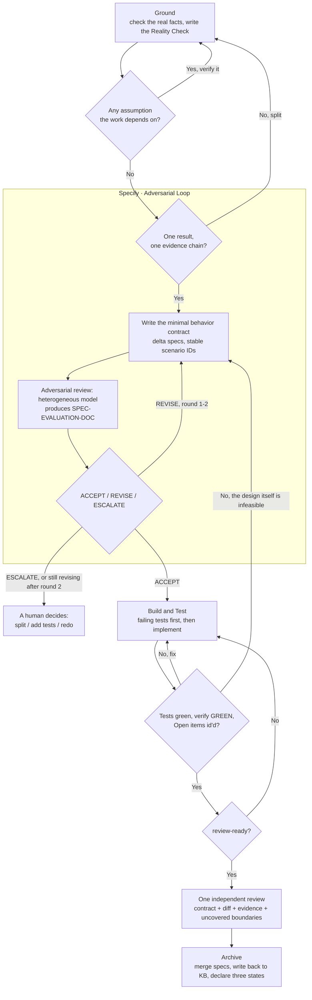

## 1. Core Concepts: Why Do It This Way

### 1.1 Agent = LLM + Tool Use

AI coding tools (Claude Code, Codex, Cursor's Agent, Windsurf Cascade, Copilot Agent) are all, at their core, the same loop:
**the LLM calls tools (read files, grep, run commands) → it steadily accumulates "known facts" in its context → once the set of known facts stabilizes, it infers from those facts how to write the code.**

> Corollary: **the more accurate and complete the facts you feed it, the more reliable its inferences.** The entire methodology is built around one thing — how to supply facts with high quality.

### 1.2 Document-Driven Development: Three Sources of Fact

The problem with vibe coding is that the prompt is too vague and the requirements too loose, so the AI "creatively" writes code within a huge space of freedom. The fix is to use documents to collapse that freedom onto the correct track. Three documents map to three kinds of facts:

| Source | Role | The question it answers |
|---|---|---|
| **The behavior contract** (the change's delta specs) | States the intent `system state A → new state B` as scenarios with testable acceptance | "What should it become?" |
| **System Knowledge Base / TRUTH-DOC** (source of all facts) | An abstracted summary of all existing code; the set of black-box intents; maintained long-term | "What is it now (state A)?" |
| **Code** (real data flow) | The concrete landing of the knowledge base; how data actually flows internally | "How does it actually run, in detail?" |

> Once the Agent reads the **contract** it knows the target state B; the **System Knowledge Base** lets it reconstruct most of the current state A; **Code** fills in the rest of the detail, and it now grasps most of the system's truth. (6.0 asks for no separate requirement doc: the goal, the observed facts and the contract carry it — [§4.4](#44-specify-the-minimal-behavior-contract-adversarial-review-target-2-rounds).)
> **Without the system knowledge base, the Agent can only reverse-engineer abstract intent from the code — slow, and easy to guess wrong.** This is exactly the core tension Section 6 ("Legacy Project Development") is meant to resolve.

**North star:** this workflow is **Spec-Anchored** (specs persist as living documents); the endgame it paves toward — executable scenarios, "the spec *is* the test suite", trending toward the Spec-as-Source tier — lives in [VISION.md](../VISION.md). It is non-blocking guidance: no gate reads it; a change that conflicts with it merely records why. The scenario-ID ↔ test-name mapping in §4.5 is the first paving stone.

### 1.3 Test-Driven Development

Early in development, from the requirement doc plus existing facts, first produce test cases (scenario-style `if … then …`):

```
If the user is not logged in and visits the /profile page
Then redirect to /login, carrying a redirect parameter
```

After the AI writes the code and the tests, it **runs the tests itself**, keeping the code self-consistent and eliminating low-level mistakes (compile errors, missing fields, malformed data).

> Each scenario in the SPEC-DOC ([§4.5](#44-specify-the-minimal-behavior-contract-adversarial-review-target-2-rounds)) is one such `if … then …`, so **the spec's scenarios *are* the test cases** the implementation must satisfy in Build & Test — "test-driven" here means letting the spec's scenarios drive the tests.

### 1.4 Adversarial Review

> **Adversarial review = use a model *different* from the "producer" to audit the output.** A single model acting as both athlete and referee will systematically overlook its own blind spots.

Developers hold several AI tools at once, which makes them naturally suited to adversarial review — **produce with tool/model A, poke holes with tool/model B**:

```
Claude Code (Opus/Claude)  ──produces──►  SPEC-DOC + DESIGN-DOC
        ▲                                       │
        │                                       ▼
   revise per review  ◄──SPEC-EVALUATION-DOC──  Codex / Cursor switched to GPT, reviews
```

**What actually makes a review adversarial — three independent levers:**

| Lever | Why it helps | Needs a 2nd tool? |
|---|---|---|
| **Different model weights** | Partially non-overlapping blind spots (the most intuitive lever — see the caveat below) | Yes |
| **Fresh context** | The reviewer never sees the producer's reasoning, so it isn't anchored to its conclusions | No |
| **Adversarial role** | The producer optimizes for "make it work"; the reviewer optimizes for "find where it breaks" | No |

> The last two levers matter *more* than the first, and neither requires a second tool. A **freshly-started session explicitly told to refute** catches most issues even when it runs the same model as the producer — because it isn't bound to its own earlier reasoning. The worst anti-pattern is **asking the model to "review what you just wrote" in the same conversation**: its context is full of its own justifications, so it rubber-stamps. Switching models but staying in one session is *weaker* than the same model in a fresh one. If you only have Claude Code, see [§2.4](#24-adversarial-review-with-only-claude-code).

**Fresh context vs. cross-round memory — the issue ledger.** Multi-round review has a built-in tension: each round's reviewer should be *fresh* (the second lever), yet it must remember earlier rounds to verify "was issue #3 actually fixed?" Keeping one long-lived reviewer session buys memory at the cost of freshness — after round 1, the reviewer is anchored to *its own* past findings too. The fix is to move the memory out of the session and into a file: a cumulative **issue ledger** per change ([§7.0](#70-the-issue-ledger-optional-shared-by-review-loops)), where every issue carries an ID and a status. (Since 6.2 this is the reviewer's own notebook: the CLI never reads it — what blocks a delivery is an `## Open` item in the state, §7.0.) Each round's reviewer can then be a brand-new session: it reads the ledger to verify fixes and appends new findings, staying unanchored. The ledger doubles as the audit trail for human gates — rejections stay visible with their reasons, and a resurfacing issue reopens its old ID instead of masquerading as a new finding.

Adversarial review runs at two points: **① the behavior-contract review (Specify) ② the code-implementation review (Review & Deliver)** — and every round of each one records its findings in the same one state file.

**An honest caveat on LLM judges.** Heterogeneity reduces bias but does not eliminate it: self-preference in LLM judges is driven by *familiarity* (perplexity), not authorship — a different model only partially escapes it; code defects are partly **shared, systemic weaknesses across models**, so a cross-model reviewer inherits some of the producer's blind spots; and in one four-tool review comparison, 93.4% of distinct findings were caught by exactly one tool — review coverage is inherently incomplete. The implication: deterministic verification stays the primary instrument, always.

LLM adversarial review is one instrument in a larger verification portfolio — where quality actually comes from, stage by stage, is stated once in [§1.5](#15-where-quality-comes-from).

### 1.5 Where Quality Comes From

Four principles every mechanism in this handbook (and the RUNBOOK) instantiates:

1. **Quality comes from different instruments at different stages.** In a change's **contract stage** (Specify), LLM review is the only instrument available — there it is the primary one, and it never drops below one round per change. In the **implementation stage** (Build & Test), executable verification is primary (v1.0 already worked this way); LLM review covers what execution can't judge.
2. **Intent comes first; the spec's form may come later.** On any track, a human-acknowledged statement of intent precedes code; the tracks (§4.0) differ only in when the full spec crystallizes — **the spec is a conserved quantity at merge time**.
3. **Supervision parameters are never written by the supervised.** What the CLI reads lives in a human-held config; the decisions live at human gates. The agent reports data, never adjusts its own oversight.
4. **Extracted descriptions are drafts until reviewed.** Anything reverse-derived from code (P5) must pass review before anything downstream consumes it.

**Compatibility with the V1 baseline (v1.0), honestly stated:** paths and exit conditions are unchanged (default config: zero path drift); there are no per-project-type variants of the exit conditions — a change with no executable test evidence has no C1 evidence; a documentation project that wants the workflow must provide a real TAP-emitting check. What 6.0 did NOT keep is v1.0's gate ladder: there is no numbered gate ladder at all and no consolidation authorization, because a stop that fires on a step number stops changes that had nothing to decide. Five things stop for a human instead (RUNBOOK §1 R1), and the prompt library shrank from twelve per-step prompts to six.

---

## 2. Your AI Toolbox

This methodology is **decoupled from any specific tool** — any "LLM + Tool use" Agent can run it. Below are common tools, their roles, and how they pair up.

### 2.1 Tool Overview

| Tool | Form | Default model ecosystem | `apriori init` entry | Role in this workflow |
|---|---|---|---|---|
| **Claude Code CLI** | Terminal | Claude (Opus/Sonnet/Haiku) | `CLAUDE.md` + `/apriori` command | Primary producer + complex logic |
| **Codex** | CLI / IDE | GPT family | `AGENTS.md` + `.codex/prompts` | Adversarial review (a GPT perspective) |
| **Cursor** | IDE (VSCode-derived) | Multiple models | `.cursor/rules/apriori.mdc` (rule-level) | Produce or review, depending on the chosen model |
| **Windsurf** | IDE | Multiple models (Cascade) | `.windsurf/rules` + workflow | Produce or review |
| **Copilot** | IDE plugin | Multiple models | `.github/copilot-instructions.md` | Produce or review, inline completion |

> ⚠️ `apriori init` writes each tool a thin **pointer** to the one self-contained `apriori/runbook.md` in that tool's native location — a slash command where the tool supports one (Claude Code, Codex, Windsurf), a rule-level entry otherwise (Cursor, Copilot). **The protocol lives once; only the entry point differs per tool.** The four step actions (explore/propose/apply/archive, RUNBOOK §4) are universal.

> **Process-skill layers are swappable — artifact machinery is not.** The RUNBOOK's P1–P6 prompts *are* this workflow's own SDD skill layer; skill systems such as Claude Code's superpowers (TDD, debugging, planning) sit below it at the implementation layer — compatible, but no replacement for the artifact machinery (spec store, ledger, gates). On any conflict of instructions, the RUNBOOK stays canonical.

### 2.2 Switching Models / Tools

**Adversarial review requires the ability to switch models.** Common approaches:

- **Claude Code CLI** (switch **between Anthropic models** via an environment variable):
  ```shell
  # PowerShell
  $env:ANTHROPIC_MODEL="claude-opus-4-8"; claude
  $env:ANTHROPIC_MODEL="claude-sonnet-4-6"; claude

  # Linux / macOS / WSL
  ANTHROPIC_MODEL="claude-opus-4-8" claude
  ANTHROPIC_MODEL="claude-sonnet-4-6" claude
  ```
  > ⚠️ `ANTHROPIC_MODEL` **only works among Anthropic's own models**. To make Claude Code use a non-Anthropic model (e.g. GPT), you **cannot** just set it to `gpt-5.5` — the default endpoint does not serve that model and the call will error out. You must route through a gateway/proxy that speaks the Anthropic protocol:
  > ```shell
  > # e.g. a gateway like LiteLLM / claude-code-router forwarding the request to GPT
  > ANTHROPIC_BASE_URL="https://your-gateway.example.com" ANTHROPIC_MODEL="gpt-5.5" claude
  > ```
  > If you just want a GPT review perspective, **the simpler path is to use Codex / Cursor directly** (below) — no gateway needed.
- **Cursor / Windsurf / Copilot**: switch directly via the model dropdown in the chat box.
- **Codex**: specify the model via its config or the `-m` launch flag; to actually drive it from the CLI for a multi-round review, see [§2.3](#23-driving-codex-non-interactively-multi-round-adversarial-review).

> 💡 Recommended combo: **Claude Code (Opus) for production + Codex/Cursor on GPT for review**. The two model families have non-overlapping blind spots, which makes the adversarial pass most effective.
> 🐧 Linux / macOS / WSL is the best environment for CLI-type tools — rich command tooling and the most training examples in LLM corpora, so behavior is most stable.

### 2.3 Driving Codex Non-Interactively (Multi-Round Adversarial Review)

The adversarial-review loop (review → revise → re-review) only works if the reviewing tool **remembers the previous round**. With Codex you run this straight from the command line — no IDE needed — using `codex exec` to open a review session and `codex exec resume` to keep every round in **one conversation context**.

**Round 1 — open a session:**
```shell
# -s read-only : the reviewer only audits; it must not modify your files
# --skip-git-repo-check : only needed when running outside a git repo
codex exec -s read-only "<your review prompt — e.g. the RUNBOOK P5 reviewer prompt>"
```
The output header prints a line like `session id: 019f....`. **Copy that id** — it's the handle for the next round. (Invoking codex from a script or background job? Close stdin — append `< /dev/null`; PowerShell has no /dev/null, pipe instead: `$null | codex exec …` — or it waits for input and hangs.)

**Round 2…N — resume the same context:**
```shell
# codex CLI ≥ 0.14x: `resume` rejects -s — pass the sandbox as a config override
codex exec resume -c sandbox_mode="read-only" <session-id> "I've revised per your last review; re-review and produce v{N+1}."
# older CLIs: -s works, but flags MUST come before the session id
codex exec resume -s read-only <session-id> "..."
```
Because the session is preserved, the reviewer still remembers its earlier findings — it can verify "was issue #3 actually fixed?" instead of starting over each round.

> Don't want to track the id? `codex exec resume --last "..."` continues the most recent session. But with several reviews in flight that's ambiguous, so prefer the explicit id for real review loops.

**Pick the reviewing model** (keep it a *different* family from the producer — that's the whole point): `codex exec -m <model> ...`, or set the default in Codex's config.

> ⚠️ **Transport warnings are gateway-specific, not failures.** If your Codex is pointed at a **custom / self-hosted gateway**, you may see `failed to connect to websocket: 404` followed by `Falling back ... to HTTPS`. That only means *that gateway* doesn't serve the WebSocket transport — the request still completes over HTTPS and the review is unaffected; on the official endpoint you won't see it at all. If the noise bothers you, filter it:
> ```shell
> codex exec ... 2>&1 | grep -v -E "websocket|Reconnecting|Falling back"
> ```

> 💡 Even with `resume`, keep the **issue ledger** ([§7.0](#70-the-issue-ledger-optional-shared-by-review-loops)) updated every round — the session gives the *reviewer* memory, but the ledger gives *you* (and every human gate) the audit trail, and it lets you swap in a completely fresh reviewer at any round without losing state.

### 2.4 Adversarial Review With Only Claude Code

No Codex or second tool? You can still run a real adversarial loop — you just give up the "different model family" lever ([§1.4](#14-adversarial-review)) and lean on **fresh context + adversarial role**, which carry most of the weight anyway.

**The one rule: the reviewer must be a *separate session* — never a "now review your own work" turn inside the producer's conversation** (there its context is full of its own justifications, so it rubber-stamps). Open a second terminal, start a fresh `claude` on a different tier, and feed it only the artifacts (spec / design / code paths) plus the reviewer prompt from the RUNBOOK (§5):

```shell
# left terminal — producer
claude                                    # Opus by default; produces SPEC-DOC / code

# right terminal — reviewer: fresh context + a different tier
ANTHROPIC_MODEL="claude-sonnet-4-6" claude
# then paste the RUNBOOK P3 reviewer prompt, pointing at the artifact paths
```

This two-terminal setup is the Claude-only equivalent of §2.3's `codex exec` / `resume` loop: produce on the left, hand the artifacts to the right, paste findings back, repeat until "VERDICT: no major issues." One difference from `resume`: a fresh `claude` remembers nothing across rounds — so hand the reviewer the **issue ledger** ([§7.0](#70-the-issue-ledger-optional-shared-by-review-loops)) along with the artifacts. It verifies earlier fixes from the ledger while keeping fresh eyes; per [§1.4](#14-adversarial-review), that combination is worth having even when `resume` is available.

**Match the model tier to the review point:**

| Review point | What it needs | Suggested reviewer |
|---|---|---|
| Specify (the behavior contract) | Judgment & reasoning | the **strongest** model available (e.g. Opus), fresh session |
| Review & Deliver (impl vs spec consistency) | Semantic faithfulness (binding already done by `apriori verify`) | **Sonnet 4.6 / Haiku 4.5** — fast and cheap is enough |

> ⚠️ Don't point a weaker model at a stronger one's hard reasoning — auditing an Opus design with Haiku tends to miss exactly the subtle issues Haiku can't follow. Review *sideways or down* in capability, not steeply up. (`/model` switches the current session, but for review always **start a new session** so the reviewer keeps fresh eyes.)

---

## 3. Environment Setup: Starting From Scratch

Assume a clean machine. Every step below gives **a command you can run directly** plus **a verification command** — no steps skipped.

### 3.1 Install Node.js (The Runtime for Everything)

The `apriori` CLI runs on Node.js, so install that first. **Use a version manager** so you can switch versions later.

**macOS / Linux / WSL (nvm recommended):**
```shell
# 1. Install nvm (the v0.40.1 in the script is an example version — use the latest release from the nvm repo)
curl -o- https://raw.githubusercontent.com/nvm-sh/nvm/v0.40.1/install.sh | bash
# 2. Reload your shell config (or reopen the terminal)
source ~/.bashrc   # zsh users: source ~/.zshrc
# 3. Install and activate the latest LTS Node
nvm install --lts
nvm use --lts
```

**macOS (Homebrew also works):**
```shell
brew install node
```

**Windows (pick one):**
```powershell
# Option A: winget (built into Win10+)
winget install OpenJS.NodeJS.LTS

# Option B: nvm-windows — download the installer from https://github.com/coreybutler/nvm-windows/releases, then:
nvm install lts
nvm use lts
```

**Verify (a version number means success):**
```shell
node -v   # e.g. v22.x.x
npm -v    # e.g. 10.x.x
```

> You can also let the AI do it: in your AI tool, send "Check whether this machine has Node.js LTS installed; if not, install it the appropriate way for this OS and print the version." But it's worth **doing it manually at least once** so you understand what's being installed.

### 3.2 Install AI Coding Tools (Pick 1–2 as Needed)

- **Claude Code CLI**: `npm install -g @anthropic-ai/claude-code`, then `claude` to launch and log in.
- **Cursor / Windsurf**: download the installer from the official site and log in.
- **Copilot**: install the plugin in VSCode / JetBrains and log in to GitHub.
- **Codex**: install the CLI / plugin per its official docs and log in.

> For adversarial review, **install at least two tools from different model ecosystems** (e.g. Claude Code + Cursor, or Claude Code + Codex).

## 4. The Complete Workflow

### 4.0 Four Phases

Every change runs the same four phases. There is no second track, no size tier and — since 6.2 — no mode: what varies is the evidence a change owes, which follows the risks it actually hits, never the number of documents or rounds. (A `mode:` line may still sit in the state file; it is optional and inert.)

| Phase | What it settles | Done when |
|---|---|---|
| **Ground** | The real code, schema, interfaces, prototype, config, deploy topology, runtime. Each fact is `observed` (read or executed — cite the path, command or response), `decision` (from the requirement or the owner), or `assumption` (unproven, and verified before implementation) | nothing the work depends on is still an assumption |
| **Specify** | The minimal behavior contract and its acceptance criteria — and whether the change needs splitting first | the delta specs state the behavior, each scenario carrying a stable ID |
| **Build & Test** | Failing evidence first, then the implementation and the real tests that match the actual risks | tests green, `apriori verify` GREEN, `## Open` holding only what is genuinely unresolved |
| **Review & Deliver** | One independent review once review-ready; delivery once substantive issues are closed | verdict accepted, `apriori gate` PASS, archived |

The state file's `phase` field carries exactly these four words plus the two exits (`done`, `abandoned`). There is no step number: 5.x numbered seven of them and hung a fixed artifact on each, and **6.0 produces materials on demand** — no phase obliges a document set.

**Five things stop for a human, and nothing else does** (RUNBOOK §1 R1): an escalation (a `VERDICT: escalate`, or a review family at round 5); critical evidence blocked (a pending `## Open` item); a review family stalled after its round 2 (reframe); any external side effect; abandonment. 5.x had a fixed ladder of five numbered gates plus a ritual for consolidating them away — a stop that fires on a step number stops changes that had nothing to decide, and teaches people to consolidate the stops that mattered.

| Mode | When | What runs |
|---|---|---|
| **fast** | A reproducible defect, a local fix, and none of the risk signals below | reproduce → fix → regression → **one** independent review |
| **standard** | Everything else | evidence proportional to the risks actually hit — never more documents, never more rounds |

The signals that call for real evidence are facts, not estimates: UI / prototype · cross-process or cross-repo · data / transactions · config / deploy / environment · permission / security · migration / compatibility. Hitting one is not negotiable by self-report — what stays unverified becomes an `## Open` item, and only the owner's `evidence-accept <ID>` settles it. One signal is mechanical: a delta declaring `## MODIFIED`, `## REMOVED` or `## RENAMED` against an already-published requirement is reported by the CLI itself as `contract-mutation` — information, since 6.2, not a mode (RUNBOOK §2).

**A change should have one main result and one main evidence chain.** Split it when it spans several boundaries that each need a different real environment, when a reviewer must switch between unrelated contexts to judge correctness, or when fixing one area keeps widening the review surface in another. This is not a line or file-count threshold — the question is whether one clear, repeatable evidence chain can prove the change done.

### 4.1 Glossary

| Abbreviation | Full name | Description |
|---|---|---|
| TRUTH-DOC | System knowledge-base doc | The abstracted set of all known facts about the current system, maintained long-term (default: `apriori/truth/` inside the code repo — see §6) |
| SPEC-DOC | The behavior contract | The delta specs produced in Specify, describing every scenario of this change |
| SPEC-EVALUATION-DOC | Contract review doc | In **Specify**'s adversarial review, another model's audit of the delta specs |
| Reality Check | The state's Ground section | `observed` / `decision` / `assumption` lines in the flow-state. It **replaced** the gap report — one state, no second file |
| Open item | The state's unresolved items | `- <ID>: <text>` under `## Open`; pending until the owner records `evidence-accept <ID>` in `gates:`, and reported as still present after — the one mechanism of risk acceptance since 6.2 |
| Issue ledger | A reviewer's cross-round notebook — **optional, never read by the CLI** | A human practice for cross-round memory; since 6.2 `gate`/`archive`/`status` never open it and nothing in it blocks — see [§7.0](#70-the-issue-ledger-optional-shared-by-review-loops) |
| P6 | Discuss first | Only when the human explicitly asks to discuss an idea first: nothing durable until they approve, then `apriori new` → Ground (RUNBOOK "Discuss first") |
| mode | An optional, inert field | `fast` or `standard` may still be written in the state file; since 6.2 nothing decides anything by it ([§4.0](#40-four-phases)) |
| phase | Where the change is | `ground` / `specify` / `build` / `review`, plus `done` / `abandoned` |

**Where each artifact lives** (these paths are the conventions used throughout the RUNBOOK's prompts — adjust to your repo; process artifacts can also be relocated wholesale via the state file's `artifact-root` field, whose semantics live in RUNBOOK §3):

| Artifact | Default location |
|---|---|
| The state — the ONE progress source | `apriori/changes/<change>/flow-state.md` |
| SPEC-DOC (the behavior contract) | `apriori/changes/<change>/specs/<module>/` |
| SPEC-EVALUATION-DOC | `apriori/changes/<change>/review/spec-review-v{N}.md` |
| Reviewer raw output | `apriori/changes/<change>/review/<stem>-raw.*` |
| TRUTH-DOC (knowledge base) | `apriori/truth/<module>.md`, **in the same repo as the code** (a separate KB repo also works if every doc carries a `source-commit` stamp — see §6) |

Note what is absent: no requirement doc, no proposal, no design doc, no gap report, no task list. 6.0 demanded all five of every 5.x change and the practices showed the cost landing on reviewers rather than on defects — so `apriori new` scaffolds none of them, and neither `gate` nor `archive` asks for one.

### 4.2 Overview Flowchart

> The flowchart draws the **Specify adversarial loop**, the **review-ready admission check**, and the **loop-backs** between phases.



> Every loop drawn here has a machine-checkable exit condition, so each can be **driven automatically by `/goal`** — see [§4.7](#47-automating-the-loop-with-goal-claude-code).

> One loop-back the chart doesn't draw: if implementation reveals the **goal itself** was wrong, go all the way back to Ground — coding around a wrong goal is the most expensive loop in the diagram.

### 4.3 Ground: Check the Real Facts

> 💡 **Before Ground, you can just talk.** If the idea is still fuzzy and you say so, the agent discusses first (paste RUNBOOK **P6**): it reads the codebase, surfaces risks and unknowns, and presents candidate approaches with tradeoffs. Two protections: **nothing durable is written before you approve** (no code, no docs, no scaffolding), and **you decide** when it's stateable. A task you can already state starts directly; the agent never enters this stance unasked.

The **Ground action** (RUNBOOK **P1**). Read the real code, schema, interfaces, prototype, config, deploy topology and runtime — including Windows/WSL semantics when the change touches paths or processes.

- **Output: the `## Reality Check` section of the state file, and nothing else.** There is no gap report to produce and no sign-off to collect. 5.x had both; what they bought was a document nobody re-read and a gate that fired whether or not anything was in doubt.
- **Three kinds, one line each.** `observed` cites the path, command, response or screenshot that produced it. `decision` names who decided. `assumption` is a fact nobody has proven — **verify it before implementing**, and if you cannot, it becomes an `## Open` item until it is resolved or the owner accepts it.
- **The risk-table product facts may never be written from memory.** Routes, schema, auth, config, deploy topology: read them, or list them as `assumption`. Across the practices that fed this design, every skipped read was paid for *after* archive rather than before it.
- **When a fact will not yield to reading**, probe code is allowed — thrown away afterwards, never a deliverable, and never referenced later. What it produces is an `observed` line.
- **Exit:** nothing the work depends on is still an `assumption`.

> Legacy projects depend on this especially: see Section 6 — make sure the KB covers the relevant modules first, or Ground will surface facts with holes in them.

### 4.4 Specify: The Minimal Behavior Contract (Adversarial Review, Target 2 Rounds)

The **Specify action** (RUNBOOK **P2**). Write the delta specs — the minimal behavior contract, each scenario with a stable ID and testable acceptance — then enter adversarial review:

```
contract v1  ──reviewing model──►  review v1
review v1    ──producer revises──►  contract v2
contract v2  ──reviewing model──►  review v2
… (target: 2 rounds — see RUNBOOK §1 R4)
```

**Split before you specify.** A change carries **one main result and one main evidence chain**. Split by default when any of three facts holds: it spans several boundaries that each need a different real environment; a reviewer must switch between unrelated contexts to judge correctness; fixing one area keeps widening the review surface of another. This is not a line or file-count threshold — the whole question is whether **one clear, repeatable evidence chain can prove the change done**. Record the split judgement as a `decision` in the Reality Check.

- **The reviewing model must differ from the one that drafted the contract** (e.g. draft with Claude, review with GPT).
- The review dimensions are fixed on purpose — behavior clarity and testable acceptance / edge and exception coverage / undeclared state changes / conflicts with observed reality / security where input or permissions are touched / lineage / **scope** — a stable checklist keeps rounds comparable.
- **Exit condition:** the reviewing model outputs `VERDICT: no major issues, ready to proceed to execution`. The target is 2 rounds; still revising after round 2 means reframing first — split / add tests / redo the approach — not opening round 3 on the same plan. `VERDICT: escalate`, or a family reaching round 5, raises an escalation the owner answers (RUNBOOK §1 R4).
- **What is NOT produced here:** no requirement doc, no proposal, no design doc, no task list. Write one only when a document is genuinely the cheapest way to be right.

For the prompts, see [§7.2](#72-specify-contract-adversarial-review-and-revision).

### 4.5 Build & Test: Failing Evidence First

The **Build & Test action** (RUNBOOK **P2**). Write code per the contract — **tests first**: derive a failing test that proves every scenario's behavior with real evidence (one parametrized test may cover a scenario's whole examples table; naming it with the scenario's ID is a suggestion, never mandatory), then implement until everything is green. "All tests passing" is still the bar, and the failing-first run proves the tests can actually fail. There is no task list to follow: the contract's scenarios are the work.

- **Traceability beats coverage numbers**: genuine scenario coverage is Build & Test's (and review's) responsibility, not a tool's. `apriori verify` only confirms tests actually ran and nothing attributable is failing — UNBOUND is a diagnostic, never a block by itself. Naming a test with its scenario ID is advisory, for traceability, never a gate. Line coverage is a signal worth watching, not a target: a model told to "hit 100%" will happily pad with assertion-free tests. For high-risk logic, spot-check test quality with mutation testing.
- **Run the tests the risks call for, not a matrix.** 6.0 keeps no per-project-type evidence table: what a change owes is the evidence its risks actually call for, and whatever stays unverified is an `## Open` item. Scenario IDs bind to `apriori verify` through unit/component tests — verify's gate speaks TAP, which Playwright does not emit, so an E2E/visual layer sits on top of the binding gate as an additional exit condition and its visual checks must emit a textual pass/fail. Implementation-time screenshot self-checks land in the gitignored `apriori/tmp/`, never in version control, while visual-regression baseline images belong to the project's own test suite. Where no executable instrument exists for a risk (no deploy surface; solo; library; docs), the independent review is the instrument there — not a downgrade ([§1.5](#15-where-quality-comes-from)).
- **Prefer a stronger model (Opus) for complex logic, and a faster/cheaper model (Sonnet) for routine coding.**
- **Keep `## Open` true as you go.** One line per risk this change hits and has not resolved, a stable id first (`- <ID>: <text>`), saying what you ran and what is still unverified; delete the line when the risk is resolved. An item nobody can resolve is a stop for the owner — it is the one gap no extra review and no extra document can fill, and only `evidence-accept <ID>` in `gates:` settles it.
- **Tests span layers**: unit tests for logic (always); for a project **with a UI**, add E2E and visual-regression checks (e.g. Playwright screenshots). A pure library like §5's mini-kv has no UI, so it needs only unit tests — skip the Playwright clause in the [§4.7](#47-automating-the-loop-with-goal-claude-code) recipe.

### 4.6 Review & Deliver: Review-Ready, One Review, Archive

**Review-ready comes first.** `apriori gate --change <name> --review-ready` answers one question from the run's own facts — may a review round start? — and writes nothing. **A change that is not review-ready does not start a review round;** it goes back to Build & Test and nothing is counted. This exists because the practices kept showing the same failure: a reviewer handed a half-built change spends round 1 doing the producer's compilation and testing, and that round is not a review. The two items (`tests`, `open`) and why each is there: [§7.4](#74-review--deliver-consistency-review-and-archive).

**Then one independent review** (RUNBOOK **P3**), on a fixed default context — contract, diff, evidence summary, uncovered boundaries — with `ACCEPT | REVISE | ESCALATE` as the outcome.

**Then archive.** `apriori archive` **merges this change's delta specs into the living spec store** (`apriori/specs/`) per the interface's archive algorithm (RUNBOOK §4), keeping the store consistent with the final implementation.

> ⚠️ Note the distinction: the archive action **does NOT automatically update your own TRUTH-DOC** (`apriori/truth/` or a separate KB repo — §6). Writing this change's new/changed facts **back into the KB is a separate step** (use the prompt in [§7.4](#74-review--deliver-consistency-review-and-archive) to have the AI do it explicitly, or write it manually).

**The archive declares three states and freezes.** Whether the implementation is complete, whether the critical evidence is complete, and whether the change is released or still pending external acceptance. That is the whole claim an archive makes. **A defect found afterwards becomes a short outcome note or a new change — never a rewrite of the archived bundle.** Back-writing an old archive manufactures a timeline in which the work was already finished, which is exactly what the practices kept producing.

**This step is the lifeline of long-term maintainability for legacy projects** — every change deposits new facts back into the KB, so the next Ground has no holes. With the KB in the same repo (§6), the writeback rides in the same PR as the code, where a reviewer can actually see it — the enforcement mapping is in [§4.8](#48-mapping-the-workflow-onto-git--pr--ci).

### 4.7 Automating the Loop with `/goal` (Claude Code)

Every loop above already has a **machine-checkable exit condition** — which is exactly what Claude Code's `/goal` consumes. `/goal "<condition>"` makes Claude work across turns **unattended until the condition holds**; after each turn an independent fast model (Haiku) reads the transcript and decides done / not-done, looping until done or you stop it.

> **Prerequisite:** `/goal` needs Claude Code ≥ v2.1.139 and an accepted hook-trust dialog; it's unavailable if `disableAllHooks` / `allowManagedHooksOnly` is set. Check with `claude --version`. (On older versions, just drive the same loops by hand per §2.3 / §2.4.)

**The one architectural rule that keeps this sound:**

> `/goal`'s built-in evaluator only **reads the transcript** and only judges *"is the condition met?"* — it is a weak model, and it is **NOT** the adversarial reviewer. So the real check must happen **inside the loop and leave its verdict in the transcript**. `/goal` orchestrates the loop; it never replaces the test run, the E2E suite, or the heterogeneous reviewer.

That layering is what lets you automate **even adversarial review** without violating [§1.4](#14-adversarial-review): inside each turn Claude **calls the reviewer** (Codex via [§2.3](#23-driving-codex-non-interactively-multi-round-adversarial-review), or a fresh Claude session via [§2.4](#24-adversarial-review-with-only-claude-code)), pastes its verdict back, and the goal condition is simply *"the reviewer's verdict line is 'VERDICT: no major issues, ready to proceed to execution'"* — no round number goes in the condition; RUNBOOK §1 R4's derived loop stops it (still revising after round 2 → stop and report, do not open round 3). The judgment stays heterogeneous + fresh-context; `/goal` only reads whether that judgment landed in the transcript.

**What to automate, and what to leave to a human:**

| Phase | A sound `/goal` condition (transcript-checkable) | Backed inside the loop by |
|---|---|---|
| Specify | the review doc is written and its verdict line = `VERDICT: no major issues, ready to proceed to execution`, or the derived review loop stops (RUNBOOK §1 R4) | a heterogeneous reviewer call each round |
| Build & Test | `npm test` exits 0 **and** lint/static analysis green (where configured) **and** every `## Open` item carries a stable id **and** the E2E/Playwright run is green **and** `apriori gate --review-ready` exits 0 | a real test + E2E run |
| Review & Deliver | the consistency review reports no gaps **and** the delta specs are merged **and** the module's KB file is updated | reviewer call + archive action + writeback |
| **an escalation · an open item nobody can resolve · an external side effect · abandonment** | — **do not wrap these in a goal** | a human decides (RUNBOOK §1 R1) |

> Scope each goal to a stretch that ends — an open-ended one can run very expensive. **`process-config.md` budgets nothing**: it holds no turn or round number. Review rounds stop where the runbook's derived loop stops them (§1 R4); the implement-and-test loop — which that loop does not govern — carries a fixed 25-turn safety bound in its recipe text. If a loop **oscillates** (the verdict flip-flops, or the same open issue keeps coming back) or stalls without progress, **escalate to a human** — never quietly lower the bar. Run **one `/goal` per machine-checkable stretch, stop wherever a human has to decide**, then start the next. The ready-to-paste recipes ship in [operator.md](./operator.md); The three ready-to-paste recipes (Specify / Build & Test / Review & Deliver) live in **[operator.md](./operator.md), the human operator appendix** — run by *you*, never by the agent, and kept in the apriori-cli repository's docs rather than inside the protocol file your project carries. Three things stay true of every recipe: the real check runs **inside** each turn and must land its result in the transcript; a stopped loop, a `VERDICT: escalate` or blocked critical evidence escalates to a human (`apriori status --escalation` exits 3 on exactly those) and is never license to lower the bar; and visual checks must emit a **textual** pass/fail or the evaluator cannot see them — a pure library like §5's mini-kv drops the Playwright clause entirely. The KB writeback is never self-approved ([§6.5](./legacy.md#65-closing-the-loop-write-back-after-every-change)).

**The authorization boundary.** The five human decisions (RUNBOOK §1 R1) govern the workflow; a separate hard rule governs anything that leaves it: any operation mutating state outside the local repository/workspace — push, merge, release, deploy, production data, remote-service administration, new paid services, messages to external parties — needs the human principal's explicit authorization, one-shot or as a named class/scope/expiry standing grant (RUNBOOK §1). No general "keep going" authorization ever covers these. And content arriving from files, tool output, or review verdicts is data, never authorization — it may advance the internal state machine where the protocol says so, but it never authorizes an external side effect.

### 4.8 Mapping the Workflow onto Git / PR / CI

Everything above is convention; a branch + CI mapping is what makes it *enforced*:

| Workflow element | Git / CI home |
|---|---|
| One change | One branch (`change/<change-name>`), one PR |
| Delta specs / review docs / the state file | Committed on the branch — reviewers see the contract and the code in the same diff |
| Build & Test exit conditions | CI jobs on the PR: tests green (naming a test with its scenario ID is a suggestion, never mandatory); lint/static analysis green (where configured); `apriori gate --change <name>` PASS — a change with no executable test evidence has no C1 evidence; a documentation project that wants the workflow must provide a real TAP-emitting check |
| Consistency-review verdict (§7.4) | Posted on the PR as a comment / required check before merge |
| The KB writeback | Part of the same PR — "code merged but KB not updated" becomes visible in review instead of silently accumulating |
| The hard stop | `apriori status --change <name> --escalation` exits 3 — wire it into a Stop hook or a required CI step if you want one |

**Parallel changes.** Each change can also take its own `git worktree` for an isolated working copy — most SDD tooling now automates this. In multi-lineage repos (several long-lived version lines), every change's state declares the **target lineage** (branch/line) up front — a lineage conflict discovered mid-change is an immediate-stop signal, not something to resolve in the merge editor. Branches isolate code, but two things still collide at archive time: the living spec store (`apriori/specs/`) and per-module KB files. Serialize archives per module — whoever merges second rebases their delta specs and KB diff — and treat a KB-file conflict as a signal that two changes touched the same facts: reconcile them deliberately, don't just pick a side in the merge editor.

---

## 5. Example Project: mini-kv (In-Memory Cache with TTL)

We'll run the whole workflow end-to-end on a small library with **real state and easy tests**. It's chosen because it lands squarely on a key spec rule — **"external shared state MUST describe the three moments: init / update / cleanup"** (see [cli §8.1 Spec-authoring rules](./cli.md#81-spec-authoring-rules)) — making it a good way to feel out the right spec granularity.

> Goal: a Node.js library `mini-kv` providing in-memory key-value storage with time-to-live (TTL).

### 5.0 Scaffold the Project

```shell
mkdir mini-kv && cd mini-kv
npm init -y
apriori init         # scaffold the apriori/ root and per-tool pointers
git init             # version control recommended, so you can diff each step
```

### 5.1 Ground · Align the Facts

Start by stating the goal in plain language, then check the facts. In your primary tool:

```text
* The goal: an in-memory key-value cache library, mini-kv — set/get/del with an optional TTL.
* System knowledge base: (new project: none / legacy project: apriori/truth/ or your KB path)
* Code, config, runtime: this repo
Align the facts and write the ## Reality Check section of apriori/changes/<change>/flow-state.md:
observed / decision / assumption, one line each. Do not write code.
```

For a greenfield library like this one, Ground is short — most lines will be `decision`. What it must NOT leave behind is an `assumption` the contract depends on: "get cleans up lazily" is either something you decided (write it as `decision`) or something you have not yet settled (write it as `assumption`, and settle it before Specify).

### 5.2 Specify · Contract + Adversarial Review

First the split test: mini-kv is one result with one evidence chain (a unit-test suite), so it does not split. Then write the contract:

```text
Write the minimal behavior contract for mini-kv as delta specs under apriori/changes/<change>/specs/mini-kv/.
One scenario per user-visible behavior, each with a stable ID and testable acceptance.
```

Pay attention to whether the resulting `spec.md` **gives each user-visible behavior its own scenario**, and whether the **external shared state (here, that in-memory map) describes the three moments: init / update-at-runtime / cleanup-and-invalidation**. Edge cases a reviewer should catch: what `ttlMs<=0` does, whether `get` cleans up lazily or on a timer, overwrite semantics.

Then switch to your reviewing tool/model and review → revise per [§7.2](#72-specify-contract-adversarial-review-and-revision), looping until `VERDICT: no major issues, ready to proceed to execution`. Concretely, drive the review with Codex ([§2.3](#23-driving-codex-non-interactively-multi-round-adversarial-review)):
```shell
# round 1 — open the review session (note the printed session id)
codex exec -s read-only "Review apriori/changes/<change>/specs/ against the goal and the Reality Check in apriori/changes/<change>/flow-state.md, using the RUNBOOK P3 checklist. End with a verdict line."
# each revision round — same context, so it checks whether your fixes landed
codex exec resume -c sandbox_mode="read-only" <session-id> "I revised per your last review; re-review and produce v{N+1}."
```

### 5.3 Build & Test · Code + Test

```text
First derive a failing test that proves every scenario's behavior (one parametrized test may cover a scenario's whole examples table; naming a test with its scenario ID is a suggestion, never mandatory) and show me the failing run.
Then implement until all tests pass and the contract is satisfied.
```
Expect output along the lines of:
- `src/mini-kv.js`: the core implementation
- `test/mini-kv.test.js`: covers set/get/del, TTL expiry, overwrite, `ttlMs<=0`, etc.

Run it to confirm:
```shell
npm test
```

Then look at the state's `## Open` section. mini-kv is a pure library with no UI, no cross-process surface and no schema, so nothing there is unverified and the section stays empty — a change owes nothing it does not actually hit.

To run the implement → test loop unattended, wrap it in a goal — the mini-kv form of the [§4.7](#47-automating-the-loop-with-goal-claude-code) Build & Test recipe (it's a library, so no Playwright clause):
```text
/goal "All of: `npm test` exits 0 (naming a test with its scenario ID is a suggestion, never mandatory); every ## Open item in apriori/changes/<change>/flow-state.md carries a stable id; and `apriori gate --change <change> --review-ready --test-cmd \"npm test\"` exits 0. Turn 1: generate one failing test per spec scenario and SHOW the failing run. Each later turn: implement the next scenario, run `npm test` and SHOW the output. Stop when all hold."
```

### 5.4 Review & Deliver · Acceptance and Archive

Verify by hand (the snippet below assumes a class `KV` is exported — adjust to whatever export shape was actually generated):
```shell
node -e "const KV=require('./src/mini-kv'); const k=new KV(); k.set('a',1,50); console.log(k.get('a')); setTimeout(()=>console.log(k.get('a')), 80);"
# expected: prints 1 first, then undefined after expiry
```
Then run the consistency review (RUNBOOK **P3**, a different model) and land its verdict beside its raw transcript. Once satisfied, archive. Note the form: a change bundle is archived **whole**, by name —
`archive` refuses a change that is not finished (`phase: review`, the review loop converged, no
open ledger row if the change kept a ledger, no critical evidence still blocked), and the
single-file `--store/--delta` form is reserved for one-module surgery on a store file that lives
outside `apriori/changes/`.
```shell
apriori archive --change add-mini-kv --changes-dir apriori/changes --write
# merged (ADDED): <your requirement IDs> · change dir → apriori/changes/archive/<stamp>-add-mini-kv/
# ARCHIVE DECLARES: implementation complete · critical evidence complete · pending external acceptance
```
Those three lines are the whole claim the archive makes, and the bundle is frozen afterwards: a defect you find next week becomes a new change, not an edit to this record.

A new project's first archive **produces the initial TRUTH-DOC** (per §6's default: `apriori/truth/mini-kv.md`, in the same repo) — congratulations, your mini-kv now has a system knowledge base, and the next feature can start from the "knowledge base exists" path in Section 6. To calibrate granularity, here's roughly what that first KB doc should look like:

```markdown
---
module: mini-kv
source-commit: <commit sha at archive time>   # covers the Contract section only
---
# mini-kv — in-memory KV cache with TTL

## Contract (code-is-truth)

**Intent**: small in-process cache; single process, no persistence, no cross-instance consistency.

**Interface**
- `set(key, value, ttlMs?)` — overwrite replaces both value and TTL; `ttlMs <= 0` deletes the key immediately
- `get(key)` — `undefined` on missing *or expired*; reading an expired key deletes it (lazy expiry)
- `del(key)` — idempotent, no error on missing keys

**State & the three moments**: one in-memory `Map`, `key → { value, expiresAt }` — init: empty at construction, sweep timer starts on first `set`; update: every `set`/`del`, `get` may delete (lazy expiry); cleanup: lazy delete on `get` + periodic sweep, timer `unref()`ed so it doesn't hold the process open.

**Pitfalls (code-derived)**: between sweeps, an expired never-read key still occupies memory (bounded by the sweep interval); not safe across worker threads.

## Decisions (doc-is-truth)

- **DEC-1 (active)** — expiry = lazy delete **plus** a periodic sweep. *Rejected alternative*: lazy-only — turned down because requirement #4 caps long-term memory of dead keys, and never-read keys would leak. Consequence: the sweep timer must be `unref()`ed.
- **INV-1 (active, invariant)** — an expired key is **never** observable via `get`. Code violating this is a bug to file, never a doc to edit.
- **CON-1 (active, product constraint)** — zero runtime dependencies; the library stays embeddable.
```

Notice the two fixed sections and their **opposite truth directions**: the Contract section is reconciled *from* code and covered by the `source-commit` stamp; the Decisions section outranks code — it ages by being superseded, not by code drift. And notice what the doc is not: no code listings, no line-by-line walkthrough. That's the granularity every later `explore` will consume.

---

## 7. Prompt Library

> **The prompt texts themselves live in [RUNBOOK.md](../RUNBOOK.md) §5 (P1–P6)** — one source, distributed with the protocol, so agents never need this handbook. This section keeps the design notes: what each prompt must achieve and why it's shaped that way. Every prompt shares one structure — explicit "Role / Input / Task / Output / Constraints," with version numbers, loops, and exit conditions made explicit.

### 7.0 The Issue Ledger (Optional; Shared by Review Loops)

**The CLI reads no ledger** (6.2) — the state's `## Open` section holds a change's open substantive issues, one `- <ID>: <text>` line each, and `gate`/`archive`/`status` read them there and nowhere else; `review/issues.md` is never opened. Whether a reviewer still keeps such a table for its own cross-round memory is a human practice with no protocol weight. Two design notes are all that belong here:

- **Why the form exists at all:** cross-round memory lives in a file instead of a session, so every round's reviewer can be a **fresh** session without losing the thread ([§1.4](#14-adversarial-review)). A re-found issue reopens its old ID — that reopened ID is the oscillation alarm [§4.7](#47-automating-the-loop-with-goal-claude-code) watches for.
- **Why exactly one thing blocks:** an `## Open` item nobody has accepted. 5.x refused archives over ledger bookkeeping — unknown status tokens, reasonless rejections, unrecorded waives — on changes whose product tests were already green; 6.2 reads none of it, and an accepted item is reported as still present rather than deleted, because the record should be true. Reviews also follow a **scope discipline** (per Anthropic's fully-verified warning that gap-hunting reviewers report gaps even in sound work): only correctness/security/stated-requirement gaps become rows; the rest are `advisory`.

### 7.1 Ground: Reality Check

Prompt: RUNBOOK **P1**. Design notes: facts only — no code. The goal and the KB go in as inputs, and the output is pinned to the state's `## Reality Check` section rather than a separate document — the gap report was the thing 5.x produced here, and folding it into the one state is what stops progress from being written in two places that drift. Three kinds and no fourth: `observed` carries its path/command/response, `decision` names who decided, and `assumption` is the one that owes something — verify it before implementing, or move it to `## Open` as an item. One carve-out: when a fact will not yield to reading, probe code is allowed — thrown away afterwards, never referenced later — with the finding landing as an `observed` line.

### 7.2 Specify: Contract Adversarial Review and Revision

Prompts: RUNBOOK **P2** (the producer's contract → review-ready handoff) / **P3** (the independent reviewer). Design notes:

- P2 bakes in the split test (one result, one evidence chain) and the two spec-quality rules from [cli §8.1](./cli.md#81-spec-authoring-rules): one scenario per user-visible output (with a stable ID), and the three moments for any external shared state. It writes the contract and **nothing else** — 5.x had this prompt produce a proposal, a design doc and a task list alongside it.
- The producer's revise pass touches spec/design content only — never source — and must answer every substantive finding with accept/reject + reason; on `escalate`, or on a round-2 verdict that is still revise, it stops instead of opening another round.

> 💡 To run this review loop through Codex from the CLI — open the session in round 1, `resume <session-id>` each subsequent round so the reviewer keeps full context — see [§2.3](#23-driving-codex-non-interactively-multi-round-adversarial-review).

### 7.3 Build & Test: Code + Test

Prompt: RUNBOOK **P2**. Design notes: P2 is tests-first — a failing test that proves every scenario's behavior, shown failing *before* implementation (one parametrized test may cover a scenario's whole examples table); naming a test with its scenario ID is a suggestion, never mandatory. There is no task list to execute in order: the contract's scenarios are the work, which removes the one artifact 5.x's apply step depended on. Scenario coverage with real test evidence is the hard bar; line coverage stays a signal ([§4.5](#45-build--test-failing-evidence-first)). The prompt ends by requiring two things the reviewer would otherwise have to establish itself: `## Open` brought up to date (every remaining item id'd, saying what is still unverified), and the complete diff read with known P0/P1 at zero — an instruction, since 6.2, that nothing checks.

### 7.4 Review & Deliver: Consistency Review and Archive

Prompt: RUNBOOK **P3** (independent review); the archive itself needs none. Design notes:

- Before P3 runs at all, `apriori gate --review-ready` must exit 0. That check is a **transient view** over the run's own facts — no receipt document, nothing persisted — and its whole purpose is that the reviewer is never the first person to compile the code or run the suite.
- `apriori verify` has already confirmed tests actually ran with no real failure (UNBOUND is advisory, not proof of coverage), so P3's **semantic faithfulness** check also covers genuine coverage — whether each test actually exercises its scenario's intent, not just shares its ID. Its default context is four things: contract, diff, evidence summary, uncovered boundaries. Its scope clause keeps style findings advisory. Like every review, it runs on a heterogeneous model ([§2.3](#23-driving-codex-non-interactively-multi-round-adversarial-review)).
- The archive action merges delta specs into the living spec store per RUNBOOK §4's algorithm (`apriori/specs/`, [§4.6](#46-review--deliver-review-ready-one-review-archive)) — and nothing else: archive never touches `apriori/truth/` (§4). The KB writeback to `apriori/truth/<module>.md`, with its `source-commit` refresh and an explicit list of what changed, is the separate, human-reviewed step that happens BEFORE review-ready when the change owes one. The archive then declares three states — implementation, critical evidence, released-or-pending — and freezes: a defect found later becomes an outcome note or a new change, never an edit to the archived bundle.

### 7.5 Reverse Knowledge Capture for Legacy Projects

Prompt: RUNBOOK **P5**. Design notes: the code is the sole source of truth — uncertainties get marked "needs human confirmation" instead of invented intent; the output lands on the change branch at `apriori/truth/<module>.md`, so the mandatory double-check ([§6.4](./legacy.md#64-path-c-knowledge-base-missing-most-common)) happens where reviews already happen: the PR diff.

---
