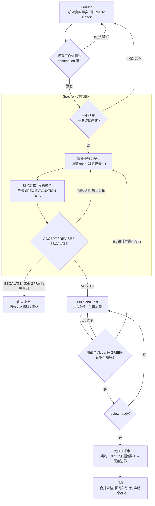

## 一、核心理念（为什么这么干）

### 1.1 Agent = LLM + Tool use

AI 编码工具（Claude Code、Codex、Cursor 的 Agent、Windsurf Cascade、Copilot Agent）本质都是一个循环：
**LLM 调用工具（读文件、grep、跑命令）→ 不断扩充上下文中的"已知事实"→ 当已知事实趋于稳定，再基于事实推断如何写代码。**

> 推论：**喂给它的事实越准、越全，它的推断越靠谱。** 整套方法论都是围绕"如何高质量地供给事实"展开的。

### 1.2 文档驱动开发：三类事实来源

Vibe Coding 的问题是提示词太宽泛、需求不明确，AI 在巨大的自由度里"创造性"地写代码。解法是用文档把自由度收敛到正确轨道上。三种文档对应三类事实：

| 来源 | 定位 | 回答的问题 |
|---|---|---|
| **行为契约**（本次变更的增量 spec） | 把 `系统状态 A → 新状态 B` 的意图写成带可测验收的 scenario | 「要变成什么样」 |
| **系统知识库 / TRUTH-DOC**（所有事实来源） | 现有系统所有代码的抽象概括、黑盒意图集合，长期维护 | 「现在是什么样（状态 A）」 |
| **代码**（真实数据流转） | 知识库的最终落地，内部数据的真实流转 | 「细节到底怎么跑」 |

> Agent 读了**契约**就知道目标状态 B；靠**系统知识库**还原绝大部分现状 A；再用**代码**补齐细节，就掌握了系统的大部分真相。(6.0 不要求单独的需求文档:目标、已观测事实与契约共同承载它——[§4.4](#44-specify最小行为契约对抗评审目标-2-轮)。)
> **缺了系统知识库，Agent 只能从代码反推抽象意图——又慢又容易猜错。** 这正是第六节"旧项目开发"要解决的核心矛盾。

**北极星:**本工作流属 **Spec-Anchored**(规格作为活文档常驻);它铺路通往的终局——scenario 可执行化、"spec *就是*测试套件"、朝 Spec-as-Source 一档演进——写在 [VISION_cn.md](../VISION_cn.md)。它是非阻塞指引:没有任何闸口读它;与它冲突的改动只需记录理由。§4.5 的 scenario-ID↔测试名映射就是第一块铺路石。

### 1.3 测试驱动开发

开发初期，依据需求文档 + 现有事实，先产出测试用例（场景化的 `如果…那么…`）：

```
如果 用户未登录，访问 /profile 页面
那么 应重定向到 /login，并携带 redirect 参数
```

AI 写完代码 + 测试后**自行运行测试**，保证代码闭环，同时消灭低级错误（编译错误、字段缺失、数据格式不对）。

> SPEC-DOC（§4.5）里的每个 scenario 就是一条这样的 `如果…那么…`，所以**规格的 scenario 本身就是测试用例**——Build & Test 的实现必须逐条满足它。这里说的"测试驱动"，就是让规格的 scenario 来驱动测试。

### 1.4 对抗训练

> **对抗训练 = 用与"生产者"不同的模型，去审查产出物。** 同一个模型既当运动员又当裁判，会系统性地放过自己的盲区。

程序员手握多种 AI 工具，天然适合做对抗训练——**用 A 工具/模型生产，用 B 工具/模型挑刺**：

```
Claude Code (Opus/Claude)  ──产出──►  SPEC-DOC + DESIGN-DOC
        ▲                                      │
        │                                      ▼
   按评审修订  ◄──SPEC-EVALUATION-DOC──  Codex / Cursor 切到 GPT 评审
```

**真正让评审"对抗"起来的,是三个相互独立的杠杆:**

| 杠杆 | 为什么有用 | 需要第二个工具吗? |
|---|---|---|
| **不同模型权重** | 盲区部分不重叠(最直观的杠杆——见下方注意) | 需要 |
| **全新上下文** | 评审方看不到生产方的推理链,不被其结论锚定 | 不需要 |
| **对抗性角色** | 生产方求"能跑通",评审方求"找它哪会崩" | 不需要 |

> 后两个杠杆比第一个**更**重要,而且都不需要第二个工具。一个**新开会话、被明确要求"证伪/挑刺"的 Claude**,即使跑的是和生产方相同的模型,也能逮到大半问题——因为它没有被自己之前的推理绑架。最糟的反模式是**在同一段对话里让模型"评审一下你刚写的"**:它的上下文里全是自己的理由,于是直接盖章。换了模型却留在同一会话,反而**不如**同模型但新开会话。若你只有 Claude Code,见 [§2.4](#24-只有-claude-code-时的对抗评审)。

**全新上下文 vs 跨轮记忆——用问题台账化解。** 多轮评审有个内生矛盾:每一轮的评审方应当是*新鲜的*(第二个杠杆),但它又必须记得前几轮,才能核对"问题 #3 是否真的修好了"。让评审方常驻同一个会话,是拿新鲜度换记忆——第 1 轮之后,它也开始被*自己*过去的结论锚定。解法是把记忆从会话挪进文件:每个变更维护一份累积的**问题台账**([§7.0](#70-问题台账可选评审循环共用)),每条问题带 ID 和状态(`open / fixed / rejected+理由 / verified / rejected-verified / waived(人,gates:) / advisory-acked`)。这样每一轮的评审方都可以是全新会话:读台账核对修复、追加新发现,同时不被锚定。台账还兼作人工闸口的审计记录——被拒绝的问题连同理由一直可见;反复出现的问题会重开旧 ID,而不是每轮都伪装成"新发现"。

对抗训练贯穿两个环节：**① 行为契约评审（Specify）② 代码实现评审（Review & Deliver）**——两处的每一轮都把发现记进同一份唯一状态文件。

**关于 LLM 判官的诚实注意。** 异构降低偏差但不消除它:LLM 判官的自我偏好由*熟悉度*(困惑度)驱动而非作者身份——换模型只能部分逃脱;代码缺陷部分是**跨模型共享的系统性弱点**,跨模型评审会继承生产方的部分盲区;一项四工具评审对比中,93.4% 的发现只被单一工具捕获——评审覆盖天然不完整。推论:确定性验证恒为主力仪器。

LLM 对抗评审是更大的验证组合中的一件仪器——质量在各阶段究竟来自哪里,统一陈述见 [§1.5](#15-质量从哪里来)。

### 1.5 质量从哪里来

本手册(及 RUNBOOK)的每个机制都是以下四条原则的实例:

1. **质量在不同阶段来自不同仪器。** 在变更的**契约阶段**(Specify),LLM 评审是唯一可用的仪器——在那里它是主力,且每个变更绝不低于一轮。在**实现阶段**(Build & Test),可执行验证是主力(v1.0 本就如此);LLM 评审负责执行判断不了的部分。
2. **意图先行,规格形式可以迟到。** 任何轨道上,一份经人认可的意图声明先于代码存在;两条轨道(§4.0)的区别只是完整规格何时成形——**规格是合并时的守恒量**。
3. **监督参数不由被监督者书写。** CLI 读取的参数放在人持有的配置里,决定放在人工闸口上;agent 只报告数据,绝不调整对自己的监督。
4. **反向提取的描述在评审前只是草稿。** 凡从代码反推出的东西(P5),必须过评审才能被下游消费。

**相对 V1 基线(v1.0)的兼容性,诚实地说:**路径与退出条件不变(默认配置下路径零漂移);退出条件仅对 v1.0 从未定义过的项目类型(纯文档项目)新增了映射变体。6.0 **没有**保留的是 v1.0 的闸口阶梯:不存在任何编号闸口阶梯,也不存在整合授权——按步骤号触发的停顿会拦下本来无事可决的 change。取而代之的是四件为人停下的事(RUNBOOK §1 R1),而提示词库也从十二条按步骤的提示词收缩为六条。

---

## 二、你的 AI 工具箱

本方法论**与具体工具解耦**——任何"LLM + Tool use"型 Agent 都能跑。下面是常见工具的定位与配合方式。

### 2.1 工具一览

| 工具 | 形态 | 默认模型生态 | `apriori init` 入口 | 在本流程中的角色 |
|---|---|---|---|---|
| **Claude Code CLI** | 终端 | Claude（Opus/Sonnet/Haiku） | `CLAUDE.md` + `/apriori` 命令 | 主力生产 + 复杂逻辑 |
| **Codex** | CLI / IDE | GPT 系 | `AGENTS.md` + `.codex/prompts` | 对抗评审（换 GPT 视角） |
| **Cursor** | IDE（VSCode 衍生） | 多模型可选 | `.cursor/rules/apriori.mdc`（规则级） | 生产或评审，按所选模型 |
| **Windsurf** | IDE | 多模型可选（Cascade） | `.windsurf/rules` + 工作流 | 生产或评审 |
| **Copilot** | IDE 插件 | 多模型可选 | `.github/copilot-instructions.md` | 生产或评审、行内补全 |

> ⚠️ `apriori init` 把一行指向唯一自包含 `apriori/runbook.md` 的**指针**写进每个工具的原生位置——工具支持斜杠命令的给命令(Claude Code、Codex、Windsurf),否则给规则级入口(Cursor、Copilot)。**协议只存一份;每个工具只是入口不同。** 四个步骤动作(explore/propose/apply/archive,RUNBOOK §4)是通用的。

> **过程技能层可替换——产物机制不可。** RUNBOOK 的 P1~P6 提示词*就是*本工作流自带的 SDD skill 层;Claude Code 的 superpowers(TDD、调试、规划)这类技能体系位于其下的实现层——兼容,但不能替代产物机制(规格库/台账/闸口)。指令冲突时,RUNBOOK 恒为准绳。

### 2.2 多模型 / 多工具切换

**对抗训练的前提是能换模型。** 常用方式：

- **Claude Code CLI**（用环境变量在 **Anthropic 模型之间**切换）：
  ```shell
  # PowerShell
  $env:ANTHROPIC_MODEL="claude-opus-4-8"; claude
  $env:ANTHROPIC_MODEL="claude-sonnet-4-6"; claude

  # Linux / macOS / WSL
  ANTHROPIC_MODEL="claude-opus-4-8" claude
  ANTHROPIC_MODEL="claude-sonnet-4-6" claude
  ```
  > ⚠️ `ANTHROPIC_MODEL` **只在 Anthropic 自家模型间生效**。想让 Claude Code 改用非 Anthropic 模型（如 GPT），**不能**直接把它设成 `gpt-5.5`——默认端点不提供该模型，会直接报错。必须经由一个兼容 Anthropic 协议的网关/代理转发：
  > ```shell
  > # 例：用 LiteLLM / claude-code-router 之类的网关把请求转发到 GPT
  > ANTHROPIC_BASE_URL="https://your-gateway.example.com" ANTHROPIC_MODEL="gpt-5.5" claude
  > ```
  > 若只是想要 GPT 的评审视角，**更省事的做法是直接用 Codex / Cursor**（见下），无需折腾网关。
- **Cursor / Windsurf / Copilot**：在对话框的模型下拉里直接切换。
- **Codex**：通过其配置或 `-m` 启动参数指定模型；想从命令行真正驱动它做多轮评审，见 [§2.3](#23-用命令行驱动-codex多轮对抗评审)。

> 💡 推荐组合：**Claude Code（Opus）做生产 + Codex/Cursor 切 GPT 做评审**。两套模型的盲区不重叠，对抗效果最好。
> 🐧 Linux / macOS / WSL 是跑 CLI 类工具的最佳环境——命令资源丰富，LLM 训练语料里这类案例最多，行为最稳。

### 2.3 用命令行驱动 Codex（多轮对抗评审）

对抗评审的闭环（评审 → 修订 → 再评审）能成立，前提是评审工具**记得上一轮**。用 Codex 时,这件事直接在命令行完成——无需 IDE——靠 `codex exec` 开一个评审会话、`codex exec resume` 让每一轮都待在**同一段对话上下文**里。

**第一轮——开启会话：**
```shell
# -s read-only ：评审只审、不许改你的文件
# --skip-git-repo-check ：仅当你在 git 仓库之外运行时才需要
codex exec -s read-only "<你的评审提示词——例如 RUNBOOK P5 的评审 prompt>"
```
输出头部会打印一行 `session id: 019f....`。**记下这个 id**——它是续接下一轮的句柄。(脚本或后台调用 codex 时要关闭 stdin——命令末尾加 `< /dev/null`(PowerShell 没有 /dev/null,改用管道 `$null | codex exec …`)——否则它会等待输入而挂起。)

**第二轮…第 N 轮——续接同一上下文：**
```shell
# codex CLI ≥ 0.14x:resume 不接受 -s——沙箱改用配置覆盖传入
codex exec resume -c sandbox_mode="read-only" <session-id> "我已按你上轮意见修订；请重新评审并产出 v{N+1}。"
# 旧版 CLI:-s 可用,但 flag 必须放在 session id 之前
codex exec resume -s read-only <session-id> "..."
```
因为会话被保留，评审方仍记得它上一轮的发现——能核对"问题 #3 是否真的改好了",而不是每轮都从零重审。

> 不想记 id？`codex exec resume --last "..."` 会续接最近一次会话。但同时有多个评审在跑时它会有歧义,所以正式评审循环建议显式带 id。

**选评审模型**（务必与生产方**不同系**——这正是对抗的意义所在）：`codex exec -m <model> ...`,或在 Codex 配置里设默认值。

> ⚠️ **传输层告警是网关个例,不是失败。** 如果你的 Codex 指向了**自定义 / 自建网关**,可能看到 `failed to connect to websocket: 404`,随后 `Falling back ... to HTTPS`。这只说明*那个网关*不提供 WebSocket 传输——请求仍会经 HTTPS 正常完成,评审不受影响;官方端点上根本不会出现。嫌刷屏可过滤掉:
> ```shell
> codex exec ... 2>&1 | grep -v -E "websocket|Reconnecting|Falling back"
> ```

> 💡 即便用了 `resume`,也请每轮同步更新**问题台账**([§7.0](#70-问题台账可选评审循环共用))——会话给的是*评审方*的记忆,台账给的是*你*(以及每个人工闸口)的审计记录;而且有了它,任何一轮都能换上全新的评审会话而不丢状态。

### 2.4 只有 Claude Code 时的对抗评审

没有 Codex、也没有第二个工具?照样能跑真正的对抗闭环——只是放弃"不同模型家族"这个杠杆([§1.4](#14-对抗训练)),靠**全新上下文 + 对抗角色**,而这两者本就占了大头。

**唯一铁律:评审方必须是*独立会话*——绝不能在生产方的对话里接一句"现在评审一下你刚写的"**(那里它满脑子都是自己的理由,只会盖章)。另开一个终端,用不同档位起一个全新的 `claude`,只喂给它产物(spec / design / code 路径)加上 RUNBOOK(§5)的评审提示词:

```shell
# 左边终端——生产方
claude                                    # 默认 Opus;产出 SPEC-DOC / 代码

# 右边终端——评审方:全新上下文 + 不同档位
ANTHROPIC_MODEL="claude-sonnet-4-6" claude
# 然后贴入 RUNBOOK P3 的评审提示词,指向产物路径
```

这套"双终端"就是 Claude-only 版的 §2.3 `codex exec` / `resume` 循环:左边生产,把产物交给右边,再把评审意见贴回来,循环到 "VERDICT: no major issues"(无重大问题)。与 `resume` 的一点差别:全新的 `claude` 不记得之前几轮——所以把**问题台账**([§7.0](#70-问题台账可选评审循环共用))连同产物一起交给评审方,它靠台账核对早前的修复是否落地,同时保持新鲜视角;按 [§1.4](#14-对抗训练) 的逻辑,即便有 `resume` 可用,这个组合也值得用。

**按评审点匹配模型档位:**

| 评审点 | 它需要什么 | 建议评审模型 |
|---|---|---|
| Specify(行为契约) | 判断与推理 | **最强**可用模型(如 Opus),新会话 |
| Review & Deliver(实现 vs spec 一致性) | 语义忠实(绑定已由 apriori verify 机械完成) | **Sonnet 4.6 / Haiku 4.5**——快且便宜就够 |

> ⚠️ 别拿弱模型去审强模型的硬推理——用 Haiku 审 Opus 的设计,往往恰好漏掉 Haiku 本就跟不上的微妙问题。评审要*平级或向下*选模型,别陡峭向上。(`/model` 切的是当前会话,但评审务必**另起新会话**,让评审方保持新鲜视角。)

---

## 三、环境搭建（从空环境开始）

假设机器是干净的。下面每一步都给出**可直接执行的命令**与**验证命令**，不跳步。

### 3.1 安装 Node.js（一切的运行时）

`apriori` CLI 跑在 Node.js 上，必须先有 Node。**推荐用版本管理器装**，方便后续切换版本。

**macOS / Linux / WSL（推荐 nvm）：**
```shell
# 1. 安装 nvm（脚本里的 v0.40.1 为示例版本号，请以 nvm 官方仓库的最新 release 为准）
curl -o- https://raw.githubusercontent.com/nvm-sh/nvm/v0.40.1/install.sh | bash
# 2. 重新加载 shell 配置（或重开终端）
source ~/.bashrc   # zsh 用户用 source ~/.zshrc
# 3. 安装并启用最新 LTS 版 Node
nvm install --lts
nvm use --lts
```

**macOS（也可用 Homebrew）：**
```shell
brew install node
```

**Windows（二选一）：**
```powershell
# 方式 A：winget（Win10+ 自带）
winget install OpenJS.NodeJS.LTS

# 方式 B：nvm-windows —— 到 https://github.com/coreybutler/nvm-windows/releases 下载安装包后：
nvm install lts
nvm use lts
```

**验证（看到版本号即成功）：**
```shell
node -v   # 例如 v22.x.x
npm -v    # 例如 10.x.x
```

> 让 AI 代劳也可以：在你的 AI 工具里发「检查本机是否安装 Node.js LTS，没有就用本系统合适的方式装好并打印版本」。但建议你**至少手动跑通一次**，理解它在装什么。

### 3.2 安装 AI 编码工具（按需选 1～2 个）

- **Claude Code CLI**：`npm install -g @anthropic-ai/claude-code`，然后 `claude` 启动并登录。
- **Cursor / Windsurf**：官网下载安装包，登录账号。
- **Copilot**：在 VSCode / JetBrains 安装插件并登录 GitHub。
- **Codex**：按其官方说明安装 CLI / 插件并登录。

> 做对抗训练**至少装两个不同模型生态的工具**（例：Claude Code + Cursor，或 Claude Code + Codex）。

## 四、完整工作流程

### 4.0 四个阶段,两种模式

每个变更都跑同样的四个阶段。没有第二条轨道,也没有尺寸档位——变的是**模式**,而模式只改变所需证据,绝不改变文档数量或轮次。

| 阶段 | 它要落实什么 | 何时算完 |
|---|---|---|
| **Ground** | 真实的代码、schema、接口、原型、配置、部署拓扑、运行环境。每条事实分三类:`observed`(已读取或执行——附路径、命令或响应)、`decision`(来自需求或 Owner)、`assumption`(尚未证实,实现前必须验证) | 本次工作依赖的东西里不再有 assumption |
| **Specify** | 最小行为契约与验收标准——以及这个 change 是否需要先拆 | 增量 spec 说清了行为,每个场景都带稳定 ID |
| **Build & Test** | 先拿失败证据,再实现,并跑与真实风险匹配的真实测试 | 测试全绿、`apriori verify` GREEN、证据行填完 |
| **Review & Deliver** | 达到 review-ready 后做一次独立评审;实质问题关闭后交付 | 结论已接受、`apriori gate` PASS、已归档 |

状态文件的 `phase` 字段正好承载这四个词,加上两个出口(`done`、`abandoned`)。没有步骤编号:5.x 编了七个,还给每个挂了一份固定产物,而 **6.0 材料按需产出**——没有任何一个阶段规定一套固定文档。

**只有四件事会为人停下,别无其他**(RUNBOOK §1 R1):一次 escalation(`VERDICT: escalate`,或某个评审 family 到第 5 轮);关键证据仍为 `blocked`;任何外部副作用;放弃。5.x 有五个编号闸口的固定阶梯,外加一套把它们整合掉的仪式——按步骤号触发的停顿会拦下本来无事可决的 change,并训练人去整合那些真正重要的停顿。

| 模式 | 何时 | 跑什么 |
|---|---|---|
| **fast** | 缺陷可稳定复现、修改局部,且未命中下列风险信号 | 复现 → 修复 → 回归 → **一次**独立评审 |
| **standard** | 其余 | 证据与真正命中的风险成比例——绝不增加文档,绝不增加轮次 |

强制走 **standard** 的信号是事实,不是估计:UI / 原型 · 跨进程或跨仓 · 数据 / 事务 · 配置 / 部署 / 环境 · 权限 / 安全 · 迁移 / 兼容。命中即不可用自述谈判——只有信号本身被证明为误判才能推翻。其中一条是机械的:对已发布需求声明 `## MODIFIED`、`## REMOVED` 或 `## RENAMED` 的增量,CLI 自己就会关闭 fast 通道(RUNBOOK §2)。

**一个 change 只应有一个主要结果和一条主要证据闭环。** 同时跨越多个各需不同真实环境的边界、reviewer 必须在互不相关的上下文之间切换才能判断正确性、修一个区域会持续扩大另一个区域的审查面——出现任一情况就先拆。这不是 LOC 或文件数门槛,核心问题只有一句:**这个 change 能否通过一条清晰、可重复的证据链证明完成?**

### 4.1 术语表

| 缩写 | 全称 | 说明 |
|---|---|---|
| TRUTH-DOC | 系统知识库文档 | 当前系统所有已知事实的抽象集合，长期维护（默认放在代码仓库内的 `apriori/truth/`——见第六节） |
| SPEC-DOC | 行为契约 | Specify 阶段产出的增量 spec，描述本次变更的所有场景 |
| SPEC-EVALUATION-DOC | 契约评审文档 | **Specify** 对抗评审中，另一模型对增量 spec 的审查意见 |
| Reality Check | 状态里的 Ground 段 | flow-state 中的 `observed` / `decision` / `assumption` 行。它**取代了** gap 报告——唯一状态,没有第二个文件 |
| 证据行(Evidence) | 状态里的风险台账 | `- <风险>: done \| blocked \| owner-accepted \| n/a — <细节>`;`blocked` 行会一直阻断交付,直到所有者决定 |
| 问题台账 | 累积问题表 —— **可选** | 只有当 change 大到值得逐条追踪状态翻转时才保留；每条问题带 ID 与状态——见 [§7.0](#70-问题台账可选评审循环共用) |
| P6 | 脑暴启动 | 进入 Ground 前的思考伙伴姿态:发散 → 收敛 → 人批准后汇入(RUNBOOK「脑暴」) |
| mode | 唯一的身份字段 | `fast` 或 `standard`,记入状态文件([§4.0](#40-四个阶段两种模式))——它缩放证据,绝不缩放文档数量 |
| phase | change 走到哪了 | `ground` / `specify` / `build` / `review`,加 `done` / `abandoned` |

**各类产物放哪**（下列路径就是 RUNBOOK 各提示词里通用的约定——按你的仓库调整；过程产物也可经状态文件的 `artifact-root` 字段整体外置，语义以 RUNBOOK §3 为准）：

| 产物 | 默认位置 |
|---|---|
| 状态文件 —— **唯一**进度源 | `apriori/changes/<change>/flow-state.md` |
| SPEC-DOC(行为契约) | `apriori/changes/<change>/specs/<module>/` |
| SPEC-EVALUATION-DOC | `apriori/changes/<change>/review/spec-review-v{N}.md` |
| 评审方原始输出 | `apriori/changes/<change>/review/<stem>-raw.*` |
| 问题台账 —— 可选 | `apriori/changes/<change>/review/issues.md` |
| TRUTH-DOC（知识库） | `apriori/truth/<module>.md`，**与代码同仓库**（独立知识库仓库也可以，但每份文档必须带 `source-commit` 标记——见第六节） |

注意这里**没有**什么:没有需求文档、没有提案、没有设计文档、没有 gap 报告、没有任务清单。5.x 对每个 change 都要这五份,而实践显示代价落在了评审方身上,而不是落在缺陷上——所以 `apriori new` 一份也不搭,`gate` 与 `archive` 也都不索要。

### 4.2 总览流程图

> 流程图画出了 **Specify 对抗循环**、**review-ready 准入检查**,以及各阶段之间的**回环**。



> 图中每个循环都有机器可判定的退出条件，因此都能**交给 `/goal` 自动驱动**——见 [§4.7](#47-用-goal-自动化整个流程)。

> 还有一条图上没画的回边：如果实现阶段发现**目标本身**就错了，要一路退回 Ground——绕着错误的目标写代码，是整张图里最贵的循环。

### 4.3 Ground｜核对真实事实

> 💡 **Ground 之前,你可以先只是想。** 想法还模糊时,进入脑暴姿态(贴 RUNBOOK **P6**):agent 先陪你发散(一次摆几个方向让你挑、扎根真实代码、随手画 ASCII 图——面向用户的东西给 2-3 个界面草图变体),再有纪律地收敛(每条消息一个问题并给选项、过覆盖清单——目的/用户/场景/界面/数据/约束/非目标/成功判据——退出前必给 2-3 个方案取舍对比)。两道保护:**你批准之前不留任何持久物**(不写代码、不写文档、不搭脚手架),且**何时"说得清"由你定**。这个姿态是承重墙:它之后一切大体自动运转,人机真正对齐就在这里。

**Ground 动作**(RUNBOOK **P1**)。读真实代码、schema、接口、原型、配置、部署拓扑与运行环境——change 触及路径或进程时,也包括 Windows/WSL 语义。

- **产出:状态文件的 `## Reality Check` 段,别无其他。** 没有 gap 报告要产出,也没有签核要收。5.x 两样都有;它们换来的是一份没人重读的文档,和一个无论有没有疑点都会触发的闸口。
- **只有三类,一行一条。** `observed` 附上产生它的路径、命令、响应或截图。`decision` 点名是谁决定的。`assumption` 是没人证实过的事实——**实现前先验证**,验证不了就变成一条 `## Evidence` 行,按 §6 的规则走。
- **风险表里的产品事实绝不可凭印象写。** 路由、schema、鉴权、配置、部署拓扑:要么读过,要么列为 `assumption`。在喂养这套设计的那些实践里,每一次省掉的阅读,代价都是在归档**之后**而不是之前付的。
- **当某个事实读不出来时**,允许写探针代码——用完即弃,不是交付物,之后也绝不被引用。它的产物是一条 `observed` 行。
- **退出:** 本次工作依赖的东西里,不再有 `assumption`。

> 旧项目尤其依赖这一步:见第六节——先确保知识库覆盖了相关模块,否则 Ground 捞上来的事实本身就带洞。

### 4.4 Specify｜最小行为契约（对抗评审，目标 2 轮）

**Specify 动作**(RUNBOOK **P2**)。写增量 spec——最小行为契约,每个场景带稳定 ID 与可测验收——然后进入对抗评审:

```
契约 v1  ──评审模型──►  评审 v1
评审 v1  ──生产方修订──►  契约 v2
契约 v2  ──评审模型──►  评审 v2
…（目标 2 轮——见 RUNBOOK §1 R4）
```

**写契约之前先拆。** 一个 change 只承载**一个主要结果和一条主要证据闭环**。出现下列三个事实中任一个就默认拆分:同时跨越多个各需不同真实环境的边界;评审方必须在互不相关的上下文之间切换才能判断正确性;修一个区域会持续扩大另一个区域的审查面。这不是 LOC 或文件数门槛,核心问题只有一句:**这个 change 能否通过一条清晰、可重复的证据链证明完成?** 把拆分判定作为一条 `decision` 记入 Reality Check。
**枚举类需求逐项带边界语义。** 需求递来「N 类校验 / N 种状态」时，每一项在 `## Reality Check` 各写一条 `decision`：阻断还是提醒、开区间期间算不算永远有效、未来值怎么处理。把类别列成 scenario 不等于做了决定——回放实验里九类校验全部列齐，一个未来月份照样进了库。

- **评审模型必须与起草契约的那个不同**(如 Claude 起草、GPT 评审)。
- 评审维度固定是有意为之——行为清晰度与可测验收 / 边界与异常覆盖 / 未声明的状态变更 / 与已观测现实的冲突 / 触及输入或权限时的安全 / 谱系 / **范围**——稳定的清单让各轮可比。
- **退出条件:**评审模型输出 `VERDICT: no major issues, ready to proceed to execution`。目标是 2 轮;第 2 轮后仍在修订,意味着先改做法——拆分 / 补测试 / 重做方案——而不是在原方案上开第 3 轮。`VERDICT: escalate`,或某个 family 到达第 5 轮,都会升级给所有者作答(RUNBOOK §1 R4)。
- **这里不产出什么:**没有需求文档、没有提案、没有设计文档、没有任务清单。只有当写文档确实是把事情做对的最便宜手段时才写。

提示词见 [§7.2](#72-specify契约对抗评审与修订)。

### 4.5 Build & Test｜先失败证据

**Build & Test 动作**(RUNBOOK **P2**)。按契约写代码——**测试先行**:每个 spec 场景派生一条失败测试(以场景 ID 命名是建议,不是强制),然后实现到全绿。"测试全过"仍是底线,而先失败的那次运行证明了这些测试真的会失败。没有任务清单要照着走:契约里的场景就是工作本身。

- **可追溯性胜过覆盖率数字**:真正的场景覆盖是 Build & Test(和评审)的责任,不是工具的。`apriori verify` 只确认测试确实跑过、且没有可归属的真实失败——UNBOUND 只是诊断,本身从不阻断。用 scenario ID 给测试命名是建议,为了可追溯性,从不是 gate。行覆盖率是值得看的信号,不是目标:被要求"打到 100%"的模型会心安理得地灌无断言测试。高风险逻辑用变异测试抽查测试质量。
- **跑风险要求的测试,而不是一张矩阵。** 6.0 不保留按项目类型划分的证据表:一个 change 欠下的,是它真正命中的每条风险各一行 `## Evidence`。scenario ID 经单测/组件测绑定给 `apriori verify`——verify 的闸口只认 TAP,而 Playwright 不输出 TAP,所以 E2E/视觉层叠在绑定闸口之上作为额外退出条件,其视觉检查必须输出文本化 pass/fail。实现期的截图自查落在已被 gitignore 的 `apriori/tmp/`,绝不进版本库,而视觉回归基线图属于项目自己的测试套件。某条风险不存在可执行仪器时(没有部署面;单人;库;文档),独立评审就是那里的仪器——不是降级([§1.5](#15-质量从哪里来))。
- **用户可见错误纪律。** 用户能触发的每一次调用都有一张定义好的失败面：错误在用户操作处可见，屏幕不留上一次成功的旧渲染，取消弹窗不变成未处理的 rejection。每个界面各一条「让调用失败、断言用户看到什么」的测试；三条只走成功路径的绿灯在这里什么都证明不了。
- **复杂逻辑优先用更强的模型(Opus),常规编码用更快更便宜的(Sonnet)。**
- **边做边填 `## Evidence` 行。** 本 change 真正命中的每条风险一行,各自为 `done` / `blocked` / `owner-accepted` / `n/a`,并写清你到底跑了什么。`blocked` 行是给所有者的一次停顿(§4.0)——它是任何额外评审和额外文档都填不上的那个缺口。
- **测试要跨层**:逻辑用单元测试(永远);**带界面**的项目再加 E2E 与视觉回归(如 Playwright 截图)。像 §5 的 mini-kv 这种纯库没有界面,只需单元测试——[§4.7](#47-用-goal-自动化整个流程) 配方里的 Playwright 条款直接删掉。

### 4.6 Review & Deliver｜先 review-ready，一次评审，然后归档

**先过 review-ready。** `apriori gate --change <name> --review-ready` 只用这次运行自身的事实回答一个问题——可以开始一轮评审了吗?——并且什么也不写。**没到 review-ready 就不开始一轮评审**:回 Build & Test,什么都不计数。它存在的理由,是实践反复呈现的同一个失败:把半成品交给评审方,第 1 轮就被用来替生产方编译和跑测试,而那一轮不是评审。四项分别是什么、为什么在那里:见 [§7.4](#74-review--deliver一致性评审与归档)。
**评审前先回收。** review-ready 之前，生产方先清掉本 change 自己留下的死代码与如今和实现矛盾的注释/DDL 抬头——多轮修订必然产出这些，评审方读到会为幽灵浪费一轮。评审方（P3）则对生产方在注释、笔记、提交信息里**自述**的每一个缺口给出裁决：修、在 `gates:` 里接受、或拒收——写下来却没人裁的缺口就是缺陷。

**然后一次独立评审**(RUNBOOK **P3**),默认上下文是固定的四样——契约、diff、证据摘要、未覆盖边界——结果是 `ACCEPT | REVISE | ESCALATE` 之一。

**然后归档。** `apriori archive` 按接口的归档算法(RUNBOOK §4)把本次 change 的**增量 spec 合并进活的 spec 存储**(`apriori/specs/`),让存储与最终实现保持一致。

> ⚠️ 注意区别:归档动作**不会自动更新你自己的 TRUTH-DOC**(`apriori/truth/` 或独立知识库仓库——见第六节)。把本次 change 的新增/变化事实**回写进知识库是单独的一步**(用 [§7.4](#74-review--deliver一致性评审与归档) 的提示词让 AI 显式做,或手写)。

**归档声明三个状态然后冻结。** 实现是否完成、关键证据是否完成、以及已发布还是仍待外部验收。这就是一次归档所做的全部声明。**之后发现的缺陷记为一条简短 outcome 或一个新 change——绝不回写已归档的 bundle。** 回写旧归档会制造"当时就已经完成"的假时间线,而那正是实践反复产出的东西。

**这一步是旧项目长期可维护性的生命线**——每个 change 都把新事实存回知识库,于是下一次 Ground 不再带洞。知识库与代码同仓(第六节)时,回写与代码走同一个 PR,评审者真的看得见——强制映射见 [§4.8](#48-把流程落到-git--pr--ci)。

### 4.7 用 /goal 自动化整个流程

上面每个循环都已经有**机器可判定的退出条件**——这正是 Claude Code 的 `/goal` 所消费的东西。`/goal "<条件>"` 让 Claude 跨轮次**无人值守地跑到条件成立**;每轮结束后由一个独立的快模型(Haiku)读取会话记录并判定完成/未完成,循环直到完成或你叫停。

> **前置条件:**`/goal` 需要 Claude Code ≥ v2.1.139 并接受 hook 信任对话框;设了 `disableAllHooks` / `allowManagedHooksOnly` 就用不了。用 `claude --version` 查。(旧版本就按 §2.3 / §2.4 手工驱动同样的循环。)

**让这套东西成立的唯一架构规则:**

> `/goal` 内建的评估器**只读会话记录**,只判断*"条件满足了吗?"*——它是弱模型,而且**不是**对抗评审方。所以真正的检查必须**发生在循环内部,并把结论留在会话记录里**。`/goal` 只编排循环;它绝不替代测试运行、E2E 套件或异构评审方。

正是这种分层,让**连对抗评审都能自动化**而不违反 [§1.4](#14-对抗训练):每一轮里 Claude **调起评审方**(经 [§2.3](#23-用命令行驱动-codex多轮对抗评审) 的 Codex,或经 [§2.4](#24-只有-claude-code-时的对抗评审) 的全新 Claude 会话),把结论贴回来,而目标条件就只是*"评审方的结论行是 'VERDICT: no major issues, ready to proceed to execution'"*——条件里不写轮次数字;RUNBOOK §1 R4 的派生循环会叫停它(第 2 轮后仍在修订 → 停下汇报,不开第 3 轮)。判断仍然异构 + 全新上下文;`/goal` 只读那份判断有没有落进会话记录。

**哪些该自动化,哪些留给人:**

| 阶段 | 一个可靠的 `/goal` 条件(可由会话记录判定) | 循环内部由什么兜底 |
|---|---|---|
| Specify | 评审文档已写出且结论行 = `VERDICT: no major issues, ready to proceed to execution`,或派生评审循环已停止(RUNBOOK §1 R4) | 每轮一次异构评审方调用 |
| Build & Test | `npm test` 退出 0 **且** lint/静态分析全绿(已配置时)**且** 每条 `## Evidence` 行都填完 **且** E2E/Playwright 运行为绿 **且** `apriori gate --review-ready` 退出 0——按 §4.5 的项目类型矩阵替换(纯文档:`apriori check`) | 真实测试 + E2E 运行 |
| Review & Deliver | 一致性评审报告无缺口 **且** 增量 spec 已合并 **且** 该模块的知识库文件已更新 | 评审方调用 + 归档动作 + 回写 |
| **escalation · 关键证据 blocked · 外部副作用 · 放弃** | —— **不要把这些包进 goal** | 由人决定(RUNBOOK §1 R1) |

> 每个 goal 只圈定一段会结束的区间——开放式的会跑得非常贵。**`process-config.md` 不给任何东西编预算**:它不含任何轮次或 turn 数。评审轮次停在 runbook 派生循环叫停它的地方(§1 R4);实现与测试循环——派生循环并不治理它——的固定 25 turn 安全上限写在配方正文里。循环若**振荡**(结论来回翻,或同一条开放问题反复回来)或无进展地卡住,**升级给人**——绝不悄悄降低标准。**一次 `/goal` 只跑一段机器可判定的区间,凡遇到需要人决定的地方就停**,然后再起下一段。可直接粘贴的配方随 [RUNBOOK.md](../RUNBOOK.md) §6 发布;三条可直接粘贴的配方（Specify / Build & Test / Review & Deliver）在 **[RUNBOOK_cn.md](../RUNBOOK_cn.md) §6 人类操作员附录**——由*你*执行,永远不由 Agent 执行,因而随你项目里已有的协议文件一起分发。每条配方都恒成立三点:真正的检查在每一轮**内部**跑,结果必须落进 transcript;循环停止、`VERDICT: escalate`、或关键证据 blocked 一律升级给人(`apriori status --escalation` 正是对这些以 3 退出),绝不是放低标准的许可;视觉检查必须产出**文本化**的通过/失败,否则评估器看不见——纯库(如 §5 的 mini-kv)直接去掉 Playwright 条款。知识库回写永远不自我批准（[§6.5](./legacy_cn.md#65-闭环每次开发都回写)）。

**授权边界。** 那四个人工决定治理工作流;另有一条硬规则治理任何离开工作流的动作:任何在本地仓库/工作区之外改变状态的操作——推送、合并、发布、部署、生产数据、远程服务管理、新的付费服务、对外发消息——都需要人类本人的显式授权,一次性授权,或按具名类别/范围/失效期的常设授权(RUNBOOK §1)。任何泛泛的"继续跑"授权都不覆盖它们。而来自文件、工具输出或评审结论的内容是数据,不是授权——它可以在协议明文规定处推进内部状态机,但绝不授权外部副作用。

### 4.8 把流程落到 Git / PR / CI

上面这些都是约定;真正让它被**强制**的,是分支 + CI 的映射:

| 流程元素 | Git / CI 落点 |
|---|---|
| 一个 change | 一个分支(`change/<change-name>`)、一个 PR |
| 增量 spec / 评审文档 / 状态文件 | 提交在分支上——评审者在同一个 diff 里同时看到契约与代码 |
| Build & Test 退出条件 | PR 上的 CI 作业:测试全绿(用 scenario ID 命名测试是建议,不是强制);lint/静态分析全绿(已配置时);`apriori gate --change <name>` PASS——纯文档项目把"测试"映射成 `apriori check`(§4.5) |
| 一致性评审结论(§7.4) | 以评论/必过检查的形式发在 PR 上,合并前必须有 |
| 知识库回写 | 同一个 PR 的一部分——"代码合了但知识库没更新"会在评审里显形,而不是悄悄堆积 |
| 硬停 | `apriori status --change <name> --escalation` 以 3 退出——想要 Stop hook 或必过 CI 步骤就接它 |

**并行 change。** 每个 change 也可以各自用一个 `git worktree` 拿到隔离的工作副本——多数 SDD 工具现在都自动化了这一步。在多谱系仓库(几条长期版本线)里,每个 change 的状态都要事先声明**目标谱系**(分支/线)——中途发现谱系冲突是立即停下的信号,不是到合并编辑器里去解的事。分支隔离了代码,但归档时仍有两样东西会撞:活的 spec 存储(`apriori/specs/`)与按模块的知识库文件。按模块串行归档——后合的人 rebase 自己的增量 spec 与知识库 diff——并把知识库文件冲突当成"两个 change 动了同一批事实"的信号:有意识地调和它们,别在合并编辑器里随手挑一边。

---

## 五、实例项目：mini-kv（带 TTL 的内存缓存）

用一个**有真实状态、易测试**的小库，把全流程跑通一遍。选它是因为它正好命中一条关键规格规则——**"外部共享状态必须描述 初始化 / 更新 / 清理 三个时机"**（见 §8.1），是体会规格颗粒度的好例子。

> 目标：一个 Node.js 库 `mini-kv`，提供带过期时间（TTL）的内存键值存储。

### 5.0 建项目骨架

```shell
mkdir mini-kv && cd mini-kv
npm init -y
apriori init         # 搭建 apriori/ 根与各工具指针
git init             # 建议纳入版本管理，方便对照每步 diff
```

### 5.1 Ground · 对齐事实

先用大白话把目标说出来,然后核对事实。在主力工具里:

```text
* 目标: 一个内存 key-value 缓存库 mini-kv —— set/get/del,TTL 可选。
* 系统知识库: (新项目，暂无 / 旧项目填 apriori/truth/ 或知识库路径)
* 代码、配置、运行环境: 当前仓库
请对齐事实，写出 apriori/changes/<change>/flow-state.md 的 ## Reality Check 段:
observed / decision / assumption,一行一条。不要写代码。
```

对这样一个绿地库来说,Ground 很短——大多数行会是 `decision`。它绝不能留下的,是契约所依赖的 `assumption`:"get 惰性清理"要么是你定的(写成 `decision`),要么是你还没敲定的(写成 `assumption`,并在 Specify 之前敲定)。

### 5.2 Specify · 契约 + 对抗评审

先过拆分判定:mini-kv 是一个结果加一条证据闭环(一套单元测试),所以不拆。然后写契约:

```text
把 mini-kv 的最小行为契约写成 apriori/changes/<change>/specs/mini-kv/ 下的增量 spec。
每个用户可见行为单独一个 scenario,各带稳定 ID 与可测验收。
```

重点检查产出的 `spec.md` 是否**为每个用户可见行为单独建 scenario**，且**外部共享状态（这里就是那张内存 map）描述了 初始化 / 运行中更新 / 清理失效 三个时机**。评审方应当抓到的边界:`ttlMs<=0` 怎么办、`get` 是否惰性清理还是定时清理、覆盖写语义。

然后切到评审工具/模型，按 [§7.2](#72-specify契约对抗评审与修订) 评审 → 修订，循环到 `VERDICT: no major issues, ready to proceed to execution`。具体可用 Codex 来驱动评审（[§2.3](#23-用命令行驱动-codex多轮对抗评审)）：
```shell
# 第一轮——开启评审会话（记下打印出来的 session id）
codex exec -s read-only "按 RUNBOOK P3 评审清单，对照目标与 apriori/changes/<change>/flow-state.md 里的 Reality Check 评审 apriori/changes/<change>/specs/，末尾给出结论行。"
# 之后每个修订轮——同一上下文，它能核对你的修复是否到位
codex exec resume -c sandbox_mode="read-only" <session-id> "我已按上轮意见修订；请重新评审并产出 v{N+1}。"
```

### 5.3 Build & Test · 编码 + 测试

```text
先从 spec 的每个 scenario 派生一条失败测试(测试名带 scenario ID 是建议,不是强制),把失败的运行结果给我看。
然后实现，直到测试全部通过、契约被满足。
```
预期它会产出类似：
- `src/mini-kv.js`：核心实现
- `test/mini-kv.test.js`：覆盖 set/get/del、TTL 过期、覆盖写、`ttlMs<=0` 等场景

跑一下确认：
```shell
npm test
```

然后填状态的 `## Evidence` 行。mini-kv 是纯库,没有界面、没有跨进程面、没有 schema,所以多数行是 `n/a — <为什么>`——而永远适用的那条是 `producer-diff: done — 看完了完整 diff,已知 P0/P1 为零`。

想让"实现 → 测试"循环无人值守地跑，就用 goal 包起来——这是 [§4.7](#47-用-goal-自动化整个流程) Build & Test 配方的 mini-kv 版（它是个库，所以没有 Playwright 那一条）：
```text
/goal "目标——以下全部成立:`npm test` 退出码 0(用 scenario ID 命名测试是建议,不是强制);apriori/changes/<change>/flow-state.md 的每条 ## Evidence 行都已填写;且 `apriori gate --change <change> --review-ready --test-cmd \"npm test\"` 退出码 0。第 1 轮:为每个 spec scenario 生成一条失败测试并把失败运行结果打印出来。之后每一轮:实现下一个 scenario,跑 `npm test` 并把输出打印出来。全部成立则停。"
```

### 5.4 Review & Deliver · 验收与归档

手动验一把（下面假设导出的是一个类 `KV`，请按实际生成的导出方式调整）：
```shell
node -e "const KV=require('./src/mini-kv'); const k=new KV(); k.set('a',1,50); console.log(k.get('a')); setTimeout(()=>console.log(k.get('a')), 80);"
# 预期先打印 1，过期后打印 undefined
```
然后跑一致性评审(RUNBOOK **P3**,换一个模型),把它的结论行与原始记录一起落盘。满意后归档。注意形式:变更 bundle 是**整个**按名字归档的——`archive` 会拒绝一个还没做完的变更(`phase: review`、评审循环已收敛、若保留了台账则没有 open 行、没有关键证据仍 blocked),而单文件形式 `--store/--delta` 只保留给 `apriori/changes/` **之外**的单模块手术。
```shell
apriori archive --change add-mini-kv --changes-dir apriori/changes --write
# merged (ADDED): <你的 requirement ID> · 变更目录 → apriori/changes/archive/<戳>-add-mini-kv/
# ARCHIVE DECLARES: implementation complete · critical evidence complete · pending external acceptance
```
那三行就是这次归档所做的全部声明,之后这个 bundle 就冻结了:下周你发现的缺陷会变成一个新 change,而不是对这条记录的一次编辑。

新项目第一次 archive 会**生成初版 TRUTH-DOC**（按第六节的默认约定：`apriori/truth/mini-kv.md`，与代码同仓库）——恭喜，你的 mini-kv 从此有了系统知识库，下个功能就能从第六节的"有知识库"路径起步。为了校准颗粒度，第一份知识库文档大致应长这样：

```markdown
---
module: mini-kv
source-commit: <归档时的 commit sha>   # 只覆盖契约节
---
# mini-kv —— 带 TTL 的内存 KV 缓存

## 契约(code-is-truth)

**意图**:小型进程内缓存;单进程,不持久化,不保证跨实例一致性。

**接口**
- `set(key, value, ttlMs?)` —— 覆盖写同时替换值与 TTL;`ttlMs <= 0` 立即删除该 key
- `get(key)` —— key 不存在*或已过期*返回 `undefined`;读到过期 key 时顺手删除(惰性过期)
- `del(key)` —— 幂等,删除不存在的 key 不报错

**状态与三个时机**:一张内存 `Map`,`key → { value, expiresAt }`——初始化:构造时为空,首次 `set` 启动清扫定时器;更新:每次 `set`/`del`,`get` 可能触发删除(惰性过期);清理:`get` 惰性删除 + 周期清扫,定时器已 `unref()`,不拖进程退出。

**坑(代码派生)**:两次清扫之间,过期但从未被读的 key 仍占内存(上界由清扫间隔决定);跨 worker 线程不安全。

## 决策(doc-is-truth)

- **DEC-1(active)**—— 过期 = 惰性删除**加**周期清扫。*被否决方案*:纯惰性——否决理由是需求第 4 条对死键的长期内存占用设了上限,从不被读的键会泄漏。推论:清扫定时器必须 `unref()`。
- **INV-1(active,不变式)**—— 过期的 key **绝不能**被 `get` 观察到。代码违反它就报 bug,永远不是改文档。
- **CON-1(active,产品约束)**—— 零运行时依赖;这个库必须保持可嵌入。
```

注意两个固定小节和它们**相反的真相方向**:契约节*从*代码校对、由 `source-commit` 标记覆盖;决策节高于代码——它靠被后继决策取代而过期,不靠代码漂移。也注意这份文档不是什么:没有代码清单、没有逐行讲解。这就是之后每次 `explore` 要消费的颗粒度。

---

## 七、提示词库

> **提示词正文只存一份，在 [RUNBOOK_cn.md](../RUNBOOK_cn.md) §5（P1–P6）**——随协议分发，Agent 无需读本手册。本节只保留设计说明:每条提示词要达成什么、为什么长成那样。所有提示词统一结构:明确「角色 / 输入 / 任务 / 输出 / 约束」,并把版本号、循环、退出条件显式化。

### 7.0 问题台账（可选；评审循环共用）

**6.0 不要求台账**——状态的 `## Open` 段承载一个 change 的开放实质问题,`gate`/`archive` 也在那里读它。可选的台账表及其状态词表只规定一次,在 RUNBOOK §5。这里只留两条设计说明:

- **这个形式为什么存在:**跨轮记忆存在文件里而不是会话里,于是每一轮的评审方都可以是**全新**会话而不丢线索([§1.4](#14-对抗训练))。同一问题被再次发现时重开旧 ID——那个被重开的 ID 正是 [§4.7](#47-用-goal-自动化整个流程) 盯的振荡告警。
- **为什么只有一件事阻断:**仍是 `open` 的行。未知状态词、无理由的驳回、没有记录的 waive、归档时的 `fixed` 行都是记账,而 5.x 会为它们拒绝归档——在产品测试已经全绿的 change 上。修它们是因为记录应当为真,而不是因为有个闸口卡着发布。评审同时遵循**范围纪律**(依据 Anthropic 已充分验证的警告:找缺口的评审方在健全的工作上也会报缺口):只有正确性/安全/已声明需求的缺口才进正式行,其余标 `advisory`。

### 7.1 Ground｜Reality Check

提示词:RUNBOOK **P1**。设计说明:只对事实——不写代码。目标与知识库作为输入进去,产出被钉在状态的 `## Reality Check` 段而不是一份单独文档——gap 报告正是 5.x 在这里产出的东西,把它折进唯一状态,正是阻止进度被写在两个会漂移的地方的做法。只有三类、没有第四类:`observed` 带着它的路径/命令/响应,`decision` 点名是谁决定的,而 `assumption` 是唯一还欠着东西的那一类——实现前先验证,或把它升级为一条 `## Evidence` 行。一个例外:某个事实读不出来时,允许写探针代码——用完即弃、之后绝不被引用——发现落成一条 `observed` 行。

### 7.2 Specify｜契约对抗评审与修订

提示词:RUNBOOK **P2**(写契约)/ **P1**(评审方)/ **P2**(生产方修订)。设计说明:

- P2 内建了拆分判定(一个结果、一条证据闭环)与 §8.1 的两条规格质量规则:每个用户可见输出单独一个 scenario(带稳定 ID),以及任何外部共享状态的三个时机。它只写契约、**别无其他**——5.x 这条提示词还要顺带产出提案、设计文档与任务清单。
- P3 专找「会导致返工或线上事故」的问题——变更触及外部输入或权限时还带安全维度,并带一个可以回答 SPLIT 的范围维度。它的默认输入是契约、状态与知识库;原始记录与已关闭问题被刻意排除在外。它的结论行(`VERDICT: no major issues, ready to proceed to execution`)就是循环的机器可判退出条件,而 `VERDICT: escalate` 是第三种结果——方案错了,不是细节错了。
- 生产方的修订轮只改 spec/design 内容——绝不动源码——且必须对每条实质发现给出采纳/拒绝+理由;遇到 `escalate`,或第 2 轮结论仍是修订时,它停下而不是再开一轮。

> 💡 想用 Codex 从命令行跑这个评审循环——第一轮开会话,之后每轮 `resume <session-id>` 让评审方保有完整上下文——见 [§2.3](#23-用命令行驱动-codex多轮对抗评审)。

### 7.3 Build & Test｜编码 + 测试

提示词:RUNBOOK **P2**。设计说明:P2 测试先行——每个 spec scenario 一条失败测试,在实现*之前*先展示失败运行;用 scenario ID 给测试命名是建议,不是强制。没有任务清单要按顺序执行:契约里的 scenario 就是工作本身,这去掉了 5.x apply 步骤唯一依赖的那份产物。有真实测试证据的 scenario 覆盖是硬标准,行覆盖率只是信号([§4.5](#45-build--test先失败证据))。提示词末尾强制两件本来要评审方自己去建立的事实:每条 `## Evidence` 行都填完,以及看完完整 diff 之后声明 `producer-diff` 行。

### 7.4 Review & Deliver｜一致性评审与归档

提示词:RUNBOOK **P3**(独立评审);归档本身不需要提示词。设计说明:

- P3 跑起来之前,`apriori gate --review-ready` 必须先退出 0。那道检查是对本次运行自身事实的**临时视图**——没有 receipt 文档,什么也不持久化——它存在的全部意义,是评审方永远不是第一个编译代码或跑测试的人。
- `apriori verify` 已确认测试确实跑过且没有真实失败(UNBOUND 只是建议性提示,不证明覆盖到位),所以 P3 的**语义忠实**检查也覆盖真正的覆盖情况——每条测试是否真的检验了 scenario 的意图,而不只是共享 ID。它的默认上下文是四样:契约、diff、证据摘要、未覆盖边界。其范围条款把风格类发现留在 advisory;和所有评审一样跑在异构模型上([§2.3](#23-用命令行驱动-codex多轮对抗评审))。
- 归档动作按 RUNBOOK §4 的算法把增量规格并入 living 规格库(`apriori/specs/`,[§4.6](#46-review--deliver先-review-ready一次评审然后归档)),并额外强制知识库回写到 `apriori/truth/<module>.md`、刷新 `source-commit` 标记,并列出改了什么。归档随后声明三个状态——实现、关键证据、已发布或待验收——然后冻结:之后发现的缺陷记为一条 outcome 或一个新 change,绝不是对已归档 bundle 的一次编辑。

### 7.5 旧项目反向知识沉淀 / 知识库校对

提示词:RUNBOOK **P5**。设计说明:代码是唯一真相——不确定处标「待人工确认」而不是编造意图;产出落在变更分支的 `apriori/truth/<module>.md`,于是那道强制复核（[§6.4](./legacy_cn.md#64-路径-c知识库缺失最常见)）就发生在评审本来就发生的地方:PR diff 里。

---
