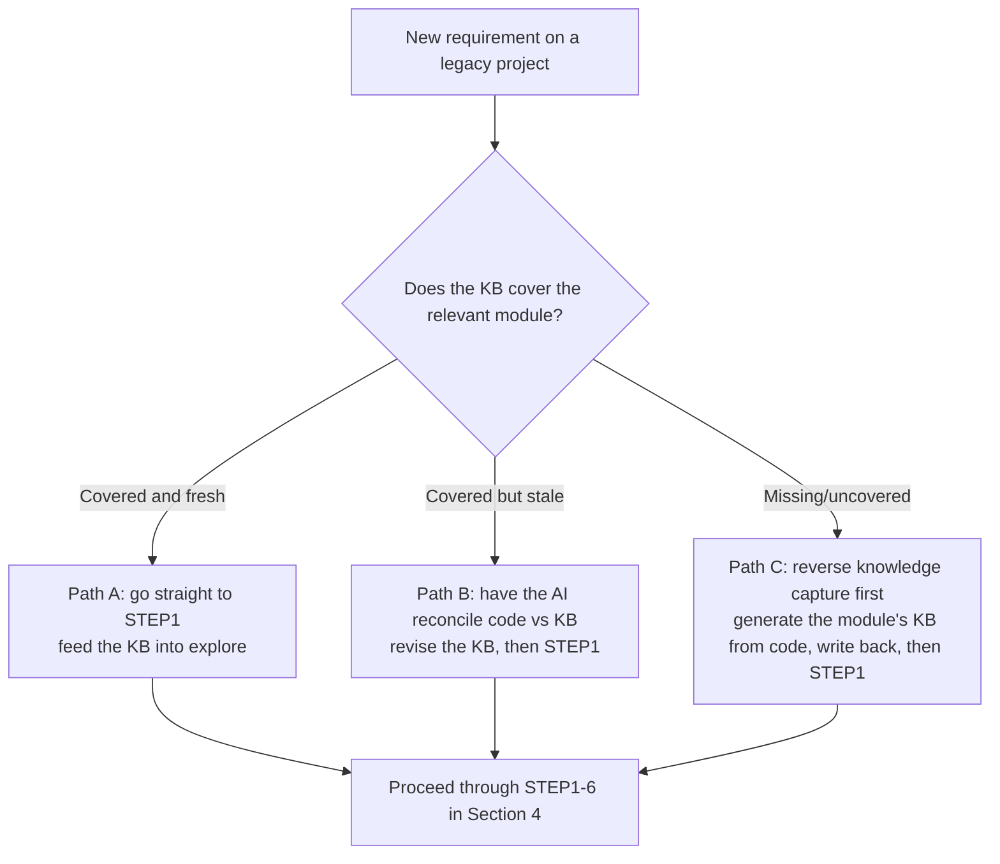

## 6. Legacy Project Development: The Knowledge-Base Loop

> Here, the **System Knowledge Base (TRUTH-DOC)** means the long-lived documentation that captures each module's abstract intent, public interfaces, and data flow. **Default placement: in the same repo as the code, under `apriori/truth/<module>.md`** — then one PR atomically carries a code change *and* its KB update, and reviewers see both in one diff ([§4.11](./concepts.md#411-mapping-the-workflow-onto-git--pr--ci)). A separate KB repo also works (e.g. one KB spanning several code repos), but you lose that atomicity — compensate by stamping every KB doc with the code commit it was verified against (`source-commit:`, used by the freshness check in §6.1). Below, "the KB" means either layout.

**What the KB owes you — and what it doesn't:**

| Maintenance duty | Exempt — regenerate on demand |
|---|---|
| Interface contracts + the three moments | Implementation walkthroughs |
| Decisions and rejected alternatives (with reasons) | Code listings |
| Invariants and product constraints | Anything a strong model can cheaply re-derive from code |
| Pitfalls — filed under their truth direction | |

Every KB doc has two fixed sections with **opposite truth directions**: `## Contract (code-is-truth)` — reconciled from code, covered by the `source-commit` stamp — and `## Decisions (doc-is-truth)`, where code violating an `active` invariant is a bug to report, and an entry expires only when a newer decision supersedes it (`superseded-by: <id>`), never by code drift.

The biggest risk in legacy projects was flagged in [§1.2](./concepts.md#12-document-driven-development-three-documents): **without the system knowledge base, the Agent can only reverse-engineer intent from the code — slow, and easy to guess wrong.** So the first principle of legacy development is — **make sure the KB covers the module you're about to change, then develop.**

### 6.1 Three Starting Points, Three Paths



**How do you *know* it's fresh?** Don't guess — the **Contract section** carries a `source-commit` stamp (the code commit it was last verified against; the Decisions section is exempt — it expires by supersession, not code drift), so the check is mechanical:

```shell
# any output = the module's code moved since the KB was last verified → Path B
git log --oneline <source-commit>..HEAD -- src/<module>/
```

A tiny CI job that runs this per module and flags "stale KB" turns the Path A/B split from a judgment call into a lookup.

### 6.2 Path A: Knowledge Base Already Covers It (Ideal)

Go straight to STEP1, feeding the KB in as the source of facts:
```text
* Requirement doc: requirement/req-final.md
* System knowledge base: apriori/truth/ (module: <module-name>; separate-repo layout: pass that repo's local path instead)
* Detailed technical design doc: design.md
Please align facts from the KB and the code, and output a gap report to apriori/explore/<change>-gap-report.md.
```

### 6.3 Path B: Knowledge Base Is Stale

First have the AI treat the **code as the source of truth** to reconcile and revise the knowledge base (prompt: [§7.6](./concepts.md#76-reverse-knowledge-capture-for-legacy-projects)), commit the revised KB docs with refreshed `source-commit` stamps, then follow Path A.

### 6.4 Path C: Knowledge Base Missing (Most Common)

**Reverse knowledge capture**: have the AI read the target module's code and produce that module's KB doc (abstract intent, public interfaces, data flow, dependencies, side effects). It lands directly at `apriori/truth/<module>.md` on your change branch, so **the review happens where reviews already happen — in the PR diff**; once approved, enter the normal workflow. Prompt: [§7.6](./concepts.md#76-reverse-knowledge-capture-for-legacy-projects).

> ⚠️ Reverse-captured knowledge **must be reviewed by a human or a heterogeneous model** — when an AI reverse-engineers intent from code, it fabricates "plausible-looking but actually wrong" abstractions. Don't let a poisoned knowledge base contaminate all downstream development.

### 6.5 Closing the Loop: Write Back After Every Change

Whether a legacy project gets easier to change over time depends on **whether STEP6 faithfully writes back to the KB**. Bake it into a team rule:
**one change = one PR that contains both the code diff and the KB diff.** With the KB in the same repo (the §6 default) this is enforceable in review — a PR that touches `src/<module>/` but not `apriori/truth/<module>.md` gets asked why ([§4.11](./concepts.md#411-mapping-the-workflow-onto-git--pr--ci)). Separate-repo teams have to lean on convention plus the `source-commit` freshness check to catch drift after the fact. Sustained over time, the KB converges from "Path C" toward "Path A," and development efficiency keeps rising.

---
