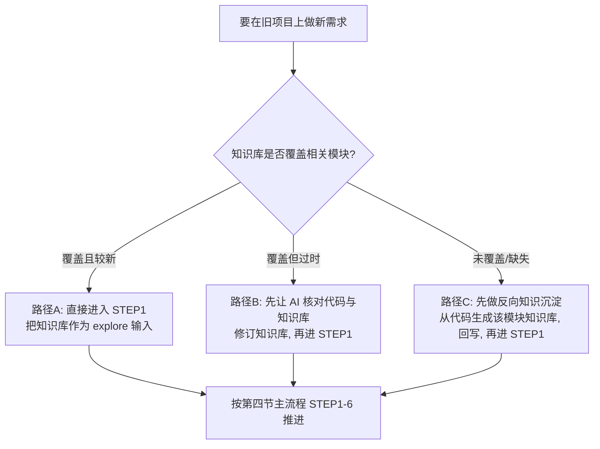

## 六、旧项目开发：系统知识库闭环

> 这里的**系统知识库（TRUTH-DOC）**指长期维护、沉淀每个模块抽象意图、对外接口、数据流的文档。**默认位置：与代码同仓库，放在 `apriori/truth/<module>.md`**——这样一个 PR 原子地同时携带代码变更*和*知识库更新，评审者在同一个 diff 里两边都看得到（[§4.11](./concepts_cn.md#411-把流程落到-git--pr--ci)）。独立的知识库仓库也可以（例如一份知识库覆盖多个代码仓库），但会失去这种原子性——补救办法是给每份知识库文档打上它核对时对应的代码 commit 标记（`source-commit:`，供 §6.1 的新鲜度检查使用）。下文所说「知识库」兼指两种布局。

**知识库欠你什么——不欠你什么:**

| 维护义务 | 豁免——按需再生 |
|---|---|
| 接口契约 + 三个时机 | 实现走读 |
| 决策与被否决方案(带理由) | 代码清单 |
| 不变式与产品约束 | 强模型能从代码廉价还原的一切 |
| 坑——按其真相方向归节 | |

每份知识库文档有两个**真相方向相反**的固定小节:`## 契约(code-is-truth)`——从代码校对、由 `source-commit` 标记覆盖;`## 决策(doc-is-truth)`——代码违反 `active` 不变式是要上报的 bug,条目只因被后继决策取代而过期(`superseded-by: <id>`),绝不因代码漂移。

旧项目的最大风险在 [§1.2](./concepts_cn.md#12-文档驱动开发三种文档) 已点明：**缺了系统知识库，Agent 只能从代码反推意图，又慢又容易猜错。** 所以旧项目开发的第一性原则是——**先保证知识库覆盖到你要改的模块，再开发。**

### 6.1 三种起点，三条路径



**怎么*知道*它新不新鲜？** 别猜——**契约节**带 `source-commit` 标记（上次核对时对应的代码 commit;决策节豁免——它靠被取代过期,不靠代码漂移），检查是机械的：

```shell
# 有任何输出 = 模块代码在知识库上次核对之后动过 → 走路径 B
git log --oneline <source-commit>..HEAD -- src/<module>/
```

用一个小 CI 任务按模块跑这条命令、标出"知识库已过期"，路径 A/B 的分流就从主观判断变成了查表。

### 6.2 路径 A：知识库已覆盖（理想情况）

直接进 STEP1，把知识库作为事实来源喂进去：
```text
* 需求文档: requirement/req-final.md
* 系统知识库: apriori/truth/（对应模块: <模块名>；独立仓库布局则填其本地路径）
* 技术详细设计文档: design.md
请基于知识库与代码对齐事实，输出 gap 报告到 apriori/explore/<change>-gap-report.md。
```

### 6.3 路径 B：知识库过时

先让 AI 拿**代码当真相**去校对、修订知识库（提示词见 [§7.6](./concepts_cn.md#76-旧项目反向知识沉淀--知识库校对)），把修订后的知识库文档连同刷新的 `source-commit` 标记一起提交，再走路径 A。

### 6.4 路径 C：知识库缺失（最常见）

**反向知识沉淀**：让 AI 阅读目标模块代码，产出该模块的知识库文档（抽象意图、对外接口、数据流、依赖、副作用）。它直接落在变更分支的 `apriori/truth/<模块名>.md`，于是**评审就发生在评审本来就发生的地方——PR diff 里**；通过后再进入正常流程。提示词见 [§7.6](./concepts_cn.md#76-旧项目反向知识沉淀--知识库校对)。

> ⚠️ 反向沉淀出来的知识库**必须人工或异构模型评审**——AI 从代码反推意图时会编造"看似合理但实则错误"的抽象。别让带毒的知识库污染后续所有开发。

### 6.5 闭环：每次开发都回写

旧项目能否越改越顺，取决于 **STEP6 是否老老实实回写知识库**。把它写进团队约定：
**一次变更 = 一个同时包含代码 diff 与知识库 diff 的 PR。** 知识库与代码同仓库时（第六节的默认），这条在评审里就能强制——动了 `src/<module>/` 却没动 `apriori/truth/<module>.md` 的 PR，会被问一句为什么（[§4.11](./concepts_cn.md#411-把流程落到-git--pr--ci)）。用独立仓库的团队只能靠约定加 `source-commit` 新鲜度检查事后兜底。长期坚持，知识库会从"路径 C"逐步收敛到"路径 A"，开发效率持续提升。

---
